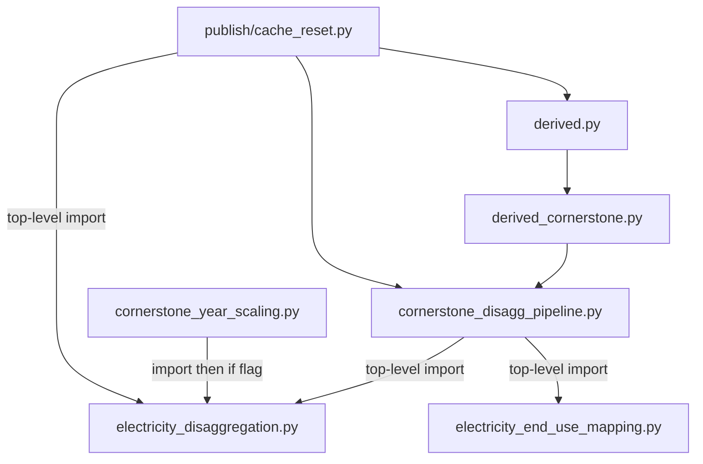

# Structural decoupling of electricity from main Cornerstone pipeline

## Goal

Canonical `2025_usa_cornerstone_v0_3` (all `implement_electricity_*` false; waste disagg on) must import and run without loading [`electricity_disaggregation.py`](bedrock/transform/eeio/electricity_disaggregation.py) or [`electricity_end_use_mapping.py`](bedrock/transform/eeio/electricity_end_use_mapping.py). Waste-only disagg stays. Flag-on configs keep current behavior via lazy imports.

Also save this plan to [`.claude/plan/electricity-pipeline-decoupling.md`](.claude/plan/electricity-pipeline-decoupling.md) when implementing.

## Current coupling (why delete-as-is fails)



Runtime call sites are already gated. The break is **import-time**.

## Approach

Lazy-import electricity symbols **inside** flag-true branches (and inside mixed-units-only entry points). Keep gate helpers (`electricity_*_enabled`) and waste orchestration in [`cornerstone_disagg_pipeline.py`](bedrock/transform/eeio/cornerstone_disagg_pipeline.py). No taxonomy/schema rewrite.

**Preferred re-export strategy:** keep `build_end_use_map` / `table_2_4_prices_cents_kwh` (and other end-use re-exports used by callers) as a **lazy facade on cdp** — defining/calling them must not load elec at `import cdp` time; the first call loads `electricity_end_use_mapping`. That preserves:

- Production importers (e.g. [`calculate_ef_diagnostics.py`](bedrock/utils/validation/calculate_ef_diagnostics.py) ~272–276)
- Test patches on `cornerstone_disagg_pipeline.table_2_4_prices_cents_kwh` ([`test_electricity_mixed_units.py`](bedrock/transform/eeio/__tests__/test_electricity_mixed_units.py) ~186/272/305; [`test_calculate_ef_diagnostics.py`](bedrock/utils/validation/__tests__/test_calculate_ef_diagnostics.py) ~218)
- Analysis / diagnostics imports of cdp re-exports (out of scope for retarget, but must not AttributeError)

Do **not** retarget every caller unless the facade approach fails; if retarget is chosen instead, update every production/test `@patch` path listed above.

## Implementation

### 1. [`cornerstone_disagg_pipeline.py`](bedrock/transform/eeio/cornerstone_disagg_pipeline.py) — main cut

Remove top-level imports from `electricity_disaggregation` and `electricity_end_use_mapping` (lines ~35–54 today). Keep waste imports and `electricity_*_enabled()` / `cornerstone_sector_disagg_active()` (config-only).

**Lazy-import inventory (symbol → function):**

| Symbol(s) | Import inside |
|---|---|
| `reallocate_electricity_coproduction` | `derive_disagg_io_bundle` — under `if electricity_reallocation_enabled()` |
| `disaggregate_electricity_make_use_va` | `derive_disagg_io_bundle` — under `if electricity_disaggregation_enabled()` |
| `get_electricity_commodity_row_weights`, `disaggregate_electricity_commodity_row_in_y` | `derive_disagg_Ytot_with_trade` — under disagg `if` |
| `distribute_electricity_aggregate_x_using_v_row_shares` | `distribute_waste_parent_x_using_v_row_shares` — under disagg `if` (~253) |
| `GENERATION_SECTOR` | `_model_year_y_row_221110` (~265) and any other user of the constant |
| `GENERATION_SECTOR`, `electricity_output_factor`, `electricity_class_row_factors` | `electricity_conversion_factors` (~281) — local-import at function entry |
| *(call only, do not local-import)* `table_2_4_prices_cents_kwh`, `build_end_use_map` | `electricity_conversion_factors` — **must** use module-level lazy facade names so `@patch('…cornerstone_disagg_pipeline.table_2_4_prices_cents_kwh')` still works |
| `apply_electricity_unit_conversion_to_A/q` | `build_electricity_mixed_units_aq` (~315) — nest import **after** `electricity_mixed_units_enabled()` early return |
| `apply_electricity_unit_conversion_to_B` | `build_electricity_mixed_units_b` (~340) — same (after early return) |
| unit-conversion helpers (+ conversion factors path) | `compute_mixed_unit_ef_vectors` (~361) |

**Lazy facade for end-use re-exports** (required for patch targets): keep module-level names `build_end_use_map`, `table_2_4_prices_cents_kwh`, and existing F401 re-exports (`END_USE_MAPPING_REVIEW_STATUS`, `build_end_use_map_resolved`, `classify_industry_end_use`) as **explicit thin wrappers** (prefer over `__getattr__` alone) that import from `electricity_end_use_mapping` on first call. Importing cdp must not load elec; `from cdp import table_2_4_…` / `@patch` on the cdp attribute must bind real callables. Do **not** local-import those two symbols inside `electricity_conversion_factors`.

### 2. [`cornerstone_year_scaling.py`](bedrock/transform/eeio/cornerstone_year_scaling.py)

In `scale_cornerstone_A` and `scale_cornerstone_q`, D7 correction imports are already function-local (~142–152, ~182–190) but run **before** the flag check. Nest the `from …electricity_disaggregation import …` **inside** `if electricity_disaggregation_enabled():`. Gate helper import from cdp stays (safe once cdp is decoupled).

### 3. [`derived_cornerstone.py`](bedrock/transform/eeio/derived_cornerstone.py)

**Not required for import-time decoupling** once cdp drops top-level elec imports: `from cdp import build_electricity_mixed_units_aq` no longer loads elec. Optional clarity: lazy-import mixed-units builders / `electricity_conversion_factors` inside the mixed-units derive functions (~942–950, ~1037). Keeping `electricity_mixed_units_enabled` as a top-level cdp import is fine (config-only).

Top-level import from cdp for waste/disagg routing stays: `cornerstone_sector_disagg_active`, `derive_disagg_io_bundle`, `derive_disagg_Ytot_with_trade`, `distribute_waste_parent_x_using_v_row_shares`.

### 4. [`publish/cache_reset.py`](bedrock/publish/cache_reset.py)

- Remove top-level imports of elec weight builders / checkpoints from `electricity_disaggregation` (~47–52).
- Stop requiring top-level `build_end_use_map` / `table_2_4_prices_cents_kwh` from cdp for the clear list if those are not `@cache`’d (today they are listed in `UPSTREAM_CACHED_DERIVES` but clearing them is a no-op if not cached). Prefer clearing end-use mapping caches only if present on the loaded module.
- Always clear waste + core cornerstone / `derived` caches (unchanged).
- **Clear elec `@functools.cache` only if already loaded** — never `import` / try-import under v0.3:

```python
import sys

def _clear_cached_attrs(mod, names: tuple[str, ...]) -> None:
    for name in names:
        fn = getattr(mod, name, None)
        if hasattr(fn, 'cache_clear'):
            fn.cache_clear()

ed = sys.modules.get('bedrock.transform.eeio.electricity_disaggregation')
if ed is not None:
    _clear_cached_attrs(ed, (
        'get_electricity_commodity_row_weights',
        '_derive_post_reallocation_checkpoint_for_disagg',
        'build_electricity_disagg_use_intersection_weights',
        'build_electricity_ugo305_scaling_ratios',
        # …any other cached elec derives currently in UPSTREAM_CACHED_DERIVES
    ))
eum = sys.modules.get('bedrock.transform.eeio.electricity_end_use_mapping')
if eum is not None:
    _clear_cached_attrs(eum, (...))  # only if any become cached
```

Flag-gated import is wrong for multi-config processes: after an elec run, leftover caches must still clear when switching to v0.3; `sys.modules.get` handles that without reloading.

### 5. Soft cleanup — [`allocation/derived.py`](bedrock/transform/allocation/derived.py) (optional / demoted)

`CORNERSTONE_INDUSTRIES_ELEC` is imported from [`cornerstone_schemas`](bedrock/utils/schemas/cornerstone_schemas.py) (~16), **not** from elec modules — this does **not** load `electricity_disaggregation.py`. Only ~486 uses the name; ~243/~391 only check the flag. Optional hygiene (`active_cornerstone_industries()` or defer import); **not** part of the decoupling acceptance probe.

### Out of scope

- Analysis / diagnostics packages (may keep hard imports of elec or cdp facade).
- Schema constants `ELECTRICITY_DISAGG_SECTORS` / `CORNERSTONE_*_ELEC` (harmless when unused; schemas ≠ elec module load).
- Behavior changes when any electricity flag is True.
- Retargeting analysis callers away from cdp re-exports (facade preserves them).

## Acceptance / testing

1. **Import + cache_reset probe (v0.3):** with elec modules blocked (rename or `sys.modules` sentinel so import fails):
   - `from bedrock.transform.eeio.derived import derive_Aq_usa`
   - `from bedrock.publish.cache_reset import clear_all_publish_caches` then call it
   - install `2025_usa_cornerstone_v0_3` and call `derive_cornerstone_Aq_scaled()` (or `derive_Aq_usa`)
   - Assert `electricity_disaggregation` and `electricity_end_use_mapping` are **absent** from `sys.modules`
2. **Multi-config cache clear:** under a process that previously loaded elec (flag-on), `clear_all_publish_caches()` still clears elec `@cache`s via `sys.modules` even when current config is v0.3 / flags false.
3. **Flag-on smoke:** `test_usa_config_waste_disagg_electricity_disaggregation` and mixed-units config still produce 407 / mixed paths; existing patches on `cornerstone_disagg_pipeline.table_2_4_prices_cents_kwh` still work (facade).
4. **Regression:** `test_electricity_disaggregation.py`, `test_electricity_reallocation.py`, `test_electricity_mixed_units.py`, waste pipeline tests; publish CLI / helpers that call `clear_all_publish_caches` still succeed under v0.3.
5. No intentional behavior change when flags are off.
