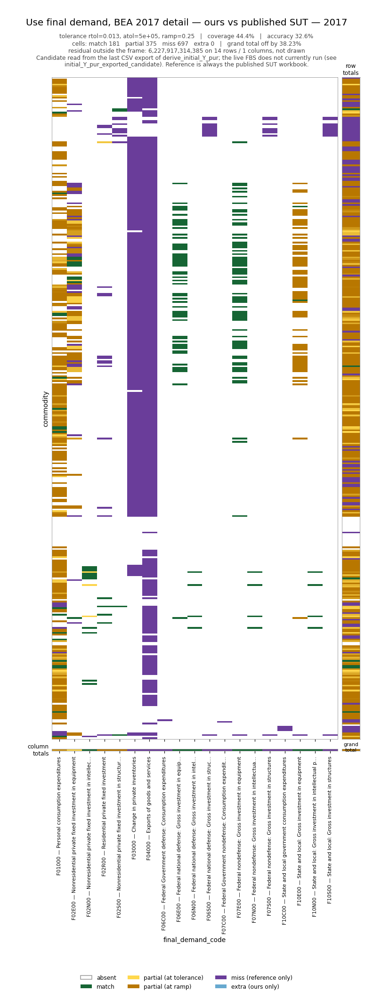

# Nowcast progress report — blocks against the published 2017 detail SUT

Generated from `bedrock.analysis.nowcasting.sections`
([#587](https://github.com/cornerstone-data/bedrock/issues/587)). Reference is
the published 2017 detail SUT throughout — the benchmark year's answer in the
framework we are building in.

Regenerate with:

```
uv run python -m bedrock.analysis.nowcasting.plots
uv run python -m bedrock.analysis.nowcasting.plots \
    --dpi 110 --out-dir .claude/plan/images --no-report   # the copies below
```

**Snapshot date:** 2026-08-05. Step 1's numbers come from the last CSV export of
`derive_initial_Y_pur`, not from a live run — see [Caveats](#caveats).

---

## Where the build stands

| block | step | shape | reference populates | reference total | candidate | coverage | accuracy |
|---|---|---|---:|---:|---|---:|---:|
| `use_fd_detail_sut` | 1 — final demand | 402 × 19 | 1,253 cells | $22.24T | exported | **44.4%** | **32.6%** |
| `use_va_detail_sut` | 2 — value added | 3 × 402 | 1,189 cells | $18.92T | *none yet* | — | — |
| `supply_bridge_detail_sut` | 4 — supply bridge | 402 × 12 | 3,202 cells | $111.28T | *none yet* | — | — |

**coverage** = of the cells the reference populates, how many we populate.
**accuracy** = of the cells we populate, how many land within tolerance.

Those three blocks are the whole of what a published 2017 detail reference
supports outside the two 402 × 402 interiors. The reference columns are the
denominator: they are what "done" looks like, and they are known before the
corresponding step is built.

---

## Step 1 — Use table, final-demand columns

`use_fd_detail_sut` · 402 commodities × 19 final-demand codes · tolerance
`rtol=0.013, atol=5e5, ramp=0.25`



| scope | absent | match | partial | miss | extra |
|---|---:|---:|---:|---:|---:|
| cells | 6,385 | 181 | 375 | **697** | 0 |
| row totals | 22 | 7 | 290 | 83 | 0 |
| column totals | 0 | 7 | 4 | 8 | 0 |

| | |
|---|---:|
| coverage | 44.4% |
| accuracy | 32.6% |
| candidate grand total | $13.74T |
| reference grand total | $22.24T |
| grand total error | 38.2% |
| residual outside the frame | **$6.23T** on 14 rows, not drawn |

### What the picture says that the totals do not

**$6.23T is parked on 14 NAICS codes**, outside the BEA detail code space —
`531110`, `923110`, `928110`, `236115`, `237110`, `238110`, `922110` and eight
`562*` codes. Two are exact identities:

- `923110` = 1,737,213,000,000 = the reference's **entire `F10C00` column total**
- `928110` = 978,501,000,000 = **`F06C00` + `F07C00`** exactly

The government columns landed intact, on the wrong codes. This is the
`bea_code_space` defect showing up as raw dollars, and it is larger than the
grand-total gap it is partly causing.

**Eight whole columns are `miss`, not `partial`** — `F03000`, `F04000`, `F06C00`,
`F06S00`, `F07C00`, `F07S00`, `F10C00`, `F10S00`. Inventories and exports are
known-unsourced (#529, #526). The other six are the government columns above.

**The two axes disagree, which is the point.** 373 of 402 row totals are outside
tolerance against 12 of 19 column totals — a column total can be right in
aggregate while its commodity split is wrong, and only the row strip shows it.

**`F01000` is amber almost everywhere.** Personal consumption has the most cells
live on both sides and nearly all sit at the far end of the ramp, not near the
boundary. Column total −17.3%: the per-commodity split, not coverage.

**`S00900` has the right magnitude and the wrong sign** — relative error exactly
2.0. `7a04a71` added `negate_flows` for this; the export predates it taking
effect.

Longer form: [`About_table_match.md`](../../bedrock/analysis/nowcasting/About_table_match.md).

---

## Step 2 — Use table, value-added rows

`use_va_detail_sut` · 3 rows × 402 industries · tolerance
`rtol=0.01, atol=5e5, ramp=0.25` · **no candidate yet**

The reference, the frame and the bar are settled; Step 2 supplies the candidate
and the picture appears. The target:

| row | description | reference total |
|---|---|---:|
| `V00100` | Compensation of employees | $10.435T |
| `T00OTOP` | Other taxes on production, less subsidies | $0.609T |
| `V00300` | Gross operating surplus | $7.873T |
| | **total (`VABAS`)** | **$18.917T** |

1,189 of 1,206 cells are populated in the reference, so this block is nearly
dense — unlike final demand, there is almost nowhere for a miss to hide as a
structural zero.

**The valuation is the thing to get right.** `T00OTOP` is *other* taxes on
production less subsidies at basic prices. It is **not** the MUT's `V00200`,
which is taxes on production *and imports* at producer prices. A candidate built
on `V00200` will not match this reference, and the section deliberately does not
alias the two — the gap shows as a `MISS`/`EXTRA` pair rather than a bad match.

Turning it on: point `Section.candidate` at the Step 2 output.

---

## Step 4 — Supply table, bridge to purchaser value

`supply_bridge_detail_sut` · 402 commodities × 12 bridge codes · tolerance
`rtol=0.01, atol=5e5, ramp=0.25` · **no candidate yet**

The right-hand block of the Supply table: imports, margins, taxes and the
subtotals carrying a commodity from domestic output at basic value to total
supply at purchaser value. Reference totals, in millions:

| code | description | 2017 total |
|---|---|---:|
| `T007` | Total commodity output (domestic, basic) | 33,772,566 |
| `MCIF` | Imports of goods and services, CIF | 2,649,430 |
| `MADJ` | CIF/FOB adjustment on imports | −23,116 |
| `T013` | **Total supply, basic** | **36,398,867** |
| `TRADE` | Trade margins | 1 |
| `TRANS` | Transportation costs | 10 |
| `T014` | **Total margins** | **1** |
| `MDTY` | Import duties | 38,507 |
| `TOP` | Taxes on products | 716,926 |
| `SUB` | Subsidies (stored negative) | −59,876 |
| `T015` | **Taxes less subsidies** | **695,565** |
| `T016` | **Total supply, purchaser** | **37,094,434** |

**`T014` sums to 1 across the whole economy.** Margins net to nothing in
aggregate while being large and offsetting per commodity. No scalar check on
this block can work; a per-commodity picture is the only thing that can. This
block is the strongest case in the project for the diagnostic existing.

Subtotals are kept in the frame rather than stripped, because they are the
Supply identities and a subtotal disagreeing with its own components is exactly
what is worth seeing:

```
T013 = T007 + MCIF + MADJ
T014 = TRADE + TRANS
T015 = MDTY + TOP + SUB
T016 = T013 + T014 + T015
```

---

## Caveats

**Step 1's live candidate does not run.** `derive_initial_Y_pur(2017)` raises
`KeyError: ['ActivityProducedBy'] not in index`. `NIPA_FD_2017.yaml` sets
`attribute_on: ['PrimarySector', 'ActivityProducedBy']`, but the
`retain_activity_columns` plumbing in `flowby.py` that keeps that column alive
into the attribution source landed in `9668ce7`, was reverted from main in
`42f7e59`, and was **not** part of the `7a04a71` salvage. The section reads the
last CSV export meanwhile; switching back is one line
(`Section.candidate = initial_Y_pur_candidate`).

Because that export predates the current config, Step 1's numbers here are a
snapshot of *that run*, not of `nowcast` HEAD. Re-run once the FBS runs again.

**Nothing here is a rollup.** Every number is BEA 2017 detail. Margins and
redefinitions net out at summary and above, so an aggregate view of these blocks
would pass on data these pictures show to be broken.
