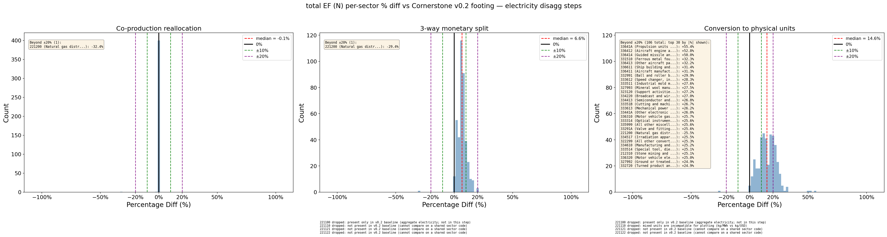

# Why total-EF (N) moves in the 3-way monetary split — and why it only moves up

Scope: the **middle panel** ("3-way monetary split") of
`ef_panels_vs_v0_2_N.png`, i.e. per-sector total EF (`N`, kg CO₂e / USD)
recomputed against the **Cornerstone v0.2 footing**.



Two questions:

1. Why is there variance in `N` when the direct EF (`D`) is essentially
   unchanged?
2. Why is that variance almost always **positive** (median ≈ +7%)?

**Bottom line up front**

- Your hypothesis is **correct**. The per-sector `%ΔN` is driven, almost
  entirely, by *how much of that sector's `N` comes from electricity*. The
  rank correlation is essentially perfect (**Spearman r = 0.9993**), and a
  one-parameter model `%ΔN ≈ 0.28 × (electricity share of N)` explains
  **R² = 0.96** of the spread.
- The changes are positive because the 3-way split **reverses the price
  dilution** that hid generation's intensity inside the aggregate sector.
  Splitting concentrates the (roughly unchanged) power-sector emissions onto
  the *generation* commodity, whose per-dollar EF is ~3× the old blended
  value. Every consumer's electricity draw is re-routed through that
  high-intensity commodity, so their `N` can only rise.

---

## How this was tested

New, self-contained script (no files outside the diagnostics package were
touched):

- `bedrock/analysis/electricity_disagg_diagnostics/analyze_n_variance.py`
- Output table: `output/ef/panel/n_variance_analysis.csv` (per-sector).

It builds the model twice — the v0.2 footing (`2025_usa_cornerstone_v0_2`)
and the 3-way split
(`2025_usa_cornerstone_v0_2_electricity_disaggregation`) — and uses the exact
identity behind the panel:

```
N_j = Σ_i  D_i · L_ij           (total EF of sector j = Σ over inputs i of
                                 direct EF D_i weighted by the Leontief
                                 requirement L_ij)
```

(The identity reproduces the published `N` to machine precision: max
residual = 2.7e-15.)

Because only the electricity sectors change their `D`, we split each
sector's `N` into an **electricity channel** and **everything else**:

```
C_elec_j = Σ_{i ∈ electricity} D_i · L_ij      (power-sector direct emissions
                                                embodied in j)
C_rest_j = N_j − C_elec_j
```

and define the **electricity share of N** = `C_elec_j / N_j` on the footing.
401 non-electricity sectors are analyzed (the four electricity codes
themselves are excluded, as in the panel).

---

## Point 1 — the variance, and your hypothesis

### Why `N` moves while `D` does not

`D_j` is sector *j*'s **own** direct emissions per dollar. For every
non-electricity sector that number is untouched by the split — median
`|%ΔD| = 0.02%`. `N_j`, by contrast, is a **supply-chain** quantity: it sums
the direct EFs of *all* upstream sectors weighted by the Leontief inverse.
The split rewrites the electricity rows of that supply chain, so every sector
that buys electricity (directly or indirectly) inherits a different `N` even
though its own `D` is frozen. That is the entire reason the middle panel has
width while `D` is a spike at 0%.

### Your hypothesis is confirmed

> *"…net changes in the N EFs should be driven by the share of that sector's
> N which is caused by electricity. A sector that consumes a lot of
> electricity is more sensitive…"*

Measured relationship between `%ΔN` and the footing electricity-share-of-N:

| statistic | value |
|---|---|
| Pearson r | 0.921 |
| **Spearman r** | **0.9993** |
| slope `k` (fit through origin) | 0.279 |
| R² (one-parameter, through origin) | 0.959 |

The decomposition shows *why* the fit is so tight: the electricity channel
accounts for **103.5%** of the total movement (`Σ dC_elec = 5.79` vs
`Σ dN = 5.59`); the "everything else" channel is a rounding error and even
slightly negative (`Σ dC_rest = −0.20`, median `|dC_rest/dN| = 1.4%`). So
`dN ≈ dC_elec`, and since `dC_elec_j = C_elec_j · (r − 1)` with a near-uniform
intensity ratio `r ≈ 1.28` (see Point 2),

```
%ΔN_j  ≈  (electricity share of N_j) × (r − 1)  ≈  share × 0.28
```

This closed form is exactly the slope 0.279 recovered from the data, and it
*is* your hypothesis: the multiplier `(r − 1)` is universal (a consequence of
the uniform G/T/D split — confirmed in code: `disaggregate_use_commodity_rows`
applies the same `w[code]` to every purchaser column), so the only thing that
varies sector-to-sector is the electricity share.

### Supporting examples

Highest electricity share → biggest `%ΔN`:

| sector | name (approx.) | elec share of N | %ΔN | %ΔD |
|---|---|---:|---:|---:|
| 452000 | General merchandise retail | 0.69 | +19.8% | 0.0% |
| 447000 | Gasoline stores | 0.68 | +19.4% | 0.0% |
| 445000 | Food & beverage stores | 0.67 | +19.1% | 0.0% |
| 33641A | Aerospace product/parts | 0.60 | +16.6% | −0.05% |
| 517110 | Wired telecom carriers | 0.58 | +16.5% | 0.0% |

Lowest electricity share → `%ΔN` ≈ 0:

| sector | name (approx.) | elec share of N | %ΔN | %ΔD |
|---|---|---:|---:|---:|
| 562212 | Solid-waste landfill | 0.005 | +0.13% | 0.0% |
| 1121A0 | Cattle ranching | 0.008 | +0.20% | 0.0% |
| 1111B0 | Oilseed farming | 0.019 | +0.43% | 0.0% |
| 111400 | Greenhouse/nursery | 0.020 | +0.40% | 0.0% |

The retail/telecom sectors — electricity-dominated footprints — move ~20%;
the farm/landfill sectors — footprints dominated by on-site CH₄/N₂O, not
purchased power — barely move. Exactly the ordering your hypothesis predicts.

---

## Point 2 — why the shift is always positive

400 of 401 sectors (99.8%) have `dN > 0`. The mechanism is a **reversal of
price dilution**.

### The direct EFs of the electricity commodities

| commodity | direct EF `D` (kg CO₂e/USD) |
|---|---:|
| 221100 aggregate electricity (footing) | **2.386** |
| 221110 generation (split) | **7.139** |
| 221121 transmission (split) | 0.225 |
| 221122 distribution (split) | 0.000 |

In the footing, ~1.44 Gt of power-sector CO₂e is divided by the **entire**
electricity commodity revenue (generation **plus** the transmission &
distribution margins), giving a blended, *diluted* 2.386. Every electricity
dollar in every supply chain carries that same watered-down intensity.

The 3-way split re-attributes essentially all of those emissions to
**generation**, whose revenue base is only ~1/3 of the aggregate's. Its EF
therefore jumps to 7.139 (≈ 2.386 × 595/205 × eGRID-reload ≈ 3×). T&D receive
~0 direct EF. Total power emissions are basically preserved (a small eGRID
reload adds ~2–3%); the split just moves *where* the emissions sit.

### Worked example — 452000 (general merchandise retail)

Electricity **dollars** embodied per $ of output are ~unchanged by the split
(the uniform row split preserves each purchaser's total), but the **emissions
those dollars carry** change because generation's dollars now carry 7.139:

```
Footing:
  C_elec = L[221100→452000] · D_221100
         = 0.04130 · 2.386                      = 0.0985

Split:
  C_elec = L[221110→452000]·7.139               (generation, incl. via T&D)
         + L[221121→452000]·0.225               (transmission)
         + L[221122→452000]·0.000               (distribution)
         = 0.01756·7.139 + 0.00171·0.225 + 0.02277·0
         = 0.1254 + 0.0004 + 0                  = 0.1257

  total electricity $ embodied: 0.0413 → 0.0420  (+1.8%, ≈ unchanged)
  emissions embodied:           0.0985 → 0.1257  (+27.6%)
```

The generation slice **alone** (0.1254) exceeds the entire footing
electricity contribution (0.0985), because 42% of the embodied electricity
dollars now flow to a commodity priced at 7.139 instead of 2.386. Adding the
unchanged `C_rest` (0.0434 → 0.0443):

```
N: 0.1419 → 0.1700     %ΔN = +19.8%
```

### Why the sign is *guaranteed* positive

For any sector that consumes electricity,

```
dC_elec_j = L[gen→j]·7.139 + L[trans→j]·0.225 − L[agg→j]·2.386
```

Distribution contributes nothing (D = 0) and transmission is negligible, so
the sign is set by generation. Across sectors `L[gen→j] ≈ 0.42 · L[agg→j]`
(the generation share the Leontief pulls to deliver electricity), giving
`L[gen→j]·7.139 ≈ 3.0 · L[agg→j] > 2.386 · L[agg→j]`. The generation term
beats the footing term *whenever the sector buys any electricity at all* — the
effective embodied-electricity intensity rises from 2.386 to a median 2.99
(**+25%**), uniformly. Combined with `dC_rest ≈ 0`, that forces `dN ≥ 0`
everywhere. There is no channel that can push a normal consumer's `N` down.

### The one exception — 221200 (natural gas distribution)

The single negative sector (`%ΔN = −29%`) is *not* a counterexample to the
electricity story: its **own** direct EF collapses (`%ΔD = −44.6%` at
reallocation; **−43.3%** at the 3-way split vs footing) in the
co-production reallocation that precedes the split. Its `N` falls because of a
change in its *own* direct emissions (the `C_rest`/`D` channel), not the
electricity channel — which is exactly why it is the lone outlier in a panel
otherwise governed entirely by the electricity supply chain.

**How the reallocation lowers 221200's `D`.** The *industry*'s satellite
emissions barely move — what falls is the emissions **attributed to the 221200
commodity**. Commodity direct factors are built as a Make-share-weighted
average of the producing industries' intensities:

```
B_commodity = (E_industry / x_industry) @ Vnorm
```

In the footing, the electric-power industry (221100) **co-produces ~9.6% of
the natural-gas-distribution commodity** (a $7.7 B Make off-diagonal). Because
that industry's direct intensity is **~7× the gas industry's**, this small
co-production share carries **~44% of the commodity's entire direct EF**:

| footing producer of 221200 commodity | Make share | industry intensity | share of commodity `D` |
|---|---:|---:|---:|
| 221200 gas distribution | 82.7% | 1.0× | 55.2% |
| **221100 electricity** | **9.6%** | **6.8×** | **43.7%** |
| S00203 (non-comparable imports) | 7.7% | 0.2× | 1.1% |

The co-production reallocation **clears that off-diagonal**: it moves the
electricity industry's $7.70 B of secondary gas output onto the gas-industry
diagonal (and the gas industry's $1.56 B of secondary electricity the other
way), leaving `V[221100, 221200] = 0`. The gas commodity is then produced
almost entirely by the gas industry, so it **stops inheriting power-sector
intensity**. Its commodity output `q` is unchanged, so the ~44% of intensity
that came from electricity is simply removed:

| step | `D` (kg CO₂e/USD) | `q` (commodity output) | attributed `E = D·q` | `%ΔD` vs footing |
|---|---:|---:|---:|---:|
| footing | 0.4573 | 80.21 B | 36.68 B | — |
| reallocation | 0.2535 | 80.21 B | 20.33 B | **−44.6%** |
| 3-way split | 0.2594 | 80.21 B | 20.81 B | **−43.3%** |

```
%ΔD_reallocation
    = (0.2535 − 0.4573) / 0.4573
    = −44.6%
```

These live values match the updated diagnostics-sheet `D_new` for 221200
(footing / reallocation / 3-way), so the panel `%ΔD` vs footing agrees.

The split only nudges the comparison from −44.6% to −43.3%, so
221200's negative `%ΔN` is a *commodity-attribution reassignment* — power-sector
GHG that had been mis-charged to the gas-distribution commodity is handed back
to the electricity industry — and is orthogonal to the electricity-supply-chain
mechanism driving every other sector.

The producer-attribution decomposition can be reproduced with:

```
python -m bedrock.analysis.electricity_disagg_diagnostics.probe_221200
```

---

<!-- BEGIN high-low-n-walkthrough -->

## Worked examples — high vs low electricity share (517110 vs 562212)

Scope: **3-way monetary split vs v0.2 footing** for two non-electricity sectors — one electricity-dominated footprint and one process-emissions dominated footprint. Own `D` is unchanged; `y` is not used (`N_j = Σ_i D_i L_ij`).

Identity:

```
N_j = C_elec_j + C_rest_j
C_elec_j = Σ_{i ∈ electricity} D_i · L_ij
C_rest_j = N_j − C_elec_j
```

Undilution reference intensities: footing `D_221100` = 2.3859 kg/USD; split `D_221110` = 7.1385 kg/USD (~3.0×).

### 517110 — Wired telecom carriers

| | Footing | 3-way split | Δ |
|---|---:|---:|---:|
| Own `D` | 0.001570 | 0.001570 | **+0.0%** |
| `N` | 0.0775 | 0.0904 | **+16.5%** |
| Electricity share of `N` (footing) | **58.1%** | — | — |

#### Footing — one blended electricity commodity

```
C_elec = L[221100→517110] · D_221100
       = 0.018892 · 2.3859
       = 0.04508

C_rest = N − C_elec = 0.07753 − 0.04508 = 0.03246
N      = 0.04508 + 0.03246 = 0.07753
```

#### After 3-way — generation / transmission / distribution

Electricity **dollars** embodied (`L_elec`): 0.018892 → 0.019230 (+1.8%). Emissions change because generation carries undiluted intensity:

```
C_elec = L[221110→517110]·D_110
       + L[221121→517110]·D_121
       + L[221122→517110]·D_122
  221110: 0.008032 · 7.1385 = 0.05734
  221121: 0.000782 · 0.2250 = 0.00018
  221122: 0.010416 · 0.0000 = 0.00000
       = 0.05751

C_rest ≈ 0.03285
N      = 0.05751 + 0.03285 = 0.09036
```

| Piece | Footing | Split |
|---|---:|---:|
| `221110` contribution | — | 0.05734 |
| `221121` contribution | — | 0.00018 |
| `221122` contribution | — | 0.00000 |
| Non-electricity (`C_rest`) | 0.03246 | 0.03285 |
| **Total `N`** | **0.07753** | **0.09036** |

```
dN      = 0.01283
dC_elec = 0.01244   ← 97% of the move
dC_rest = 0.00039
%ΔN     = +16.5%
C_elec change = +27.6% on electricity channel
```

Closed-form check from Point 1: `%ΔN ≈ elec_share × 0.28` = 0.581 × 0.28 = +16.3% (observed +16.5%).

**Why `517110` moves a lot:** electricity is **58%** of footing `N`. Effective embodied-electricity intensity rises from 2.39 → 2.99 kg per electricity $; that ~25% intensity bump on a large share of `N` produces a double-digit `%ΔN`.

### 562212 — Solid-waste landfill

| | Footing | 3-way split | Δ |
|---|---:|---:|---:|
| Own `D` | 7.334 | 7.334 | **+0.0%** |
| `N` | 7.537 | 7.547 | **+0.1%** |
| Electricity share of `N` (footing) | **0.5%** | — | — |

#### Footing — one blended electricity commodity

```
C_elec = L[221100→562212] · D_221100
       = 0.014982 · 2.3859
       = 0.03575

C_rest = N − C_elec = 7.53708 − 0.03575 = 7.50134
N      = 0.03575 + 7.50134 = 7.53708
```

#### After 3-way — generation / transmission / distribution

Electricity **dollars** embodied (`L_elec`): 0.014982 → 0.015250 (+1.8%). Emissions change because generation carries undiluted intensity:

```
C_elec = L[221110→562212]·D_110
       + L[221121→562212]·D_121
       + L[221122→562212]·D_122
  221110: 0.006370 · 7.1385 = 0.04547
  221121: 0.000620 · 0.2250 = 0.00014
  221122: 0.008261 · 0.0000 = 0.00000
       = 0.04561

C_rest ≈ 7.50114
N      = 0.04561 + 7.50114 = 7.54675
```

| Piece | Footing | Split |
|---|---:|---:|
| `221110` contribution | — | 0.04547 |
| `221121` contribution | — | 0.00014 |
| `221122` contribution | — | 0.00000 |
| Non-electricity (`C_rest`) | 7.50134 | 7.50114 |
| **Total `N`** | **7.53708** | **7.54675** |

```
dN      = 0.00967
dC_elec = 0.00986   ← 102% of the move
dC_rest = -0.00019
%ΔN     = +0.1%
C_elec change = +27.6% on electricity channel
```

Closed-form check from Point 1: `%ΔN ≈ elec_share × 0.28` = 0.005 × 0.28 = +0.1% (observed +0.1%).

**Why `562212` barely moves:** the same undilution physics raises `C_elec` by ~0.010 kg/$, but footing `N` is dominated by `C_rest ≈ 7.50`. Electricity is only **0.47%** of `N`, so `%ΔN` is tiny.

### Side-by-side

| | 517110 (Wired telecom carriers) | 562212 (Solid-waste landfill) |
|---|---:|---:|
| `L_elec` (footing) | 0.0189 | 0.0150 |
| `C_elec` footing → split | 0.0451 → 0.0575 | 0.0357 → 0.0456 |
| `dC_elec` | +0.0124 | +0.0099 |
| `C_rest` (footing) | 0.0325 | 7.5013 |
| Elec share of `N` | **58.1%** | **0.47%** |
| `%ΔN` | **+16.5%** | **+0.1%** |
| Own `%ΔD` | +0.0% | +0.0% |

**One-liner:** same electricity-channel undilution in both sectors; `%ΔN` scales with electricity's share of that sector's total EF.

### Reproduce

```
python -m bedrock.analysis.electricity_disagg_diagnostics.ef_comparison.analyze_n_variance
```

That regenerates `n_variance_analysis.csv` and refreshes this section (between the HTML markers) from live footing / 3-way models. Sectors are configured as `WALKTHROUGH_SECTORS` in `ef_comparison/analyze_n_variance.py` (currently `517110`, `562212`).

<!-- END high-low-n-walkthrough -->

<!-- BEGIN mixed-units-n-variance -->

## Why the mixed-units (physical generation) panel shows higher `N` than the 3-way split

Scope: the **right panel** ("Conversion to physical units") of `ef_panels_vs_v0_2_N.png` vs the **middle panel** ("3-way monetary split"). Both panels are percent differences against the **same v0.2 footing**, so the mixed panel **stacks** the 3-way undilution and the mixed-units `A`/`L` rewrite.

### Panel facts (non-electricity sectors vs footing)

| Step | Median `%ΔN` | Max `%ΔN` | Sectors with `%ΔN` > 10% | Sectors with `%ΔN` > 15% | n |
|---|---:|---:|---:|---:|---:|
| 3-way monetary split | +6.6% | +19.8% | 64 | 12 | 401 |
| Conversion to physical units | +14.6% | +55.4% | 298 | 194 | 401 |

### Suggested slide framing

#### What causes the extra `N` move at unit conversion

1. **This is not another jump in direct EF.** USD-equivalent **`D` is unchanged** for generation under the mixed-units transform: `D_110` = 7.1385 kg/USD ↔ 392.4687 kg/MWh via `c_col = D_USD/D_MWh ≈ 0.018189` MWh/USD. T/D direct EFs and inventory `E` are untouched; block USD-equiv `D` is stable.
2. **What changes is `L` (and thus `N = Σᵢ Dᵢ Lᵢⱼ`).** Mixed units rewrite **A**: the generation **sales row** is multiplied by purchaser-specific `c_j` (USD→MWh), and the generation **column** is divided by `c_col`. Leontief requirements for generation become **MWh per $** of sector `j`.
3. **Physical MWh per electricity dollar is not uniform.** `c_row` varies by EPA end-use price (`c_j = λ / p_j`). Cheaper power → **larger** `c_j` → more MWh embodied per $ of purchases → more kg from `D_MWh`. Empirically, the median electricity-channel contribution **`C_elec` rises 1.39×** from 3-way → mixed (in line with typical `c_j / c_col`).
4. **The panel is vs footing, so effects stack:** 3-way undilution (embodied-electricity intensity median ~2.39 → ~2.99 kg/$ elec) **+** mixed-units physical `L` rewrite → wider / higher `%ΔN` cloud than the middle panel alone.

**One-liner:** The 3-way split raises the *price* of electricity emissions (`D_gen`); mixed units often raise the *physical quantity* of generation embodied per dollar (`L[gen→j]` in MWh).

#### Same share logic, bigger multiplier

| Idea | 3-way vs footing | Mixed vs footing |
|---|---|---|
| Own `%ΔD` | ~0 (non-elec) | ~0 (non-elec; gen reported USD-equiv) |
| Driver | Higher elec intensity (undiluted `D_110`) | Same + more MWh/`$` via `c_row`/`L` |
| Median `%ΔN` | +6.6% | +14.6% |
| Still true | Larger elec share of `N` → larger `%ΔN` | Same ordering, larger amplitudes |

### Contrast examples

| Sector | Name | End-use | N footing | N 3-way | N mixed | `%ΔN` vs footing (3-way) | `%ΔN` vs footing (mixed) | Note |
|---|---|---|---:|---:|---:|---:|---:|---|
| 33641A | Aerospace products | Industrial | 0.393 | 0.458 | 0.611 | +16.6% | +55.4% | Industrial `c_j` amplifies gen `L` (MWh/$) |
| 452000 | General merchandise retail | Commercial | 0.142 | 0.170 | 0.167 | +19.8% | +18.0% | Commercial `c_j` ≲ `c_col`; little extra vs 3-way |
| 1121A0 | Cattle ranching | Industrial | 3.201 | 3.207 | 3.218 | +0.2% | +0.5% | Industrial but low elec share of `N`; small move either step |

EPA end-use classes for these examples (from `build_end_use_map()` / `classify_industry_end_use`): **33641A Industrial**, **452000 Commercial**, **1121A0 Industrial**. None is Residential or Transportation.

### Does Industrial always rise more than Commercial / Transportation (3-way → mixed)?

**No — not always.** Industrial is higher **on average**, and every industrial sector in this run rises; some commercial/transport sectors fall slightly. The distributions **overlap**.

| End-use | n | Median `%ΔN` (3-way→mixed) | Mean | Min | Max | Share with `%ΔN` > 0 |
|---|---:|---:|---:|---:|---:|---:|
| **Industrial** | 266 | +11.8% | +10.7% | +0.3% | +33.2% | 100.0% |
| **Commercial** | 125 | +1.9% | +2.0% | -1.6% | +5.9% | 91.2% |
| **Transportation** | 10 | +1.3% | +1.4% | -0.1% | +3.3% | 90.0% |

Strict separation fails: `min(Industrial) = +0.3%` < `max(Commercial∪Transportation) = +5.9%`. About **9** industrial sectors sit below the commercial median `%ΔN` (3-way→mixed). Class mapping correlates with the mixed-units bump (via `c_j` / retail prices), but **elec share of `N`** and supply-chain structure still matter — Industrial ≠ always larger than Commercial/Transportation for every sector.

### Reproduce

```
python -m bedrock.analysis.electricity_disagg_diagnostics.ef_comparison.analyze_n_variance
```

This regenerates `n_variance_analysis.csv`, `n_variance_mixed_analysis.csv`, and refreshes this section inside `n_variance_explained.md`.

<!-- END mixed-units-n-variance -->

## Summary

- **Variance with flat `D`:** `N` is a Leontief supply-chain metric; the split
  rewrites the electricity rows, so consumers' `N` shifts even though their own
  `D` is fixed.
- **Point 1 (hypothesis):** correct — `%ΔN` is `≈ 0.28 ×` the electricity
  share of `N` (Spearman 0.999, R² 0.96); the electricity channel explains
  ~104% of the movement.
- **Point 2 (always positive):** the split un-dilutes generation, raising the
  embodied-electricity intensity ~25% for every pathway; with the rest of the
  supply chain unchanged, `dN` is positive for all real consumers. The sole
  exception (221200) is driven by its own `D`, not by electricity.
- **High vs low walkthrough:** wired telecom (`517110`) rises ~+16.5% because
  electricity is ~58% of its `N`; solid-waste landfill (`562212`) rises only
  ~+0.13% because electricity is ~0.5% of its `N` — same undilution, different
  share (see the marked walkthrough section).

Reproduce with:

```
python -m bedrock.analysis.electricity_disagg_diagnostics.ef_comparison.analyze_n_variance
```

That regenerates `n_variance_analysis.csv`, `n_variance_mixed_analysis.csv`, and
refreshes marked sections in this file (high/low walkthrough + mixed-units N panel).
