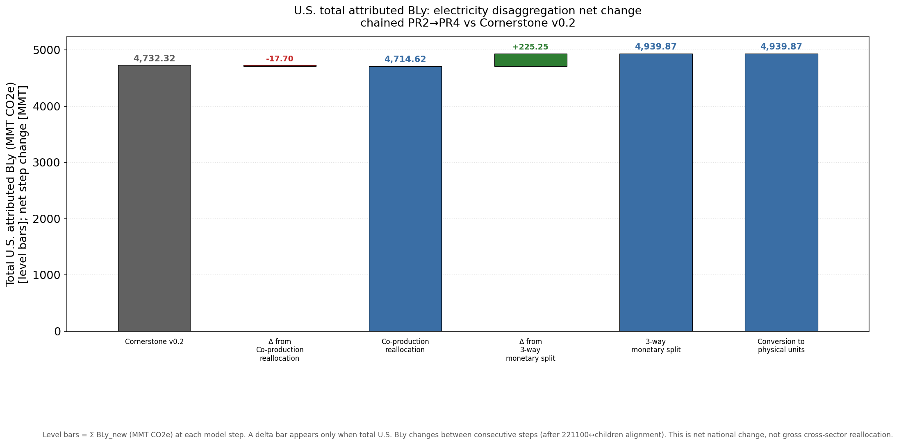
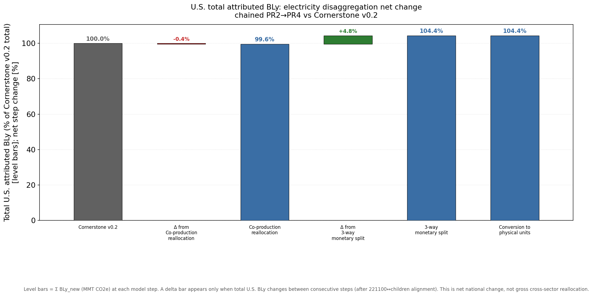
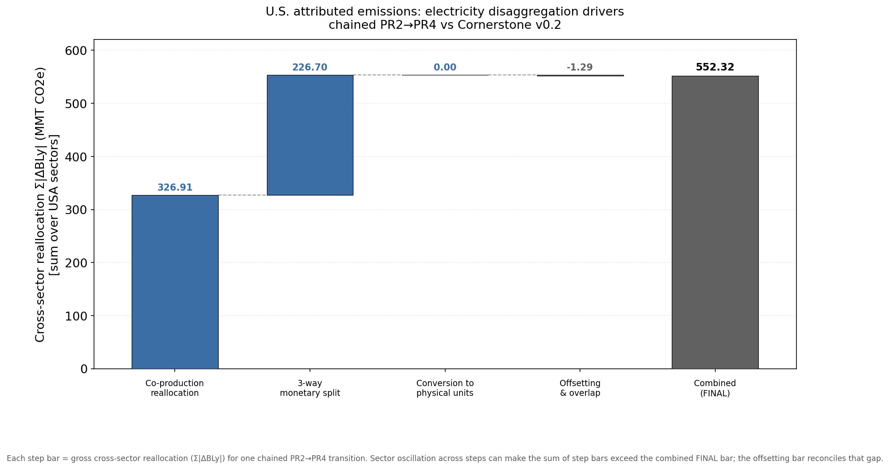

# Electricity disaggregation: net U.S. BLy change between steps

Analysis date: 2026-07-09  
Data source: local diagnostics exports in `../local_data/` (Cornerstone v0.2 chain, pinned snapshot `7372464249c434c9bebb172c065a4d0e3702176e`)

## Executive summary

This report explains **net changes in total U.S. attributed BLy** (`Σ BLy_new`) between consecutive model steps in the electricity disaggregation chain. These are the deltas shown in the net-change waterfall charts — not the gross cross-sector reallocation (`Σ|ΔBLy|`) in the dispersion charts.

| Transition | Net Δ total BLy (MMT CO₂e) | % of v0.2 footing (5,030 MMT) | Main driver |
|------------|---------------------------:|--------------------------------:|-------------|
| v0.2 footing → co-production reallocation | **−21.8** | −0.43% | **221200** (natural gas distribution) loses BLy; **221100** gains a smaller amount |
| reallocation → 3-way monetary split | **+271.4** | +5.40% | **221110** (generation) appears with ~1,982 MMT BLy; aggregate **221100** removed |
| 3-way split → mixed units | **~0** | ~0% | Unit conversion on A/q/B; national BLy path unchanged at MMT precision |

**FINAL net change (v0.2 footing → mixed units): +249.6 MMT (+4.96%)**





For comparison, the **dispersion** charts measure gross sector reshuffling (much larger numbers, offset bar when steps partially cancel):



---

## What is being measured?

**BLy** is total production-induced attributed emissions from the national-accounts IO identity:

\[
\text{BLy}_j = \sum_i \left[\mathrm{diag}(d)\, L\, y\right]_j
\]

where \(d\) = direct intensity from \(B\), \(L\) = Leontief inverse from \(A\), and \(y\) = national accounting final demand.

Each diagnostics run writes per-sector `BLy_new (MtCO2e)` on the `BLy_new_vs_BLy_old` tab. **Net national change between two live configs** is:

\[
\Delta_\text{net} = \sum_j \left(\text{BLy}^{\text{new}}_j - \text{BLy}^{\text{prev}}_j\right)
\]

after aligning electricity sectors (`221100` ↔ `221110` / `221121` / `221122`) so aggregate and child rows are not double-counted.

This is **not** the same as a change in the underlying GHG inventory \(E\). The `BLy_and_E_orig_diffs` tab compares \(\sum \text{BLy}\) to \(\sum E_\text{orig}\) from the pinned snapshot:

| Config | Σ BLy (MMT) | Σ E_orig (MMT) | BLy − E_orig (MMT) |
|--------|------------:|---------------:|-------------------:|
| v0.2 footing | 5,029.97 | 4,854.03 | +175.94 |
| + reallocation | 5,008.19 | 4,839.65 | +168.54 |
| + 3-way split | 5,279.58 | 4,839.65 | +439.93 |
| + mixed units | 5,279.58 | 4,839.65 | +439.93 |

\(E_\text{orig}\) is fixed from the snapshot from reallocation onward; the **+271 MMT** step widens the BLy–inventory gap because BLy rises while \(E\) does not.

---

## 1) Why is there a small **negative** net change between v0.2 and reallocation (−21.8 MMT)?

### What PR2 (co-production reallocation) does

PR2 clears **221100** Make-table co-production off-diagonals by transferring activity onto the **221100** diagonal, adjusting Use and VA consistently (`reallocate_electricity_coproduction` in `electricity_disaggregation.py`). Final demand **Y is not modified**. Row totals of U and VA are preserved per transfer.

### Sector-level decomposition (footing → reallocation)

| Sector | BLy at v0.2 | BLy after reallocation | Δ BLy (MMT) | Notes |
|--------|------------:|------------------------:|------------:|-------|
| **221200** (natural gas distribution) | 54.46 | 27.37 | **−27.09** | Largest mover |
| **221100** (electricity aggregate) | 1,710.46 | 1,715.83 | **+5.37** | Partial offset |
| 531ORE | 58.34 | 58.28 | −0.06 | Minor |
| **562*** waste children | 150.24 (sum) | 150.24 (sum) | **0.00** | Unchanged |
| **All other sectors** | — | — | ≈ 0 | |
| **Net total** | **5,029.97** | **5,008.19** | **−21.78** | |

Waste disaggregation is **not** the cause of the national drop: summed waste-child BLy is identical (150.24 MMT) in both sheets. The footing sheet includes a **NaN** placeholder row for aggregate `562000`; the reallocation sheet lists only children. That formatting difference affects gross alignment visuals but **not** the raw national totals.

### Interpretation

The −21.8 MMT net change is a **real shift in attributed emissions**, not a tabulation artifact. Co-production reallocation **moves BLy from 221200 into 221100** (and slightly out of the national total net of other tiny moves):

- **221200** loses ~27 MMT — consistent with co-production transfers that pull natural-gas-distribution-related activity off 221200’s Make/Use path and onto the 221100 electricity diagonal.
- **221100** gains ~5 MMT — the receiving sector, but the inbound amount does not fully replace what left 221200 nationally.

Because PR2 reshapes **Make / Use / VA** but not **Y** or **E**, recomputing \(d\), \(L\), and \(y_nab\) changes how emissions propagate through the IO system. A small **national BLy drift** (~0.4% of footing) is expected even though the step is designed to preserve table row totals.

The gross dispersion at this step is much larger (**333 MMT Σ|ΔBLy|**) because many sectors oscillate while the **net** cancels almost completely.

---

## 2) Why is there a large **positive** net change between reallocation and 3-way split (+271.4 MMT)?

### What PR3 (3-way monetary split) does

PR3 replaces aggregate **221100** with three Cornerstone sectors:

| Code | Role |
|------|------|
| **221110** | Electric power generation |
| **221121** | Electric bulk power transmission |
| **221122** | Electric power distribution |

It runs four Make/Use/VA steps (make intersection, use intersection, commodity-row split, Y split), removes **221100** from the IO tables, and reindexes. Gross-output shares from UGO305-A (2017) drive the split weights:

| Sector | GO weight |
|--------|----------:|
| 221110 generation | 34.2% |
| 221121 transmission | 3.9% |
| 221122 distribution | 61.9% |

### Sector-level decomposition (reallocation → 3-way split)

| Sector | BLy after reallocation | BLy after 3-way split | Δ BLy (MMT) |
|--------|------------------------:|----------------------:|------------:|
| **221100** | 1,715.83 | *(removed)* | **−1,715.83** |
| **221110** | *(absent)* | **1,981.63** | **+1,981.63** |
| **221121** | *(absent)* | 5.68 | +5.68 |
| **221122** | *(absent)* | 0.00 | 0.00 |
| All others (net) | — | — | ≈ 0 |
| **Net total** | **5,008.19** | **5,279.58** | **+271.39** |

### Interpretation

This is **not** merely relabeling the same 1,716 MMT of aggregate 221100 BLy:

- Generation (**221110**) alone receives **1,982 MMT** — about **+270 MMT more** than the entire pre-split 221100 column held.
- Transmission (**221121**) adds another **+5.7 MMT**.
- Distribution (**221122**) is zero in BLy at this step.

So PR3 **creates** ~271 MMT of additional national attributed BLy. Mechanisms include:

1. **IO restructuring** — splitting one aggregate into three industries changes \(A\), \(L\), and sectoral \(y\); BLy is recomputed from the new structure while **\(E\)** stays on the pinned snapshot (4,839.65 MMT from reallocation onward).
2. **Generation-heavy BLy assignment** — despite GO weights that favor **distribution** (62%), BLy concentrates in **221110** after the Make/Use/Y splits. The monetary disaggregation pipeline routes a disproportionate share of production-induced emissions to the generation commodity.
3. **Widening BLy vs inventory gap** — BLy − E_orig rises from +168.5 MMT to +439.9 MMT (+271 MMT), matching the net BLy step almost exactly.

This step is the **dominant national BLy impact** in the electricity chain (+5.4% of v0.2 footing). It dominates the FINAL +249.6 MMT net change (reallocation’s −21.8 MMT partially offsets it).

The gross dispersion at this step (**273 MMT Σ|ΔBLy|**) is similar in magnitude to the net change because the shift is concentrated in electricity sectors rather than diffusing as offsetting pairs across the economy.

---

## 3) Why is there **no** net change between 3-way split and mixed units (~0 MMT)?

### What PR4 (conversion to physical units) does

PR4 converts **221110** from monetary to **MWh** units in \(A\), \(q\), and \(B\) using eGRID generation and EIA price factors (`build_electricity_mixed_units_aq`, `build_electricity_mixed_units_b`). **221121** and **221122** remain monetary.

### Evidence

| Metric | 3-way split | Mixed units | Δ |
|--------|------------:|------------:|--:|
| Σ BLy_new (MMT) | 5,279.579878 | 5,279.579878 | **0.000000** |
| Σ E_orig (MMT) | 4,839.647629 | 4,839.647629 | 0 |
| max \|sector Δ BLy\| | — | — | **~1×10⁻¹⁰** (floating point) |
| 221110 BLy (MMT) | 1,981.63 | 1,981.63 | 0 |
| 221121 BLy (MMT) | 5.68 | 5.68 | 0 |

Every sector’s `BLy_new` is unchanged at displayed precision.

### Interpretation

Mixed-units conversion is a **unit change in the IO representation** of generation, not a change to the national GHG inventory or to national-accounts final demand used in the BLy path. Diagnostics compute:

```text
BLy_new = diag(d(B_mixed)) @ L(A_mixed) @ y_nab_mixed
```

The conversion factors are constructed so that this national accounting identity is **unchanged** when moving from monetary disaggregation to mixed units. The mixed-units diagnostics sheet explicitly notes: *“mixed BLy_new vs monetary E_orig; national drift expected”* — referring to the **already-elevated** BLy from PR3 vs monetary \(E\), not to a new drift at PR4.

EF comparisons for **221110** are exempted in EF diagnostics (`unit_incommensurate_mixed_units`) because **per-MWh** intensities are not comparable to **per-$** baselines — but **total BLy mass** is unchanged.

Hence the net-change chart shows **no “BLy change due to conversion” bar** (|Δ| < 0.0001 MMT tolerance), while the dispersion chart also shows **0 MMT Σ|ΔBLy|** at this step.

---

## Takeaways for readers of the charts

| Question | Dispersion chart (Σ\|ΔBLy\|) | Net-change chart |
|----------|------------------------------|------------------|
| How much sector reshuffling? | Large at PR2 and PR3 | N/A |
| Did total U.S. BLy change? | Not shown | **−21.8 → +271.4 → 0** |
| Why offset bar in dispersion? | Steps partially cancel in gross terms | Not needed — nets telescope |

**No new diagnostics runs are required** for this analysis; all numbers come from the existing `BLy_new_vs_BLy_old` and `BLy_and_E_orig_diffs` tabs in the local workbooks.

---

## Reproduction

```bash
uv run python -m bedrock.analysis.electricity_disagg_diagnostics.run_all \
  --local-dir bedrock/analysis/electricity_disagg_diagnostics/local_data
```

Sector decompositions in this report were generated by differencing cached `BLy_new` vectors across manifest sheet IDs with the same alignment rules as `net_change.py`.
