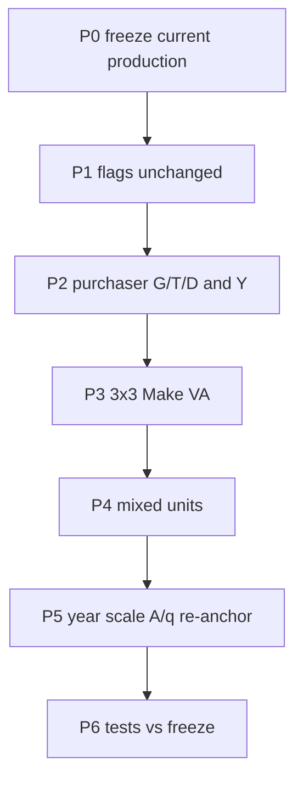

# EIA-anchored G/T/D — code implementation

Replace today’s 3-way split and mixed-units conversion **in place**. Methods are settled in [Discussion #88](https://github.com/cornerstone-data/methods/discussions/88) and the methods record (`elec_cf_production_ffe5fb51.plan.md`). Do not reopen D0–D14 here.

**Do not start P1 until P0 is written and committed.** No new config flags. Co-production cleanup unchanged. MECS deferred.



## Methods this code must keep

- Four Table 2.2 class MWh = EIA Table 2.2 **shares of Total End Use** × **(eGRID − Table 2.14 export MWh)**; Industrial includes Direct Use; within class ∝ electricity $. `F04000` is the **Exports** class: generation MWh = Table 2.14 Canada + Mexico (same year as eGRID; if EPA lags, latest 2.14 year and log it). Do not change the `F04000` dollar bill; leftover via D8. Do not put `F04000` 100% on generation.
- Each purchaser's `221100` **dollar** bill unchanged; leftover T&D = bill − generation $. If gen $ would exceed a bill, **water-fill within class** (remainder to remaining slack). Nibble that class only if class bills < `p × class MWh`.
- `p` numerator = **2017** UGO generation share of `221100` Use+Y, including at the model year.
- Leftover T vs D = **2017** UGO T/(T+D) (~5.92% / 94.08%) on the 2017 chain **and** after D6.
- Off-diagonals 0. **`T_dom = Udom[221100,221100]`.** `Udom[G,G]` from Industrial+Direct Use, clipped to `T_dom`; remainder on `Udom[T,T]` / `Udom[D,D]`. **`Uimp[221100,221100]` → `Uimp[G,G]` only** (D11; no leftover T/D on imported self-use). Clip D1 against `T_dom` only, not `T_dom + Uimp`. If clip fires, put the clipped generation $ on other Industrial purchasers (class MWh still hit the D0 target).
- Make-last. Columns: fuels → gen; Make-last weights; spill other non-fuel if `VA_G` &lt; 0.
- Mixed units: `c_col` = eGRID / `q_$`; `c_row` = `1/p`; Table 2.4 out.
- 2017-chain eGRID = plant-net eGRID 2016 × (EIA 3.1 2017 / 3.1 2016) ≈ **4,039 TWh**. Published year: `us_total_net_generation_mwh(model_base_year)` (canonical 2024). Do not add GGL losses.
- Domestic generation Use+Y MWh = eGRID = `q` except a class-level nibble if that class cannot cover `p × class MWh`; extra import MWh = abs(F05000) / `p`; imports are generation only (no leftover).

## Today’s production (what we replace)

[`disaggregate_electricity_make_use_va`](bedrock/transform/eeio/electricity_disaggregation.py) order is Make (UGO) → Use 3×3 (Table 8.3) → columns (UGO) → compensating `w_row` on Use rows. Y is split later in [`derive_disagg_Ytot_with_trade`](bedrock/transform/eeio/cornerstone_disagg_pipeline.py) with `get_electricity_commodity_row_weights()`. Mixed units: [`electricity_conversion_factors`](bedrock/transform/eeio/cornerstone_disagg_pipeline.py) uses `us_total_net_generation_mwh(model_base_year)` and class-varying [`electricity_class_row_factors`](bedrock/transform/eeio/electricity_disaggregation.py) from Table 2.4. Year scaling then applies [`rescale_electricity_children_to_detail_GO_growth_A` / `_q`](bedrock/transform/eeio/electricity_disaggregation.py) from [`cornerstone_year_scaling.py`](bedrock/transform/eeio/cornerstone_year_scaling.py), then commodity-PI inflation in [`derive_cornerstone_Aq_scaled`](bedrock/transform/eeio/derived_cornerstone.py). Mixed units consume that cached A/q. `y_nab` is `backcompute_y_from_A_and_q` on that object.

**New 2017-chain order** inside the 3-way: commodity rows + Y first (non-electricity columns only) → Use 3×3 (D1/D10) → Make-last → columns/VA → drop `221100`. Then year scaling 1a (unchanged intermediate), PI inflation, then **P5 re-apply at the end of `derive_cornerstone_Aq_scaled`** (3-way flag). Mixed units consume that already-reanchored monetary A/q.

Year scaling is **not** V/U/VA. Do not re-run Make-last on 2017 [`derive_disagg_io_bundle().V`](bedrock/transform/eeio/cornerstone_disagg_pipeline.py) after inflation.

## Shared purchaser model (P2 + P3 + P5 consume this)

[`disaggregate_electricity_make_use_va`](bedrock/transform/eeio/electricity_disaggregation.py) and [`derive_disagg_Ytot_with_trade`](bedrock/transform/eeio/cornerstone_disagg_pipeline.py) are separately `@cache`d. Today Y is split later via `get_electricity_commodity_row_weights()`. Writing Use and Y independently will either cycle (`make_use_va` → `derive_disagg_Ytot_with_trade`) or allocate twice and diverge on clip.

**Two layers — do not make the 2017 U/Y getter the only API.**

1. **Pure allocator** `allocate_purchaser_gtd` (no IO getters, not `@cache`d on frames). Frozen dataclass `PurchaserAllocation` with **Series** aligned to `bills.index` (do not use `gen$` / `T$` / `D$` as field names — not valid identifiers): `bill`, `end_use_class`, `mwh`, `gen_dollars`, `t_dollars`, `d_dollars`, `clipped`; scalars `p`, `egrid_mwh`, `td_share`.

   Signature: `(bills: pd.Series, *, self_use_key: str, eia_year: int, p_share_2017: float, td_share_2017: float) -> PurchaserAllocation`

   `bills` is **domestic** D8 bills only (indexed by Use columns ∪ Y columns). Do **not** pass `Uimp` into this function (D11 is a separate write). Class dollar weights: `clip(lower=0)` for **shares only**. Drop `F05000` from Table 2.2 pools. `F04000` is Exports (D0).

   **Self-use key is always `'221100'`.** 2017 chain: that column exists. P5: drop `221110`/`221121`/`221122` from `bills`, set `bills['221100']` = sum of those three **industry** electricity bills, then call the allocator. Do **not** use `'221110'` (a real child column) or a sentinel `'2211XX'`. Force `end_use_class['221100']` to **Industrial** (do not look it up in `build_end_use_map()`: that map has no `221100`, and a Commercial default would steal D1 from the Industrial pool). **`T_dom` = `bills['221100']`.** D10 clip-to-`T_dom` + Industrial redistribute lives here. After the call, P5 writes `gen_dollars`/`t_dollars`/`d_dollars` for `'221100'` onto the child **diagonals**, not onto a `221100` A column.

2. **2017 cached getter** `get_2017_purchaser_allocation`: **`Udom` / `Uimp` from [`_derive_post_reallocation_checkpoint_for_disagg`](bedrock/transform/eeio/electricity_disaggregation.py)** (post-reallocation V/U/VA; this is the existing helper — do not “find” Udom via `derive_disagg_io_bundle`). Pre-split Y from [`_derive_y_before_electricity_disagg`](bedrock/transform/eeio/cornerstone_disagg_pipeline.py). Domestic bills = `Udom` + Y **except** `F05000`. Call `allocate_purchaser_gtd(..., self_use_key='221100', eia_year=2017, ...)`. Write **`Uimp` generation-row for `j ≠ 221100`** (D11, no leftover). **Leave `Uimp[221100,221100]` on the aggregate** for P3 to place as `Uimp[G,G]`. Do **not** call `derive_disagg_Ytot_with_trade` or `derive_disagg_io_bundle` from this getter.

P5 does **not** call `get_2017_purchaser_allocation`. It builds a model-year `bills` Series from the pre-1a snapshot below and calls `allocate_purchaser_gtd`.

**P2 Use-row writer:** a new function (e.g. `write_purchaser_gtd_use_and_y`). Do **not** call [`disaggregate_use_commodity_rows`](bedrock/transform/eeio/electricity_disaggregation.py) “with a small tweak”: that function skips only `221110`/`221121`/`221122`, not `221100`, and zeros the aggregate row.

Register new `@cache`s (`get_2017_purchaser_allocation` and any Table 2.2 / 2.14 / 3.1 loaders that live in `electricity_disaggregation.py`) in [`cache_reset.py`](bedrock/publish/cache_reset.py) `_ELECTRICITY_DISAGG_CACHED_ATTRS`. **The pre-1a intercept store lives in [`cornerstone_year_scaling.py`](bedrock/transform/eeio/cornerstone_year_scaling.py)** — `_ELECTRICITY_DISAGG_CACHED_ATTRS` only walks `electricity_disaggregation`, and `_clear_cached_attrs` only calls `cache_clear`. Implemented names: dataclass `SummaryYearScaledAq`, getter `get_summary_year_scaled_aq`, clearer `clear_summary_year_scaled_aq()` (this plan originally called them `Pre1aAq` / `get_pre_1a_aq` / `clear_pre_1a_aq`; those names are aliases for the same objects). The clearer wipes the intercept **store** (not only `@cache`). Extend `_clear_electricity_caches_if_loaded` to call `clear_summary_year_scaled_aq()` when `cornerstone_year_scaling` is loaded (otherwise a flag switch keeps a stale pre-1a snapshot). Table 2.2 / 2.14 / 3.1 / `egrid_mwh_for_io_year` caches belong on whichever module that clearer actually walks — if they live in extract/`egrid_generation.py`, register them there, not only in `_ELECTRICITY_DISAGG_CACHED_ATTRS`. Same `_CACHED_FUNCTIONS` tuples in [`test_electricity_disaggregation.py`](bedrock/transform/eeio/__tests__/test_electricity_disaggregation.py), [`test_electricity_mixed_units.py`](bedrock/transform/eeio/__tests__/test_electricity_mixed_units.py), and [`test_inflation_helpers_cornerstone.py`](bedrock/utils/economic/__tests__/test_inflation_helpers_cornerstone.py). Drop `get_electricity_commodity_row_weights` from those lists once it is gone from the production path.

## P0 — Freeze current production (first, on today’s code)

New package next to diagnostics, not inside it:

```text
bedrock/analysis/electricity_disagg_eia/
  README.md
  paths.py
  snapshot_current_production.py
  compare_to_baseline.py          # stub until P6
  output/baseline_current_production/
```

Run existing waterfall configs `2025_usa_cornerstone_v0_3_electricity_disaggregation` and `…_electricity_mixed_units`. Commit the snapshot (git SHA, datetime, flags). Write under `output/baseline_current_production/` with **named files** so P6 `compare_to_baseline.py` is not invented twice, e.g. `q.parquet`, `x.parquet`, `use_y_generation.parquet`, `intersection_3x3.parquet`, `E.parquet`, `D.parquet`, `N.parquet`, `BLy.parquet`, `class_generation_mwh.parquet`, `run_metadata.json`. Include `q`/`x` G/T/D, generation Use+Y $, `U[G,G]`, F01000 generation, electricity 3×3, electricity rows+Y, `E`/`D`/`N`/BLy, and **class generation MWh** as Residential / Commercial / Industrial / Transportation / **Exports** / HH, with Commercial **excluding** `F04000` (today’s map lumps exports into Commercial — slice `F04000` out of Commercial for the freeze so P6 can compare to D0). Optional CF compare in `compare_to_baseline.py` used 2018 eGRID and absolute sales — label it historical; it is not a P6 gate.

**How to record `p` on today’s path (there is no single production `p` now):**

- 3-way-only freeze: record `p` as **N/A**. Also record generation Use+Y $ and (if mixed-units config) `c_col` / `c_row`.
- Mixed-units freeze: record an **implied** generation price `q_$[221110] / eGRID` (today’s `1/c_col`) plus the class-varying `c_row` Series. Label it implied, not D0 `p`.

Do **not** freeze footing or reallocation configs. **Do not start P1 until this commit exists.**

## P1 — Flags

No new flags in [`usa_config.py`](bedrock/utils/config/usa_config.py). `implement_electricity_reallocation` unchanged. `implement_electricity_disaggregation` and `implement_electricity_mixed_units` keep their names; only the functions behind them change. YAML configs keep the same names.

Tests: flags off (canonical v0.3) and reallocation-only stay bit-identical.

**Phi (same PR, not a new flag):** when `implement_electricity_disaggregation` is on, [`phi_for_sectors`](bedrock/transform/iot/derive_PRO_to_PUR_ratio.py) sets `221110` / `221121` / `221122` to **1.0** after reindex. Do not rely only on `reindex(..., fill_value=1.0)`. Extend [`test_phi_helpers.py`](bedrock/transform/iot/__tests__/test_phi_helpers.py) (and [`test_sef_phi_wiring.py`](bedrock/publish/__tests__/test_sef_phi_wiring.py) if that path sees a 407 index).

## P2 — Purchaser G/T/D builder

### New production inputs (schemas)

Promote Table 2.2 from diagnostics [`_eia_table_2_2_sales_mwh`](bedrock/analysis/electricity_disagg_diagnostics/hh_vs_interindustry/hh_vs_interindustry.py) into production (extract/transform helper). Need **Total End Use**, Residential, Commercial, Industrial, Transportation, **Direct Use** (already in [`EIA_ElectricPowerAnnual.yaml`](bedrock/extract/eia/EIA_ElectricPowerAnnual.yaml) `epa_02_02`).

- **Table 2.2 loader return:** `dict[str, float]` with keys `Residential`, `Commercial`, `Industrial`, `Transportation`, `Direct Use`, `Total End Use` (MWh). Raise if `Total End Use` or `Direct Use` is missing. Do **not** copy `_eia_table_2_2_sales_mwh`’s `ActivityProducedBy == "Total Electric Industry"` mask — Direct Use / Total End Use may be other provider rows; inspect FBA keys. Industrial pool = Industrial + Direct Use. Class shares = pool / Total End Use (Residential, Commercial, Industrial pool, Transportation).
- **`eia_table_2_14_export_mwh(year)`:** EIA Table 2.14 Canada + Mexico **exports** (`epa_02_14`). Filter `FlowName == "electricity exports"` and `Location` in Canada / Mexico (parser already drops the U.S. total block). Confirm units against the extract (`flow_amount_scale: 1` on `epa_02_14` vs `1000` on Table 3.1). If that year is missing, use the latest available 2.14 year and log it.
- **`eia_table_3_1_total_mwh(year)`:** EIA 3.1.A + 3.1.B all-sector net generation (`epa_03_01_a` / `epa_03_01_b`). Filter `ActivityProducedBy == "Total (all sectors)"` and sum `FlowAmount` (extract already drops double-count columns). Raise if 2016 or 2017 is missing (D12 has no fallback).
- **[`egrid_mwh_for_io_year(year)`](bedrock/extract/disaggregation/egrid_generation.py):** if `year == 2017`, `us_total_net_generation_mwh(2016) * eia_table_3_1_total_mwh(2017) / eia_table_3_1_total_mwh(2016)`; else `us_total_net_generation_mwh(year)`. P6 unit test: 2017 result ≈ **4.038559e9 MWh** (report 4,039 TWh).

Purchaser builder (new functions in `electricity_disaggregation.py`, port allocation ideas from the CF but **not** absolute sales or Table 2.4 leftover):

- Four-class MWh = EIA Total End Use **shares** × (eGRID − `eia_table_2_14_export_mwh`); Industrial pool = Industrial sales + Direct Use. `F04000` MWh = that export total. Four-class + `F04000` = eGRID.
- 2017 getter calls the allocator as above. `p` = (2017 UGO gen share × domestic `221100` Use+Y $) / eGRID. T/(T+D) from `build_electricity_disagg_go_weights()` (always the 2017 column, including after year scaling).
- `gen` water-fill within class: if `bill <= 0`, `gen = 0` (D13: clip-to-0 is for **shares** only; leftover may stay negative). Else each purchaser `min(proportional MWh_j × p, bill)`; put clipped $ on remaining slack in that class; nibble the class only if class bills < `p × class MWh`. Leftover = bill − gen; split leftover with 2017 T/(T+D). 2017 live IO: no class is tight (Industrial bills/needed ≈ 1.7×); first-pass clips = 0.
- **2017-chain drop order:** P2 writes G/T/D rows on Use columns **`≠ 221100`** and on **all Y columns**. It **leaves** `U[221100,221100]` on the aggregate (electricity industry columns do not exist yet). **P2 writes `Uimp` onto the generation row only for `j ≠ 221100`.** Leave `Uimp[221100,221100]` on the aggregate for P3. Do **not** call [`disaggregate_use_commodity_rows`](bedrock/transform/eeio/electricity_disaggregation.py) unchanged: that function skips only `221110`/`221121`/`221122`, not `221100`, and zeros the aggregate row — that would destroy `T` before P3. Do not drop `221100` here.
- `derive_disagg_Ytot_with_trade` consumes the 2017 getter (stop using `w_row`). Imports: 100% generation; extra MWh = abs(F05000)/`p`.

Drop `_compute_w_row` / `get_electricity_commodity_row_weights` from the production path. [`test_production_matches_compensated_scenario`](bedrock/analysis/electricity/d_85/__tests__/test_production_matches_compensated_scenario.py) is not a live production identity after this; P6 retargets it to the P0 freeze or deletes it. Do not skip/xfail production tests to land the replacement.

Keep [`electricity_end_use_mapping.py`](bedrock/transform/eeio/electricity_end_use_mapping.py) as the class map. Extend `EPAEndUse` with `'Exports'` (today the Literal is only the four Table 2.2 classes + `'Total'`). In P2, change `END_USE_MAPPING_REVIEW_STATUS` from DRAFT to adopted for EIA-anchored G/T/D. Drop `F05000` from D0 class weights (D13) even though `_FD_DEFAULTS` labels it Commercial. Electricity children stay Industrial; map `F04000` → **Exports**, not Commercial. Do not reopen NAICS/FD catch-alls in this replacement.

**Table 2.4 / analysis d_85:** the allocator and mixed units do **not** call Table 2.4. Changing `_FD_DEFAULTS['F04000']` to Exports would KeyError any helper that indexes `electricity_end_use_retail_prices_cents_kwh` by class (no Exports ¢/kWh). Do not port d_85 to the new method. In the price helper only, skip Exports or fall back to Commercial **for the ¢/kWh lookup** — that is not a D0 class assignment. Production classification stays Exports.

## P3 — 3×3, Make, columns

After P2 has non-electricity Use rows + Y, with `U[221100,221100]` still present:

- Use 3×3 (**Udom vs Uimp, matches D10/D11**): `T_dom = Udom[221100, 221100]`. `Udom[G,G] = min(D1 Industrial slice × p, T_dom)`. Remainder `T_dom − Udom[G,G]` on `Udom[T,T]`/`Udom[D,D]` with 2017 T/(T+D); off-diagonals 0. **When P3 materializes the G/T/D 3×3 (the first moment child columns exist), set `Uimp[G,G] = Uimp[221100,221100]`** (or the P2 generation-row copy of that cell), zero the aggregate intersection, and **do not apply D10 leftover to Uimp**. Clip D1 against **`T_dom` only**, not `T_dom + Uimp`. Table 8.3 intersection weights drop out (`disaggregate_use_intersection`).
- **D10 clip + redistribute:** already applied inside `allocate_purchaser_gtd` against `T_dom`. P3 writes the **Udom** diagonals from that result. If clip fired, other Industrial purchasers already carry the redistributed generation $; the generation industry column is unchanged.
- **`Uimp[G,G]` is a P3 write.** `_split_aggregate_column_by_rule` still skips electricity rows, so this P3 placement is the only `Uimp[G,G]` write that survives dropping `221100`. “Written once” means do not also apply leftover T/D on Uimp, not “P3 never touches the cell.” P2 already wrote `Uimp` generation-row for `j ≠ 221100`; P3 does **not** rewrite those.
- P3 **overwrites** any leftover that a naive P2 write would have put on the electricity industry **Udom** column (D1: gen column buys generation only).
- Make: reverse order — `disaggregate_make_intersection` takes **domestic** Use+Y row-total shares (`Udom` + Y), **not** `Uimp`. Including imports would make `q` include extra import MWh (fights D11). Not `w_go`.
- **GO-identity absorb:** call [`_enforce_go_identity_precondition`](bedrock/transform/eeio/electricity_disaggregation.py) after P2 non-electricity Use-row writes and **before** the 3×3 and Make-last, while `221100` is still the sole electricity industry on V/U/VA and the original `U[221100,221100]` is still on the aggregate column. It mutates aggregate VA. Do **not** call it after Make-last (`disaggregate_make_intersection` drops `221100` from V) or after the 3×3 has moved self-use off the 221100 column (the 1% relative check would fail). Then `disaggregate_use_industry_columns` takes Make-last `w`. Fuels 100% → gen. If `VA_G` &lt; 0, spill other non-fuel to T/D until 0; else warn and keep negative VA as today.
- **Drop `221100` only after** Make-last + columns (rows already rewritten except the intersection, which P3 replaces).
- **Drop the VA-row-total-preserved assert** in `disaggregate_use_industry_columns` (Make-last `x` is not UGO `x`; G/T/D VA row sums need not equal the old aggregate VA row). Keep the per-column `inputs + VA = x_s` balance assert. Use-row totals on non-electricity commodities across the three columns still preserved.

## P4 — Mixed units

In `electricity_conversion_factors`:

- `c_col` stays `electricity_output_factor(q_$, eGRID)` with **`egrid_mwh_for_io_year(model_base_year)`**, not raw `us_total_net_generation_mwh`. A 2017 model year has no stewi inventory; D12 must apply.
- `c_row` is a **Series on A columns**, every entry `1/p`. Y entries are unused once `_model_year_y_row_221110` is gone — do not require a Y-indexed `c_row`. Do not call `electricity_class_row_factors` with Table 2.4 prices.
- Stop calling `electricity_end_use_retail_prices_cents_kwh` / Table 2.4 from `electricity_conversion_factors`.
- Drop `_model_year_y_row_221110` from the conversion path once P5 has rewritten generation rows (no 2017-share split of backcomputed y).

Rewrite [`test_electricity_mixed_units.py`](bedrock/transform/eeio/__tests__/test_electricity_mixed_units.py) assertions that Industrial `c_row` &gt; Residential `c_row`.

Keep both `y_nab` getters: [`derive_cornerstone_y_nab`](bedrock/transform/eeio/derived_cornerstone.py) from `Aq_scaled` (dollars); [`derive_cornerstone_y_nab_mixed_units`](bedrock/transform/eeio/derived_cornerstone.py) from mixed A/q (generation in MWh). Do not force mixed-units `y_nab[221110]` to dollars.

## P5 — Year scaling (A/q write-back, after PI inflation)

Leave `rescale_electricity_children_to_detail_GO_growth_A` / `_q` as an **intermediate** after summary `"22"` inside [`scale_cornerstone_A` / `scale_cornerstone_q`](bedrock/transform/eeio/cornerstone_year_scaling.py). That hook is **before** commodity-PI inflation. Those functions do not exist in A/q space as V/U/VA Make-last.

**Hook (settled):** the **end of** [`derive_cornerstone_Aq_scaled`](bedrock/transform/eeio/derived_cornerstone.py), after PI inflation, gated on `implement_electricity_disaggregation` — **not** on mixed units, and **not** only inside [`build_electricity_mixed_units_aq`](bedrock/transform/eeio/cornerstone_disagg_pipeline.py). **Skip P5** on the early return `if cfg.scale_a_matrix_with_useeio_method` (that path returns unscaled 2017 `base`). **Run P5 on both** the `apply_io_year_adjustments` (commodity-PI) branch and the industry-PI branch — electricity YAMLs use `apply_io_year_adjustments: True`. D6 is a published-year identity whenever the 3-way flag is on. `y_nab`, snapshot `Adom`/`q`, 3-way-only diagnostics (`derive_Aq_usa` / `pull_efs_for_diagnostics`), and mixed-units `c_col` (`electricity_conversion_factors(derive_cornerstone_Aq_scaled())`) all consume this object. Mixed units then convert already-reanchored monetary A/q.

Do **not** put P5 only in the mixed-units builder: the 3-way-only waterfall would keep the 1a-inflated 2017 mix, and `derive_cornerstone_B_mixed_units` would compute `c_col` from a pre-P5 `q_$`.

**Pre-1a snapshot (closed retrieval — no undo-A-only shortcut).** 1a also scales `q_G/T/D`. Commodity PI is `diag(p) @ A @ diag(1/p)` with `q *= p`. Undo-A-only (`A[k,j] / r_k`) times post-1a `q` multiplies G/T/D **industry** bills by the 1a `q` factor and is **wrong**. Code names this snapshot `SummaryYearScaledAq` (`get_summary_year_scaled_aq` / `clear_summary_year_scaled_aq`); this plan originally called it `Pre1aAq` (`get_pre_1a_aq` / `clear_pre_1a_aq`). Same intercept: after summary `"22"` and the 0.98 column-sum fix, before detail GO-growth 1a.

**Named type (implemented):** `@dataclass(frozen=True) class SummaryYearScaledAq: Adom: pd.DataFrame; q: pd.Series`. Getter: `get_summary_year_scaled_aq(original_year, target_year) -> SummaryYearScaledAq` (`@cache` on **years only** — DataFrame inputs are not a cache key). Clearer: `clear_summary_year_scaled_aq()`. This plan originally named these `Pre1aAq` / `get_pre_1a_aq` / `clear_pre_1a_aq`; use the `SummaryYearScaled*` names in code. Register the clearer in `cache_reset.py` (not the getter in `_ELECTRICITY_DISAGG_CACHED_ATTRS`).

**Intercept, do not re-derive:** split [`scale_cornerstone_A`](bedrock/transform/eeio/cornerstone_year_scaling.py) / [`scale_cornerstone_q`](bedrock/transform/eeio/cornerstone_year_scaling.py) so the snapshot **is** the live object after summary `"22"` **and** the 0.98 column-sum fix (A) / summary-q scale (q), **before** `rescale_electricity_children_to_detail_GO_growth_*`. Include the dollar-year rebase that already happens inside those functions when `apply_io_year_adjustments` is on. Do **not** re-run ratios from [`derive_cornerstone_Aq()`](bedrock/transform/eeio/derived_cornerstone.py) into a parallel snapshot — that would miss the 0.98 fix and diverge from live A/q. `scale_cornerstone_A` / `_q` call the same helper, then apply 1a.

**Store A only on the `dom` call.** `scale_cornerstone_A` is invoked for `dom`, `imp`, and `total`. Write `SummaryYearScaledAq.Adom` (originally `Pre1aAq.Adom`) only when `dom_or_imp_or_total == 'dom'`. The `imp` / `total` calls **must not overwrite** that snapshot. `get_summary_year_scaled_aq` (originally `get_pre_1a_aq`) returns the intercepted live objects; it **must not re-invoke** `scale_cornerstone_A` / `_q` (that would be first-call-wins if `imp` ran first, or a second scale). If the `dom` intercept has not run, raise. P5 runs after `derive_cornerstone_Aq_scaled` has already scaled domestic A, so the store is populated.

P5 inflates `get_summary_year_scaled_aq(...).Adom` / `.q` with the **same** PI helpers the live path just used (`inflate_cornerstone_A_matrix_with_commodity_pi` + `inflate_cornerstone_q_or_y_with_commodity_pi`, or the industry-PI pair). Then industry bills = `(A_G + A_T + A_D) × q_j` on that inflated snapshot (domestic). FD total = `backcompute_y_from_A_and_q` on that snapshot. 1a still runs on live A/q; it must not change D8 totals.

At that hook:

1. **Bills Series for `allocate_purchaser_gtd`.** Industry: from the inflated pre-1a snapshot above. Collapse G+T+D electricity-industry bills into **`bills['221100']`** (drop the three child keys) before the allocator (`self_use_key='221100'`; class forced Industrial). There is no model-year Y **matrix**. For **non-import, non-export FD columns**, take the snapshot electricity `y` total (`backcompute_y_from_A_and_q` on the inflated snapshot — not `derive_cornerstone_y_nab()`, which would cycle) and spread it across **2017 Y electricity column shares**, excluding `F05000` and `F04000`. Do **not** renormalize those shares after dropping `F04000`/`F05000` (that would dump the export residual onto other FD bills). Do **not** reconstruct model-year `F05000` or `F04000` from those 2017 shares. **`F04000` dollar bill:** take the 2017 **G/T/D-indexed** electricity slice of [`derive_disagg_Ytot_with_trade()`](bedrock/transform/eeio/cornerstone_disagg_pipeline.py)`[F04000]` (or [`derive_cornerstone_Ytot_matrix_set()`](bedrock/transform/eeio/derived_cornerstone.py)`.exports`). **Sum only `221110+221121+221122`.** Do **not** inflate-and-sum all commodities. Do **not** use `_derive_y_before_electricity_disagg` for this bill (that frame’s `221100`×`F04000` **cell** is a scalar; PI `fill_value=1.0` skips inflation). Apply the pre-1a summary-`q` (or pre-1a `q`) ratio, then pass that G/T/D Series through the same `inflate_cornerstone_q_or_y_with_commodity_pi` or industry-PI helper as the live branch, **then sum**. Assign `F04000` generation **MWh** from Table 2.14 at the eGRID year (D0); apply D8 leftover on that bill.
2. Call `allocate_purchaser_gtd` (not `get_2017_purchaser_allocation`) at `model_base_year` with that `bills` Series, `self_use_key='221100'`, `eia_year=model_base_year`, **2017** gen share × inflated electricity Use+Y total for `p`, **2017** T/(T+D). Do not pass `Uimp` into the allocator. **D11 extra import MWh** = (scaled electricity `imports` from [`derive_cornerstone_Y_and_trade_scaled`](bedrock/transform/eeio/derived_cornerstone.py), sum of G+T+D) / `p`. Place that import $ on the generation row of the **imports / `y_imp` vector only** — **not** on `q` (output = domestic use) and **not** on Aimp. Aimp electricity rows are existing Uimp intermediates restated as 100% generation (already inside `F05000`, not additional).
3. **Write all Use-space electricity dollars and FD `y` first. Do not convert the 3×3 to A yet.** After year scaling there is no `U[221100,221100]` — three Industrial children exist. Do **not** write allocator `gen_dollars`/`t_dollars`/`d_dollars` straight into `Adom` for `221121`/`221122` as ordinary Industrial purchasers. **`T_dom` = `bills['221100']` from step 1.** Write `Udom[G,G] = min(D1 slice, T_dom)`; remainder on `Udom[T,T]`/`Udom[D,D]` with 2017 T/(T+D); off-diagonals 0. Write remaining electricity **Adom rows** for non-electricity industry purchasers from the allocator. Encode allocated **FD** G/T/D as `y` (FD is not an A column). Rewrite **Aimp** electricity **rows** (including the intersection) as 100% generation (D11).
4. **Then set `q`.** Make-last in A/q: `q` follows new **domestic** Use+Y G/T/D totals (`Udom` row sums + `y`), **not** `Aimp` and **not** the live 1a-inflated `q`.
5. **Then `A = U / q`, including the three diagonals.** `Adom[:, j] = Udom[:, j] / q_j` (same definition as live A / `backcompute_y_from_A_and_q`). Rebuild electricity **Adom and Aimp columns** for **non-electricity rows only** (collapse `U[:,G]+U[:,T]+U[:,D]`, re-split with Make-last `w`, fuels → gen, non-fuel spill if `VA_G` would go negative). **Skip electricity rows** in that column resplit (same as P3 `_split_aggregate_column_by_rule`). Converting the 3×3 to A *before* step 4, then skipping those rows in the column rebuild, freezes `A[G,G] * q_G ≠ U[G,G]`.
6. Do **not** overwrite 2017 `derive_disagg_io_bundle().V`. Published monetary A/q from `derive_cornerstone_Aq_scaled` is what changes (3-way-only and mixed-units configs).
7. **B `x` split (settled):** [`distribute_electricity_aggregate_x_using_v_row_shares`](bedrock/transform/eeio/electricity_disaggregation.py) uses **P5 `scaled_q` G/T/D shares**, not 2017 V row shares. Call this from the GHG-year `x` path after `derive_cornerstone_Aq_scaled` (no cycle: A/q does not depend on B). Vnorm stays on 2017 V.

Then mixed units (P4) with model-year eGRID, consuming this cached A/q.

## Decided during review

- **P5 hook:** end of `derive_cornerstone_Aq_scaled`, 3-way flag. Not mixed-units-only.
- **P5 Y bills:** no model-year Y matrix. Non-import, non-export FD: 2017 Y column shares × snapshot electricity `y` (`backcompute_y_from_A_and_q` on the inflated pre-1a Adom/`q` — not `derive_cornerstone_y_nab()`). D0: `F04000` MWh from Table 2.14; `F04000` $ = sum of 2017 Y **electricity** (`221110+221121+221122`) × `F04000` after pre-1a `q` ratio then the same PI helper as the live branch (not the full export column, not `_derive_y_before_electricity_disagg`). D11 extra import $ on the imports / `y_imp` generation row only — not on `q`, not added onto Aimp. Building a scaled Y matrix is out of scope.
- **B `x` after P5:** split GHG-year parent GO with P5 `q` shares. Do not rewrite 2017 V.
- **D8 clip:** water-fill within class so Use+Y MWh = eGRID. Nibble a class only if its bills cannot cover `p × class MWh`. P6 logs clipped $ / any class nibble.
- **D8 bill vs Uimp:** domestic bill = `Udom` + Y except `F05000`. `Uimp` is 100% generation, no leftover (D11).
- **P5 D8 bills vs 1a:** `get_summary_year_scaled_aq` (originally `get_pre_1a_aq`) intercepts live `scale_cornerstone_A`/`_q` after `"22"` + 0.98 (A), before 1a; store A **only** on the `dom` call; inflate with the same PI helpers; do **not** undo 1a on A rows only, do **not** re-scale from `derive_cornerstone_Aq()`, and do **not** re-invoke scale from the getter. `F04000` $ is 2017 Y electricity×`F04000` after `"22"`+PI, not a `y_nab` share.
- **P5 allocator vs 2017 getter:** P5 calls `allocate_purchaser_gtd` with `self_use_key='221100'` after collapsing child industry bills into that key. `get_2017_purchaser_allocation` reads Udom from `_derive_post_reallocation_checkpoint_for_disagg` and writes `Uimp` generation-row for `j ≠ 221100`; P3 places `Uimp[G,G]`.
- **P5 3×3 / A/q order:** write all Use-space electricity $ and FD `y` first; set `q` from domestic Use+Y; **then** `A = U/q` including diagonals; rebuild only non-electricity rows of G/T/D columns. Do not convert the 3×3 to A on 1a `q`. `T_dom` = collapsed domestic electricity-industry bill. Aimp rows 100% generation.
- **P5 Aimp columns:** rebuild electricity columns on Aimp the same way as Adom (fuels → gen).
- **P5 early return:** skip P5 when `scale_a_matrix_with_useeio_method`; run P5 on both commodity-PI and industry-PI branches.
- **`y_nab` under mixed units:** keep the two getters. Published / snapshot `y_nab` is dollars from `Aq_scaled`. Mixed-units `y_nab` is hybrid (221110 in MWh) so `q = A q + y` holds.
- **eGRID cap:** plant net generation only (`us_total_net_generation_mwh`). Do not add GGL losses. D12’s 4,039 TWh stays plant-net 2016 × EIA 3.1.
- **End-use map:** keep the live map. P2 changes `END_USE_MAPPING_REVIEW_STATUS` to adopted for EIA-anchored G/T/D. `F05000` out of D0 pools; electricity children Industrial; `F04000` **Exports** (D0). Broader mapping review is out of scope.
- **Exports (D0):** Table 2.14 Canada+Mexico on `F04000`. Four Table 2.2 classes share (eGRID − that MWh). Keep the `F04000` dollar bill; D8 leftover; do not put the column 100% on generation. If EPA lags `model_base_year`, latest 2.14 year and log it.
- **P6 CI (same PR as the replacement):** rewrite production tests and cache lists in the same change set that drops `w_row`. Do not skip/xfail. Analysis d_85 (`disagg_scenarios`, `test_compensated_scenario`, monetary_disagg, full_trace) stays historical vs the old 3-way / P0 freeze; do not rewrite those in this PR.
- **`p` numerator:** 2017 UGO generation share only. Missing UGO is an error. Do not fall back to Table 8.3 Production / (Production+T+D) (~87% gen, opex not GO).
- **Phi on electricity children:** when the 3-way flag is on, `phi_for_sectors` sets `221110` / `221121` / `221122` to **1.0** (PRO = PUR), matching USEEIO Phoebe `221100`. Do not rely only on `reindex` fill. Other commodities keep their Phi. Leftover T&D is D8, not a Phi haircut. Mixed units: generation `N` is per MWh, so Phi ≠ 1 on `221110` is the wrong units.

## P6 — Tests and comparison

**Same PR as P1–P5.** Rewrite production CI; do not preserve bit-identical; do not skip/xfail to land the replacement.

- [`test_electricity_disaggregation.py`](bedrock/transform/eeio/__tests__/test_electricity_disaggregation.py): drop `w_row` market-clearing as a production identity. **`TestCompensatingRowWeights`:** delete `test_compute_w_row_closes_market_clearing` when `_compute_w_row` dies; retarget `test_getter_does_not_call_io_bundle` onto `get_2017_purchaser_allocation` (still must not call `derive_disagg_io_bundle` / `derive_disagg_Ytot_with_trade`). **`TestTable83UseIntersectionWeights`:** rewrite to assert the new D10/D11 write (`Udom` remainder on T/T and D/D; `Uimp` intersection → G,G only; Table 8.3 weights unused). Also assert non-intersection `Uimp` electricity rows are 100% generation. **`TestStep3WorkedExample`:** after dropping the VA-row-total-preserved assert, keep a worked example that still checks per-column `inputs + VA = x_s` and Use-row totals on non-electricity commodities. Keep schema 407, Make/Use balance (`q` follows **domestic** Use+Y), GO weights still used for `p` and T/(T+D). Optional: pre-1a industry bills ≠ post-1a `Adom ⊙ q` (1a must not be the published D8 bill).
- **1a vs published q (two tests, do not merge):** keep [`test_apply_io_plus_elec_child_q_matches_detail_GO_growth`](bedrock/transform/eeio/__tests__/test_electricity_disaggregation.py) as “1a still runs” on `scale_cornerstone_q` (intermediate child `q` still matches detail GO growth). Add a **separate** assert on `derive_cornerstone_Aq_scaled` (3-way-only config) that **published** electricity `q` is **not** that 1a result (P5 overwrote it). Retarget [`test_differentiated_child_q_scaling`](bedrock/transform/eeio/__tests__/test_electricity_disaggregation.py): today it treats `derive_cornerstone_Aq_scaled` child `q` as 1a-differentiated — that becomes the scale_cornerstone_q test, not the published A/q test. **P5 order lock:** published `Adom[i,j] * q[j]` equals allocated Udom for electricity rows **including the three diagonals**, and `backcompute_y_from_A_and_q` electricity FD matches the written `y`. Make/Use balance alone (`q` = U+y) does not catch converting the 3×3 to A on 1a `q`.
- Mapping: `assert build_end_use_map()['F04000'] == 'Exports'`.
- Mixed-units tests: flat `c_row` (all `1/p` on A columns; Y entries unused once `_model_year_y_row_221110` is gone — do not keep a Y-indexed `c_row` requirement); domestic gen Use+Y MWh = eGRID (allow a documented class nibble if bills < `p × class MWh`); four-class mix vs EIA 2.2 shares of (eGRID − 2.14); `F04000` generation MWh ≈ Table 2.14 (not Table 2.4). Add an order-of-magnitude check that export MWh is ~10 TWh, not ~10 GWh (loader units vs Table 3.1 `flow_amount_scale: 1000`). Stop patching `electricity_end_use_retail_prices_cents_kwh` on the conversion path.
- Cache lists in the same PR: drop `get_electricity_commodity_row_weights` from [`cache_reset.py`](bedrock/publish/cache_reset.py) `_ELECTRICITY_DISAGG_CACHED_ATTRS` and from `_CACHED_FUNCTIONS` in [`test_electricity_disaggregation.py`](bedrock/transform/eeio/__tests__/test_electricity_disaggregation.py), [`test_electricity_mixed_units.py`](bedrock/transform/eeio/__tests__/test_electricity_mixed_units.py), and [`test_inflation_helpers_cornerstone.py`](bedrock/utils/economic/__tests__/test_inflation_helpers_cornerstone.py); register `get_2017_purchaser_allocation` there. **Do not** put `get_summary_year_scaled_aq` (originally `get_pre_1a_aq`) in `_ELECTRICITY_DISAGG_CACHED_ATTRS` — call `clear_summary_year_scaled_aq()` (originally `clear_pre_1a_aq()`) from `_clear_electricity_caches_if_loaded`. Table loaders / `egrid_mwh_for_io_year` register on the module those clears actually walk.
- P6 clip diagnostic: per-class bills vs `p × MWh`, water-fill remainder, any class nibble vs eGRID.
- `egrid_mwh_for_io_year(2017)` ≈ **4.038559e9** MWh.
- [`test_production_matches_compensated_scenario`](bedrock/analysis/electricity/d_85/__tests__/test_production_matches_compensated_scenario.py): retarget to the P0 freeze or delete. It is not a live production ≡ Table 8.3 + `w_row` identity.
- Leave analysis d_85 (`disagg_scenarios`, `test_compensated_scenario`, monetary_disagg, full_trace) as historical documentation of the old 3-way. Do not port those to the new method in this PR.
- Phi: with 3-way on, `phi_for_sectors` on a 407 index returns 1.0 for `221110` / `221121` / `221122` even when `cornerstone_industry_avg_margins` is on.

[`compare_to_baseline.py`](bedrock/analysis/electricity_disagg_eia/compare_to_baseline.py): live new vs P0 freeze (and optionally the existing CF report). Waterfall names unchanged.

## Out of scope

- MECS inside Industrial.
- Changing co-production cleanup.
- 407 as default canonical schema.
- New flags or extra waterfall configs.
- Fitting exports by rewriting the `F04000` **dollar** bill, or putting `F04000` 100% on generation. D0 is the production identity for export **MWh**; leftover on that column stays D8.
- Re-running Make-last on 2017 V after year scaling.
- Porting analysis d_85 / monetary_disagg / full_trace off Table 8.3 + `w_row` in this PR.
