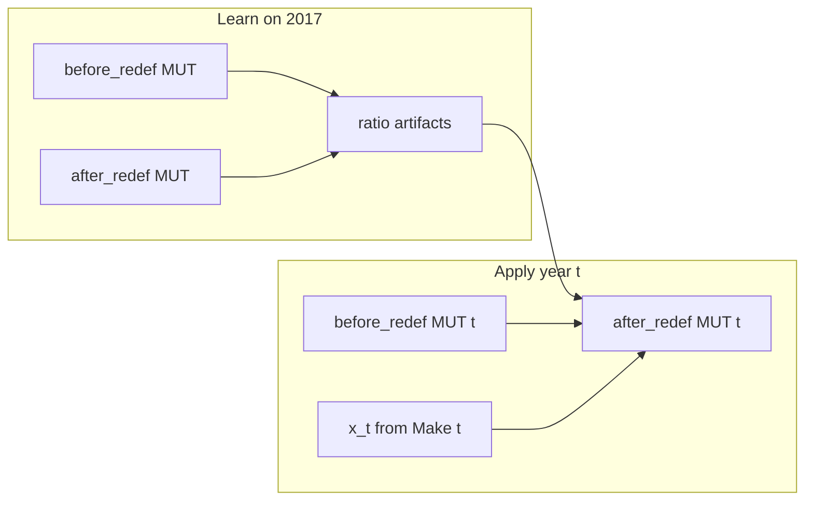

# Redefinition-ratio Step 7 implementation plan

**Location:** [`bedrock/analysis/nowcasting/after_redef_MUTs/redefinitions_ratio_implementation/ratio-plan.md`](ratio-plan.md)

## Motivation

The reconstruction report ([BEA-style_redefinitions_reconstruction_report.md](../BEA_style_redefinitions_implementation/BEA-style_redefinitions_reconstruction_report.md)) shows:

- 2017 Use/VA/Import/Margins match **only** with C6; dest-B alone leaves ~559B Use gross residual; C1–C4 (13 pairs) worsen Use residual; C6 undoes ~22k spurious algo cells.
- Keeping B+C1–C4 as the “real” method with C6 as a small patch is not honest.
- Recommendation: realign Step 7 with the **#572 / `plan.md` ratio-carry** story for Use/VA/Import/Margins; do not paste GO ratios without a clear production path.

This plan implements that recommendation with a **single cellwise GO-ratio idiom everywhere** (including Make), so one story for year-`t` MUTs reconstructed from SUTs.

This file is the canonical plan. Pair it with a short README in this folder pointing at the reconstruction report as motivation.

---

## Settled decisions


| Decision                      | Choice                                                                                                                                                                                                                |
| ----------------------------- | --------------------------------------------------------------------------------------------------------------------------------------------------------------------------------------------------------------------- |
| Method                        | Per-cell 2017 movement ratios (`compute_coproduction_ratios` template for the *ratio* formula; MUT apply is cellwise, not the GO-vector transfer helper)                                                              |
| Make                          | **Cellwise** GO-ratio like Use (not share×V; **not** source→dest transfer). One idiom everywhere. Required so full-grid Make `assert_ok` can hold despite published column-sum leftover up to ~$10M                     |
| Control total                 | Make: **row** industry GO `x[i]=V.sum(axis=1)`; Use/VA/Import/Margins: **buyer** (column) industry GO `x[j]` when `j` is a Make industry                                                                               |
| BEA-style stack               | **Archive** under `after_redef_MUTs/BEA_style_redefinitions_implementation/code/`; **zero** production imports/calls/registrations                                                                                     |
| Production module             | **New** [`bedrock/transform/iot/nowcast_redefinition_ratios.py`](../../../../transform/iot/nowcast_redefinition_ratios.py)                                                                                            |
| Scope                         | 2017 learn + cell-by-cell accept **and** year-`t` apply API (synthetic/scaled tests OK; real non-2017 MUTs still from Step 6 later)                                                                                   |
| `compute_coproduction_ratios` | **Do not repurpose** for Use/Import/Margins; leave GO-vector helper on `main`/nowcast as-is. Step 7 may **call** it for ideas/tests but must not change its signature or use it as the MUT operator                   |
| `plan.md` / #572              | **Do not edit** in this PR (this work *is* that acceptance story)                                                                                                                                                     |
| Landing                       | **One CI-green PR** (or stacked PRs that never leave `main`/`nowcast` red): archive + new module + sections rewire land together. Do not merge “temporarily broken sections”                                            |


---

## Contracts

### Rounding

Define in the transform module (same number as `sections.ROUNDING_ATOL`; do not import `sections` into the transform). Import `MILLION_CURRENCY_TO_CURRENCY` from `bedrock.utils.economic.units`:

```text
ATOL = 0.5 * MILLION_CURRENCY_TO_CURRENCY   # $0.5M
```

A cell is stored when `abs(before - after) > ATOL` (subject to Use/VA/Import/Margins industry filters below). Do not use float `!= 0`.

### Industry code set

Import `USA_2017_INDUSTRY_CODES` from `bedrock.utils.taxonomy.bea.v2017_industry`. Use it wherever this plan filters buyers / Make industries (`j ∈ USA_2017_INDUSTRY_CODES`).

### Margins value columns

Module constant, exact strings matching `io_2017` / the existing BEA margins loaders (including apostrophes):

```text
MARGINS_VALUE_COLUMNS = (
    "Producers' Value",
    'Transportation',
    'Wholesale',
    'Retail',
    "Purchasers' Value",
)
```

### `x` (industry GO)

```text
industry_gross_output(V) -> pd.Series
# index = Make industry codes; value = V.sum(axis=1) in USD
```

When `apply_redefinition_ratios(..., ratios, x=None)`, always **copy** the five input frames first (never mutate the caller’s tables). If `x is None`, set `x = industry_gross_output(V)` from the **input** Make before any apply steps; if `x` is passed, use it as-is (still copy the five frames).

If `abs(x[i]) ≤ ATOL`, every ratio that would divide by `x[i]` is stored as `0` and apply moves `0` for that control.

### In-memory bundle

```text
@dataclass
class RedefinitionRatios:
    V: pd.DataFrame
    # columns: industry (str), commodity (str), ratio (float)
    # one row per Make cell with abs(delta) > ATOL (diagonal and off-diagonal)

    U: pd.DataFrame
    # columns: row_code (str), industry (str), ratio (float)
    # row_code = commodity code

    VA: pd.DataFrame
    # columns: row_code (str), industry (str), ratio (float)
    # row_code in V00100 / V00200 / V00300

    Uimp: pd.DataFrame
    # columns: row_code (str), industry (str), ratio (float)

    margins: pd.DataFrame
    # columns: industry_code (str), commodity_code (str), value_column (str),
    #          amount (float), scale (str)
    # scale ∈ {'go_ratio', 'absolute'}
    # value_column ∈ MARGINS_VALUE_COLUMNS (each ratio’d independently)
```

`load_redefinition_ratios() -> RedefinitionRatios`. `compute_redefinition_ratios(...) -> RedefinitionRatios` (no path I/O). `apply_redefinition_ratios(..., ratios: RedefinitionRatios, x=None)` is argument-only.

### On-disk artifacts (pinned)

Five tracked sparse tables under `bedrock/analysis/nowcasting/` (not `output/`). Add repo-root `.gitignore` negations:

```text
!bedrock/analysis/nowcasting/redefinition_ratios_2017_V.parquet
!bedrock/analysis/nowcasting/redefinition_ratios_2017_U.parquet
!bedrock/analysis/nowcasting/redefinition_ratios_2017_VA.parquet
!bedrock/analysis/nowcasting/redefinition_ratios_2017_Uimp.parquet
!bedrock/analysis/nowcasting/redefinition_ratios_2017_margins.parquet
```


| Artifact | Path                                       |
| -------- | ------------------------------------------ |
| Make     | `redefinition_ratios_2017_V.parquet`       |
| Use      | `redefinition_ratios_2017_U.parquet`       |
| VA       | `redefinition_ratios_2017_VA.parquet`      |
| Import   | `redefinition_ratios_2017_Uimp.parquet`    |
| Margins  | `redefinition_ratios_2017_margins.parquet` |


Path constants live next to the loaders in `nowcast_redefinition_ratios.py` (`_REDEF_DIR = Path(__file__).resolve().parents[2] / 'analysis' / 'nowcasting'`).

Read **and write** with string dtypes on all code columns (`industry`, `commodity`, `row_code`, `industry_code`, `commodity_code`, `value_column`, `scale`) so codes like `511200` stay strings. Parquet via `to_parquet` / `read_parquet`.

Remove the six BEA-style production negations (`redefinitions_2017_classification.csv`, `recipes.csv`, `overlay_*.parquet`) from root `.gitignore` once those files move into the archive folder (re-add archive-path negations only if those artifacts remain tracked under the archive).

---

## Operator (pinned)

Learn on 2017 (USD, loader units). Sign convention: `delta = before − after` (same as `compute_coproduction_ratios`). Apply: subtract `ratio * x` from the before cell (**no** destination credit on Make — cellwise only).

```text
x = industry_gross_output(V_before)
```

### Make (cellwise; diagonal and off-diagonal)

**Why not transfer:** Published 2017 before→after Make has per-commodity `|q_before − q_after|` up to ~$10M (tens of diagonal cells beyond `ATOL`). A source→primary transfer preserves column sums and therefore **cannot** meet full-grid Make `assert_ok(max_partial=0, …)`. Cellwise learns the published diagonal leftovers too.

Store every `(i, c)` with `abs(V_before[i,c] - V_after[i,c]) > ATOL` (no off-diagonal-only filter).

```text
ratio_V(i, c) = delta / x[i]   if abs(x[i]) > ATOL else 0
# apply year t (x_t frozen before mutation):
V[i, c] = V[i, c] - ratio * x_t[i]
```

No second write to a destination cell. Commodity-only codes that are not Make industries never appear as `i` (Make index is industries).

### Use / VA / Import (cellwise)

Store every `(row, j)` with `abs(delta) > ATOL` and `j ∈ USA_2017_INDUSTRY_CODES` (defensive: these tables have no FD columns; avoid KeyError on `x[j]`).

```text
ratio = delta / x[j]   if abs(x[j]) > ATOL else 0
# apply:
X_after_t[row, j] = X_before_t[row, j] - ratio * x_t[j]
```

Learn VA with `load_2017_value_added_before_redef_usa` vs `load_2017_value_added_usa` (after-only name unchanged).

### Margins

Index `(Industry Code, Commodity Code)`; five value columns each get their own stored row (`scale` + `amount`). `value_column` must be one of `MARGINS_VALUE_COLUMNS`.

**Industry buyers** (`industry_code ∈ USA_2017_INDUSTRY_CODES`):

```text
if abs(x[j]) > ATOL:
    amount = delta / x[j]     # go_ratio
else:
    amount = 0.0              # go_ratio; still store if abs(delta) > ATOL
# apply: M_after[(j,c), col] = M_before[(j,c), col] - amount * x_t[j]
```

(The `amount = 0` branch makes the local partition exhaustive with the global `x` rule; do not fall through to `absolute` for Make industries.)

**Non-industry buyers** (final-demand codes and any other `Industry Code` not in Make’s industry index): there is no Make `x[j]`. For those rows, if `abs(delta) > ATOL`, store **`scale='absolute'`** with `amount = delta` (USD). Apply:

```text
M_after[(j,c), col] = M_before[(j,c), col] - amount   # no x_t scale
```

That is the only deliberate exception to the GO idiom; it is required so 2017 margins can match when FD (or other non-Make) margin rows move. If no such row moves above `ATOL`, the absolute branch stores nothing.

Absent `(j,c)` on apply: treat missing before cells as 0; create the row when adding a nonzero move (union-align / `fillna(0)` as needed).




**2017 round-trip is by construction** when `x_t = x_2017`: every stored cell is `after = before − (before−after)/x_2017 * x_2017` (and absolute margins residuals replay unchanged). Year `t` uses that year’s Make-derived `x_t` for all `go_ratio` rows. This claim does **not** apply to a transfer-style Make operator (rejected above).

---

## Production layout

**New**

- [`bedrock/transform/iot/nowcast_redefinition_ratios.py`](../../../../transform/iot/nowcast_redefinition_ratios.py) — types, paths, `MARGINS_VALUE_COLUMNS`, `industry_gross_output`, `compute_redefinition_ratios`, `load_redefinition_ratios`, `apply_redefinition_ratios`
- [`bedrock/transform/iot/__tests__/test_nowcast_redefinition_ratios.py`](../../../../transform/iot/__tests__/test_nowcast_redefinition_ratios.py)
- [`bedrock/analysis/nowcasting/redefinition_ratios_2017.py`](../../redefinition_ratios_2017.py) — CLI (see below)

**Public API (standalone names/docstrings; no plan-phase numbering)**

- `industry_gross_output(V) -> pd.Series`
- `compute_redefinition_ratios(V_before, U_before, VA_before, Uimp_before, margins_before, V_after, U_after, VA_after, Uimp_after, margins_after) -> RedefinitionRatios`
- `apply_redefinition_ratios(V, U, VA, Uimp, margins, *, ratios, x=None) -> V, U, VA, Uimp, margins`
- `load_redefinition_ratios() -> RedefinitionRatios`

**CLI (`redefinition_ratios_2017.py`)**

```text
uv run python -m bedrock.analysis.nowcasting.redefinition_ratios_2017
uv run python -m bedrock.analysis.nowcasting.redefinition_ratios_2017 --check
```

Default (no flags): load the ten published 2017 before/after MUT loaders (Make / Use / VA / Import / Margins), call `compute_redefinition_ratios`, write the five tracked parquets under `_REDEF_DIR`.

`--check`: write the parquets first (same as default), then **`ratios = load_redefinition_ratios()`** (disk round-trip, not the in-memory compute result), `apply_redefinition_ratios` on the published before tables with that `ratios` and `x=None`, then exit **0** only if (1) Use-intermediate published before→after magnitudes match 5,740 / 553,635 / 42,893 / −7 and (2) applied Make / Use / VA / Import / Margins each match published after under `Tolerance(atol=ATOL, rtol=0)` with `assert_ok(max_partial=0, max_miss=0, max_extra=0, max_margin_partial=0)` (Margins via `compare_tables` once on the five-column frame, same as `compare_redef_margins_2017`). Exit **1** with printed failures otherwise.

**Keep**

- [`load_2017_value_added_before_redef_usa`](../../../../extract/iot/io_2017.py) and after-only [`load_2017_value_added_usa`](../../../../extract/iot/io_2017.py)
- Existing after-redef section *slots* in [`sections.py`](../../sections.py), **rewired** to the ratio apply path. Shared body loads the five before-redef inputs: `load_2017_V_before_redef_usa`, `load_2017_Utot_before_redef_usa`, `load_2017_value_added_before_redef_usa`, `load_2017_Uimp_before_redef_usa`, `load_2017_margins_before_redef_usa`, then `apply_redefinition_ratios(..., ratios=load_redefinition_ratios())` (not BEA `apply_redefinitions`).

**Archive (move out of production)**

Move into [`after_redef_MUTs/BEA_style_redefinitions_implementation/code/`](../BEA_style_redefinitions_implementation/code/) (create `code/` if needed):

- `nowcast_redefinitions.py`
- `redefinitions_2017.py` census/overlay CLI
- `redefinitions_2017_classification.csv`
- `redefinitions_2017_recipes.csv`
- `redefinitions_2017_overlay_U.parquet`
- `redefinitions_2017_overlay_VA.parquet`
- `redefinitions_2017_overlay_Uimp.parquet`
- `redefinitions_2017_overlay_margins.parquet`
- BEA unit/integration tests: **rename** so pytest does **not** collect them (e.g. `test_nowcast_redefinitions.py` → `nowcast_redefinitions_reference.py`, no `test_` prefix / no `Test*` classes discovered). Do **not** leave importable `bedrock.transform.iot.nowcast_redefinitions`.

Pinned CI rule for the archive tree (not a live package):

1. Archived Python is plain files under `.../code/`, **not** on `bedrock.transform` / `bedrock.analysis` import paths.
2. Add `bedrock/analysis/nowcasting/after_redef_MUTs/` to:
   - pytest `norecursedirs` **or** `collect_ignore` / `collect_ignore_glob` in root `conftest.py` / `pyproject.toml`
   - `[tool.mypy] exclude` in `pyproject.toml` (CI runs `mypy bedrock`; without this, renamed reference files that still say `from bedrock.transform.iot.nowcast_redefinitions` fail typecheck after production deletion)
   - ruff `extend-exclude` (or equivalent) for the same path so lint does not treat the archive as production
3. Production tests for BEA operators are **deleted** from `bedrock/transform/iot/__tests__/` after the rename-into-archive (no duplicate live tests).

**Production purge checklist**

- [`sections.py`](../../sections.py): no import of `nowcast_redefinitions` / `load_classification` / `load_overlay` / `load_recipes` / `apply_redefinitions`
- No `bedrock.transform.iot.nowcast_redefinitions` imports anywhere outside the archive folder
- Delete old production paths after the move (do not leave a stub that re-exports BEA operators)
- Rewrite the Make section note: acceptance is full-grid `assert_ok(max_partial=0, …)` because Make is cellwise; drop the BEA classified-source / $11M leftover gate text

---

## Acceptance and tests

**#572 gate (2017)**

- Apply learned ratios to published before tables → match published after on Use, VA, Import, Margins, **and Make** with `Tolerance(atol=ROUNDING_ATOL, rtol=0)` and `assert_ok(max_partial=0, max_miss=0, max_extra=0, max_margin_partial=0)`.
- Make uses that full-grid gate (cellwise operator makes it possible). Do **not** keep the BEA “classified-source + $11M leftover” gate.
- Magnitude sanity on published before→after Use movement unchanged (5,740 / 553,635 / 42,893 / −7).
- `eeio_integration` successor of today’s `test_2017_full_matches_published_after`: **all four** Step 7 sections including `MAKE_AFTER_REDEF_DETAIL_MUT.run(...).assert_ok(max_partial=0, …)`, plus `compare_redef_margins_2017` with the same budgets. (Today’s BEA test deliberately omits Make; the ratio successor must include it.)

**Unit tests**

- Toy Make **cellwise** round-trip (include at least one diagonal and one off-diagonal stored cell; no dest credit).
- Toy Use/VA cellwise round-trip.
- Margins: one industry-buyer `go_ratio` row and one FD-buyer `absolute` row.
- `x is None` uses pre-mutation Make GO.
- Year-`t` API: scale `x` (or synthetic before tables) and assert `go_ratio` moves scale linearly; absolute margins rows do not.
- No requirement to load real 2018+ MUTs in this PR.

**Do not**

- Ship dest-B / C1–C4 / C6 in production
- Call or test production against archived BEA modules
- Edit `plan.md` or GitHub #572 in this PR

---

## Phased work

All of the following land in **one CI-green change** (or a Graphite stack that stays green on `nowcast` at every submit). Do not merge archive-without-rewire.

1. **Plan docs** — this plan + README under `redefinitions_ratio_implementation/`; cite reconstruction report.
2. **Archive BEA production** — move modules/artifacts; rename/exclude tests from collection; purge production refs.
3. **Ratio transform** — `nowcast_redefinition_ratios.py` + toy tests (Make cellwise, Use cellwise, margins GO vs absolute).
4. **2017 artifacts + CLI** — compute/write the five tracked parquets; `--check` replay.
5. **Wire sections + eeio_integration** — full cell-by-cell on all five frames including Make; `compare_redef_margins_2017`.
6. **Year-`t` scale test** — synthetic GO scale; document Step 6 as input provider.

---

## Risks (honest, from the report)

- Ratio carry **describes** 2017 and freezes 2017 movement structure; it is not Chapter 9’s production-function rule for year `t`.
- Make cellwise GO-ratio can move mass when year-`t` secondary `V[i,c]` is empty, and can change diagonal cells without a matching off-diagonal source — accepted cost of one idiom and of matching published Make leftovers.
- Absolute margins residuals on FD buyers do not scale with year-`t` activity — accepted cost of matching 2017 when those rows move.
- Extrapolation quality for 2018–2025 is unproven until Step 6 supplies before-redef MUTs; this PR only makes the API ready.
- The existing `adjust_gross_output` GO-vector **transfer** helper remains the right tool for industry GO totals on `main`; MUT Step 7 deliberately does **not** reuse that transfer for Make cells.
