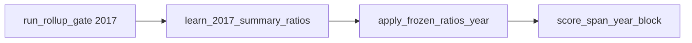

# Summary redefinition span test — implementation plan

**Location:** [`summary-span-test-plan.md`](summary-span-test-plan.md)  
**Motivation:** [PR #775 review](https://github.com/cornerstone-data/bedrock/pull/775#issuecomment-5478546184) — Wes requested a **summary-level 2018–2024 span test** before merge.

**Scope:** Wire published **before-redef summary MUT** loaders (GCS upload done 2026-08-31), add a thin backward-compatible `industry_set` hook on **compute** ratio API, add analysis script to learn 2017 summary ratios and score frozen carry on **Make / Use / VA / Import** for 2018–2024, update docs and PR #775.

**Out of scope:** Detail Step 6 MUTs, SUT→MUT conversion, **margins** (no annual summary margins series for 2018–2024; not needed for Wes’s ask), merging #775 before span results are posted, changing detail ratio parquet contents or `sections.py` wiring, changing production after-redef **vintage pinning** used by cornerstone scaling.

**Margins:** Omitted from this span test. Pass empty margins frames into `compute_redefinition_ratios` / `apply_redefinition_ratios` only because the API requires that argument.

---

## Standalone naming rule (mandatory)

All **code** identifiers in this work — function names, parameters, dataclasses, constants, modules, CLI flags, and docstrings — must describe what the code does. They must be understandable without this plan document.

**Allowed in this markdown only** (document structure): section headings such as “## Phase 0 — …”, “### 1.2 …”. Those numbers are **not** part of the API.

**Forbidden in code / docs strings / CLI:**

- Plan-phase or workflow-number prefixes: `phase_0_*`, `phase0_*`, `step_1_*`, `1_1_*`, `phase1_loaders`, etc.
- Docstrings that say “Phase 0 hook” / “Step 3 apply” instead of describing behavior.
- Mermaid or comment labels copied into function names.

**Required style (examples already used below):**

| Kind | Name |
| --- | --- |
| Loaders | `load_summary_V_before_redef_usa`, `load_summary_V_usa_2024_vintage` |
| Compute hook | `industry_set` |
| Rollup | `rollup_make_to_summary`, `rollup_va_to_summary` |
| Script entrypoints | `run_rollup_gate`, `learn_2017_summary_ratios`, `apply_frozen_ratios_year`, `score_span_year_block` |
| Metrics models | `RollupGateResult`, `SpanBlockScore`, `SpanTestReport`, `BuiltMutFrames` |

---

## Settled decisions


| Decision               | Choice                                                                                                                                                                                                                                                                 |
| ---------------------- | ---------------------------------------------------------------------------------------------------------------------------------------------------------------------------------------------------------------------------------------------------------------------- |
| Before input 2018+     | Published before-redef **summary MUT** from GCS (not SUT proxy, not rolled detail)                                                                                                                                                                                     |
| After target (span)    | After-redef summary Make/Use/Import/VA from the **1997–2024-named** workbooks (`USA_SUMMARY_MUT_MAPPING_1997_2024`) — filename vintage only. **Only open sheets for years ≥ 2017** (2017 learn/round-trip; 2018–2024 span score). Do **not** use production `load_summary_*_usa` vintage pinning. Production pinning stays unchanged for cornerstone. |
| Ratio learn 2017       | Always **published** summary before + after **2017** (same 2024-vintage after file); rollup gate validates concordance only                                                                                                                                               |
| Ratio operator         | Reuse `compute_redefinition_ratios` / `apply_redefinition_ratios` with optional `industry_set` on **compute** only (default = detail `_INDUSTRY_SET`). Span passes `frozenset(USA_2017_SUMMARY_INDUSTRY_CODES)`. Do **not** add unused `industry_set` to apply. |
| Blocks scored          | Make (`V`), Use intermediate (`U`), VA (`V001`/`V002`/`V003`), Import (`Uimp`) for **2018–2024** only; margins omitted (empty API stubs only). **No pre-2017 years** in score, learn, rollup, or loader calls. |
| Match bar              | `ATOL = 0.5 * MILLION_CURRENCY_TO_CURRENCY` ($0.5M), same as Step 7                                                                                                                                                                                                    |
| Span years             | **2018–2024** score default; **2017** only for rollup gate + round-trip learn/sanity. Never read sheet years `< 2017`. |
| GCS filenames (before) | `IOMake_Before_Redefinitions_PRO_Summary.xlsx`, `IOUse_Before_Redefinitions_PRO_Summary.xlsx`, `ImportMatrices_Before_Redefinitions_Summary.xlsx` (uploaded 2026-08-31) |
| Concordance rollup     | Map each detail code to **`parents[0]`** (repo precedent: `value_added_timeseries.detail_to_summary`). Do not sum over multi-parent lists. Before `groupby`, assert every input-axis code is in the map (or drop+count explicitly and fail the gate if any dropped). |
| VA row remap (rollup)  | Detail → summary: `V00100→V001`, `V00200→V002`, `V00300→V003`. Constant `SUMMARY_VA_CODES = ("V001", "V002", "V003")` in [`v2017_value_added.py`](../../../../utils/taxonomy/bea/v2017_value_added.py), shared by loaders + rollup + script. |
| Span score metric      | Per block/year: **L1 relative error** = `sum(\|built − published\|) / sum(\|published\|)` over cells with **`\|published\| > ATOL`** (skip near-zero published cells; avoid div-by-zero). Count industries (Use/VA/Import columns; Make rows) with max abs relative error on those cells > 1%, >25%, >50%. |
| After span loaders live in | **`io_2017.py` only** (same module as production summary MUT loaders). Not the analysis package. |
| Excel load helper      | Extract `_load_usa_summary_mut_from_mapping(mapping, matrix_name, year)` in `io_2017.py`. Production `_load_usa_summary_mut` keeps its year→mapping arms and calls this helper; before-redef and 2024-vintage span loaders call it with a fixed mapping. **Do not** change which mapping each production year selects. |

---

## Phase 0 — Ratio API hook (minimal production change)

**Why:** `_cellwise_ratios(..., industry_is_column=True)` filters buyers with `_INDUSTRY_SET = frozenset(USA_2017_INDUSTRY_CODES)`. Summary industry codes (`111CA`, `22`, `HS`, …) are **not** in that set, so U/VA/Uimp ratios would all be dropped and apply would be a no-op (identity). Make alone would still move — a false positive.

**Change in** [`nowcast_redefinition_ratios.py`](../../../../transform/iot/nowcast_redefinition_ratios.py):

1. Add optional `industry_set: frozenset[str] | None = None` to `compute_redefinition_ratios` only.
2. Resolve once at the compute boundary:

```python
effective_industries = industry_set if industry_set is not None else _INDUSTRY_SET
```

3. Thread **`industry_set: frozenset[str]`** (required kw-only, already resolved) into `_cellwise_ratios` and `_margins_ratios`. Replace every hardcoded `_INDUSTRY_SET` use inside those helpers with this parameter (the `industry_is_column=True` buyer filter in `_cellwise_ratios`, and the industry vs FD branch in `_margins_ratios`). Make path still uses `industry_is_column=False` and does not filter by the set.
4. When callers omit `industry_set` on compute, behavior identical to today. Existing callers and tests need **no** call-site edits.
5. Do **not** add `industry_set` to `apply_redefinition_ratios` (apply does not filter; learned ratios already encode the set).
6. **Mandatory** unit test: summary-shaped toy Use frame with `industry_set=frozenset({"22"})` stores a ratio; without the arg (detail default) the same frame stores nothing.

**Docstring for the new parameter (compute):** describe buyer industry filter override for non-detail taxonomies — do **not** mention “Phase 0” or this plan.

**Not allowed:** changing default detail behavior, parquet schema, or `sections.py`.

---

## Phase 1 — Summary MUT loaders (before + after VA)

### 1.1 `matrix_mappings.py`

Add to [`bedrock/utils/taxonomy/bea/matrix_mappings.py`](../../../../utils/taxonomy/bea/matrix_mappings.py):

```python
USA_SUMMARY_MUT_BEFORE_REDEF_MAPPING = {
    "Make_summary_before_redef": "IOMake_Before_Redefinitions_PRO_Summary.xlsx",
    "Use_summary_before_redef": "IOUse_Before_Redefinitions_PRO_Summary.xlsx",
    "Import_summary_before_redef": "ImportMatrices_Before_Redefinitions_Summary.xlsx",
}

USA_SUMMARY_MUT_BEFORE_REDEF_NAMES = ta.Literal[
    "Make_summary_before_redef",
    "Use_summary_before_redef",
    "Import_summary_before_redef",
]

# Years accepted by before-redef and 2024-vintage span MUT loaders.
USA_SUMMARY_SPAN_MUT_YEARS = ta.Literal[
    2017, 2018, 2019, 2020, 2021, 2022, 2023, 2024,
]
```

- Keep after-redef `USA_SUMMARY_MUT_NAMES` / production year Literal unchanged.
- **Year domain for span/before loaders:** accept **`USA_SUMMARY_SPAN_MUT_YEARS` only**. Raise `ValueError(f"year {year} out of span domain 2017–2024")` on anything else (including `< 2017`). Do **not** score, learn, or open sheets for 1997–2016 even though those sheets exist in the workbooks.

**Vintage pinning:** Before-redef is a **single** latest workbook per matrix (no year-span suffix). After-redef production keeps its three-file pin. Span diagnostic forces the 2024 after mapping so before and after are one BEA release. The string `1997-2024` in after filenames is BEA’s release label — not a license to read pre-2017 sheets.

### 1.2 `v2017_value_added.py` — summary VA codes

Add next to detail VA codes in [`v2017_value_added.py`](../../../../utils/taxonomy/bea/v2017_value_added.py):

```python
SUMMARY_VA_CODES = ("V001", "V002", "V003")
```

Optional: `SUMMARY_VA_DESC` mirroring detail descriptions with summary codes. Not required for the span test.

**VA codes:** Summary Use publishes **`V001` / `V002` / `V003`**. Keep those codes; do **not** remap to detail `V00100`….

### 1.3 `io_2017.py` — shared Excel helper + before-redef summary

Refactor production path without changing pin arms:

```python
def _load_usa_summary_mut_from_mapping(
    mapping: Mapping[str, str],
    matrix_name: str,
    year: int,
) -> pd.DataFrame:
    """Load one sheet from a summary MUT workbook dict (million USD, raw)."""
    # same body as today's _load_usa_summary_mut after mapping is chosen:
    # load_from_gcs → read_excel(sheet_name=str(year), skiprows=5) → set_index → ...
```

- `_load_usa_summary_mut` keeps the `year_int > 2023 / > 2022` arms, then calls `_load_usa_summary_mut_from_mapping(mapping, matrix_name, year_int)`.
- On GCS / missing-sheet failure: let `load_from_gcs` / pandas raise; wrap only if needed so the message includes **year** and **filename** (`mapping[matrix_name]`).

All before-redef summary loaders: **`year: USA_SUMMARY_SPAN_MUT_YEARS`**; raise otherwise. No pre-2017 sheet reads.

| Function | Mirrors | Returns |
| --- | --- | --- |
| `_load_usa_summary_mut_before_redef(matrix_name, year)` | calls `_load_usa_summary_mut_from_mapping(USA_SUMMARY_MUT_BEFORE_REDEF_MAPPING, …)` | Raw Excel sheet (million USD) |
| `load_summary_V_before_redef_usa(year)` | `load_summary_V_usa` | Make, industry × commodity, USD |
| `load_summary_Utot_before_redef_usa(year)` | `load_summary_Utot_usa` | Use intermediate, commodity × industry |
| `load_summary_Uimp_before_redef_usa(year)` | `load_summary_Uimp_usa` | Import matrix |
| `load_summary_value_added_before_redef_usa(year)` | Slice `SUMMARY_VA_CODES` from before Use workbook | VA `V001`/`V002`/`V003` × summary industries |

`load_summary_value_added_before_redef_usa`: load the before Use workbook (same file as Utot), assert all three `SUMMARY_VA_CODES` exist in the index, then `.loc[SUMMARY_VA_CODES, USA_2017_SUMMARY_INDUSTRY_CODES] * MILLION_CURRENCY_TO_CURRENCY`. Index labels = `SUMMARY_VA_CODES` (plain Index or named); columns = `USA_2017_SUMMARY_INDUSTRY_INDEX`.

### 1.4 After-redef summary for span (matched 2024 vintage) — also `io_2017.py`

Production `load_summary_*_usa` → `_load_usa_summary_mut` pins `year ≤ 2022` to `USA_SUMMARY_MUT_MAPPING_1997_2022`, etc. **Do not use those for learn/score in this diagnostic.**

Add span-facing loaders **in `io_2017.py`** that always read `USA_SUMMARY_MUT_MAPPING_1997_2024` for years in `USA_SUMMARY_SPAN_MUT_YEARS` (reject `< 2017`):

| Function | Source | Returns |
| --- | --- | --- |
| `load_summary_V_usa_2024_vintage(year)` | `IOMake_After_Redefinitions_PRO_1997-2024_Summary.xlsx` via `_load_usa_summary_mut_from_mapping` | Same shape as `load_summary_V_usa` |
| `load_summary_Utot_usa_2024_vintage(year)` | matching Use 1997–2024 file | Same as `load_summary_Utot_usa` |
| `load_summary_Uimp_usa_2024_vintage(year)` | matching Import 1997–2024 file | Same as `load_summary_Uimp_usa` |
| `load_summary_value_added_usa_2024_vintage(year)` | Slice `SUMMARY_VA_CODES` from that Use load | VA **3×71** |

Assert all three `SUMMARY_VA_CODES` rows exist on both before and after-VA loaders (raise `ValueError` listing missing codes).

**Implementation notes (verified against local BEA zips, 2017 sheets):**

- `skiprows=5`, `sheet_name=str(year)`, `GCS_USA_MAKE_USE_DIR` / `LOCAL_USA_MAKE_USE_DIR`.
- Use / Import industry block: `.loc[USA_2017_SUMMARY_COMMODITY_CODES, USA_2017_SUMMARY_INDUSTRY_CODES]` (71 industries; commodity axis **73** including `Used`/`Other`; excludes FD).
- Import also has `Used`/`Other` as columns; industry filter drops them.
- `* MILLION_CURRENCY_TO_CURRENCY`; assign `USA_2017_SUMMARY_*_INDEX` labels.

### 1.5 Tests

Add [`test_summary_mut_before_redef_loaders.py`](../../../../extract/iot/__tests__/test_summary_mut_before_redef_loaders.py):

- These are **realdata** GCS smoke tests (repo default outside `_HERMETIC` in [`conftest.py`](../../../../conftest.py)). Do **not** invent `@pytest.mark.integration`. Optionally monkeypatch synthetic xlsx like `test_benchmark_detail_sut.py` for hermetic coverage of parsing.
- **2017 smoke:** Make **71×73**; Use/Import **73×71**; VA **3×71** (before + 2024-vintage after).
- **Index labels:** match `USA_2017_SUMMARY_*_INDEX` or `SUMMARY_VA_CODES` + summary industry index.
- **VA rows:** before and after VA loaders each assert `V001`/`V002`/`V003` present.
- **2024:** before Make/Use/Import and 2024-vintage after (+ VA) load year 2024.
- **Vintage guard (unit, hermetic):** assert span after-loader path selects `USA_SUMMARY_MUT_MAPPING_1997_2024` filenames for years 2017, 2022, and 2024 (production `load_summary_*_usa` still pins 2017/2022 to the 1997–2022 files).
- **Year guard:** calling any before/span loader with `year=2016` raises `ValueError`.

---

## Phase 2 — Detail→summary rollup helpers (analysis-only)

Add [`summary_rollup.py`](summary_rollup.py) under this package.

### 2.1 Concordance

```python
def first_parent_map(mapping: dict[str, list[str]]) -> dict[str, str]:
    """Collapse multi-parent BEA maps to parents[0] (value_added_timeseries precedent)."""
    return {detail: parents[0] for detail, parents in mapping.items() if parents}
```

(Public name `first_parent_map` — not `_first_parent` unless kept private to the module; either is fine if the docstring stands alone.)

- Industry axes: `load_bea_v2017_industry_to_bea_v2017_summary()` → `first_parent_map` (prefer over commodity map for gov industries; same as `value_added_timeseries.detail_to_summary`).
- Commodity axes: `load_bea_v2017_commodity_to_bea_v2017_summary()` → `first_parent_map`.
- Do **not** sum a cell into every parent when `len(parents) > 1`.
- **Coverage:** before `groupby`, assert every code on each rolled axis is in the parent map. Unmapped codes must not become NaN buckets; fail fast with the list of missing codes (or drop+count and fail the gate if count > 0).

### 2.2 VA row remap

```python
DETAIL_VA_TO_SUMMARY = {
    "V00100": "V001",
    "V00200": "V002",
    "V00300": "V003",
}
```

Lives in `summary_rollup.py` (analysis-only). `rollup_va_to_summary` remaps the detail VA index with this dict **before** industry-axis groupby sum, then reindexes to `SUMMARY_VA_CODES`.

### 2.3 Rollup functions

```text
rollup_make_to_summary(V_detail) -> pd.DataFrame
rollup_use_intermediate_to_summary(U_detail) -> pd.DataFrame
rollup_va_to_summary(VA_detail) -> pd.DataFrame
rollup_import_to_summary(Uimp_detail) -> pd.DataFrame
```

| Function | Axes rolled | Pre-filter |
| --- | --- | --- |
| `rollup_make_to_summary` | Industry **rows** via industry map; commodity **cols** via commodity map; `groupby` sum both | None beyond coverage assert |
| `rollup_use_intermediate_to_summary` | Commodity rows + industry cols | Columns ∩ `USA_2017_INDUSTRY_CODES` before rollup |
| `rollup_va_to_summary` | VA row remap then industry cols | Columns ∩ `USA_2017_INDUSTRY_CODES` |
| `rollup_import_to_summary` | Same as Use intermediate | Columns ∩ `USA_2017_INDUSTRY_CODES` |

- Input: detail before (or after) loaders.
- Output: summary-labeled frames aligned with `load_summary_*_before_redef_usa(2017)` / `load_summary_value_added_before_redef_usa(2017)` (reindex to summary industry/commodity indexes where needed so compare is aligned).

### 2.4 Rollup gate models

```python
@dataclass(frozen=True)
class RollupGateResult:
    label: str  # e.g. "Make", "Use", "VA", "Import"
    ok: bool
    max_abs_diff: float
    n_partial: int
    n_miss: int
    n_extra: int
```

Populate from `table_match.compare_tables(..., Tolerance(atol=ATOL, rtol=0.0))` using `TableMatch` counts / cells.  
Define `max_abs_diff` as `nanmax(|candidate − reference|)` over aligned cells (or max abs `diff` from `match.cells()` — `TableMatch` has no `max_abs_diff` field).  
**Pass:** `assert_ok(max_partial=0, max_miss=0, max_extra=0, max_margin_partial=0)`.  
Span test always learns from **published** summary; set `rollup_ok=False` in the report if any block fails — do **not** abort learning solely because rollup failed (gate is diagnostic).

---

## Phase 3 — Span test script

Add [`summary_redef_span_test.py`](summary_redef_span_test.py) under this package.

### 3.1 CLI

```bash
uv run python -m bedrock.analysis.nowcasting.after_redef_MUTs.redefinitions_ratio_implementation.summary_redef_span_test
uv run python -m ...summary_redef_span_test --years 2018 2019 2020 2021 2022 2023 2024
uv run python -m ...summary_redef_span_test --rollup-only
```

| Flag / default | Behavior |
| --- | --- |
| (no args) | Rollup gate (2017) → learn 2017 ratios → round-trip check → score default years `2018…2024` → write report |
| `--years …` | Score only these years (each must be in 2018–2024; reject 2017 and `<2017` for score). Learn/round-trip still use 2017. |
| `--rollup-only` | Run rollup gate only; write a short report section; skip learn/apply/score |

**Exit codes:** `0` if the process completes and writes the report (rollup fail is recorded in the report, not a non-zero exit by itself). Non-zero only for uncaught load/compute errors or invalid CLI years. 2017 round-trip failure: still write the report, mark `round_trip_ok=False`, exit `0` so CI/local can inspect the artifact — call out loudly in stdout.

### 3.2 Empty margins stub (API only)

```python
def empty_margins_frame() -> pd.DataFrame:
    # Empty MultiIndex matching production margins loaders (io_2017):
    # (Industry Code, Commodity Code) × MARGINS_VALUE_COLUMNS.
    idx = pd.MultiIndex.from_tuples([], names=["Industry Code", "Commodity Code"])
    return pd.DataFrame(columns=list(MARGINS_VALUE_COLUMNS), index=idx, dtype=float)
```

Pass into compute/apply everywhere. Do not load or score margins.

### 3.3 Workflow functions (descriptive names — not step_N)



**`run_rollup_gate(year=2017) -> list[RollupGateResult]`**

1. Load detail 2017 before MUT; roll up (including VA remap + coverage assert).
2. Load published summary 2017 before (+ VA).
3. Compare each block (Make / Use / VA / Import); print `RollupGateResult` table.
4. Optional: roll detail 2017 after vs **2024-vintage** after-redef summary (log only; not required for `ok`).

**`learn_2017_summary_ratios() -> RedefinitionRatios`**

```python
SUMMARY_INDUSTRIES = frozenset(USA_2017_SUMMARY_INDUSTRY_CODES)
# After = 2024-vintage loaders (not production load_summary_*_usa)
ratios = compute_redefinition_ratios(
    V_b, U_b, VA_b, Uimp_b, empty_margins_frame(),
    V_a, U_a, VA_a, Uimp_a, empty_margins_frame(),
    industry_set=SUMMARY_INDUSTRIES,
)
V_hat, U_hat, VA_hat, Uimp_hat, _ = apply_redefinition_ratios(
    V_b, U_b, VA_b, Uimp_b, empty_margins_frame(),
    ratios=ratios,
    x=None,
)
```

- `VA_a` from `load_summary_value_added_usa_2024_vintage(2017)`.
- Round-trip: `compare_tables` vs after 2017 for Make / Use / VA / Import; expect `assert_ok(...)`; record `round_trip_ok`.

**`apply_frozen_ratios_year(year, ratios) -> BuiltMutFrames`**

```python
@dataclass(frozen=True)
class BuiltMutFrames:
    V: pd.DataFrame
    U: pd.DataFrame
    VA: pd.DataFrame
    Uimp: pd.DataFrame

x_t = industry_gross_output(V_before_t)
V_hat, U_hat, VA_hat, Uimp_hat, _ = apply_redefinition_ratios(
    V_before_t, U_before_t, VA_before_t, Uimp_before_t, empty_margins_frame(),
    ratios=ratios,
    x=x_t,
)
return BuiltMutFrames(V=V_hat, U=U_hat, VA=VA_hat, Uimp=Uimp_hat)
```

**`score_span_year_block(built, published, *, block, year) -> SpanBlockScore`**

Compare each built block to the matching **2024-vintage** published after frame (same mapping as learn).

### 3.4 Score / report data models

```python
@dataclass(frozen=True)
class SpanBlockScore:
    year: int
    block: str  # "Make" | "Use" | "VA" | "Import"
    l1_relative_error: float | None  # None if denom == 0 (no cells with |published| > ATOL)
    n_cells_scored: int
    n_industries_off_gt_1pct: int
    n_industries_off_gt_25pct: int
    n_industries_off_gt_50pct: int
    worst_industries: tuple[str, ...]  # top contributors by abs L1 mass, capped (e.g. 10)
    worst_cell_abs_diff: float | None  # max |built − published| among scored cells
    worst_cell_row: str | None
    worst_cell_col: str | None
    worst_cell_rel_error: float | None  # that cell's |built − published| / |published|

@dataclass(frozen=True)
class SpanTestReport:
    rollup_ok: bool
    rollup_results: tuple[RollupGateResult, ...]
    round_trip_ok: bool
    scores: tuple[SpanBlockScore, ...]
```

**L1 denom edge case:** if `n_cells_scored == 0` (every published cell ≤ ATOL), set `l1_relative_error=None`, print a warning for that block/year, and do **not** treat as 0.0 success.

| Metric | Definition |
| --- | --- |
| L1 relative error | `sum(\|built − published\|) / sum(\|published\|)` over cells with `\|published\| > ATOL` |
| Columns/rows off >1% / >25% / >50% | Count industries (Use/VA/Import columns; Make rows) whose max abs relative error on those cells exceeds the threshold (nested counts, not exclusive bins) |
| Worst cell | Among scored cells, the one with largest `\|built − published\|`; report gap in $M, `row×col`, and that cell’s relative error |
| Worst summary sectors | Rank by abs L1 contribution; highlight `22`, `23`, `721`, `722`, `42`, `HS`, government groups when present in the top list |
| Rollup gate | Pass/fail + per-block `RollupGateResult` |
| 2017 round-trip | Pass/fail from `learn_2017_summary_ratios` / apply check |

Write [`summary-span-test-report.md`](summary-span-test-report.md) in this folder with fixed sections:

1. Summary (`rollup_ok`, `round_trip_ok`, one-line span headline)
2. Rollup gate table
3. 2017 round-trip
4. Per-year / per-block score table (`SpanBlockScore` fields)
5. Worst sectors notes
6. Caveat paragraph (below)

**Caveat (required in report):** Published summary after = BEA annual estimate, not independent ground truth ([`frozen_mix_diagnostic.py`](../../../frozen_mix_diagnostic.py) precedent). Matched 2024 vintage removes release-revision confound from the frozen-ratio question; it does not make the after tables “true” redefinitions for year `t`.

### 3.5 Unit tests

[`__tests__/test_summary_rollup.py`](__tests__/test_summary_rollup.py):

- Toy 2×2 detail → 1×1 summary with known sums (`parents[0]`).
- VA remap `V00100` → `V001`.
- Coverage assert: unmapped detail code raises / fails gate.
- Rollup gate: pass at $0, fail above ATOL.

[`bedrock/transform/iot/__tests__/test_nowcast_redefinition_ratios.py`](../../../../transform/iot/__tests__/test_nowcast_redefinition_ratios.py):

- Extend with `industry_set` summary toy case (see Phase 0).

Optional GCS smoke: 2017 `run_rollup_gate` completes without exception (realdata).

---

## Phase 4 — Run and capture results

1. Run full span test locally with GCS access.
2. Save `summary-span-test-report.md` from the script (overwrite ok).
3. If a workbook is missing a requested year sheet: fail loud with year + filename (do not silently skip).

**Decision table (interpretive; numbers go in the report):**

| Outcome | Guideline | Action |
| --- | --- | --- |
| Span mostly passes | L1 relative error stays low across years; no sector blow-ups | Post on #775; request re-review |
| Mixed | Drift rises like #724 (e.g. clear year-over-year worsening; many industries >1% off) | Post; discuss alternatives; do not merge as-is |
| Bad | Double-digit L1 in multiple years, or COVID-year / energy / trade blow-ups | Do not merge #775; pivot method |

Exact “pass” thresholds for merge are a review judgment after the numbers exist — the report must print the fixed metrics above so that judgment is comparable.

---

## Phase 5 — Docs and PR (after Phase 4 numbers exist)

| File | Change |
| --- | --- |
| [`ratio-reconstruction-report.md`](ratio-reconstruction-report.md) §3 | Replace “waits on Step 6” with summary span results + link |
| [`README.md`](README.md) | Rows for this plan + report artifact |
| PR #775 description | Remove Step 6 deferral for this diagnostic; link span report |
| [`plan.md`](../../../plan.md) Step 7 testing (optional) | One line: summary span test is first out-of-sample gate |

---

## File checklist

| File | Action |
| --- | --- |
| [`nowcast_redefinition_ratios.py`](../../../../transform/iot/nowcast_redefinition_ratios.py) | Optional `industry_set` on `compute_redefinition_ratios` (default detail); thread resolved set into `_cellwise_ratios` / `_margins_ratios` |
| [`test_nowcast_redefinition_ratios.py`](../../../../transform/iot/__tests__/test_nowcast_redefinition_ratios.py) | Summary `industry_set` unit test |
| [`matrix_mappings.py`](../../../../utils/taxonomy/bea/matrix_mappings.py) | Before-redef summary mapping + `USA_SUMMARY_SPAN_MUT_YEARS` |
| [`v2017_value_added.py`](../../../../utils/taxonomy/bea/v2017_value_added.py) | `SUMMARY_VA_CODES` |
| [`io_2017.py`](../../../../extract/iot/io_2017.py) | `_load_usa_summary_mut_from_mapping`; before-redef summary loaders; **2024-vintage** after span loaders (incl. VA); do not change production vintage pin arms |
| [`test_summary_mut_before_redef_loaders.py`](../../../../extract/iot/__tests__/test_summary_mut_before_redef_loaders.py) | New (realdata + vintage/year guards) |
| [`summary_rollup.py`](summary_rollup.py) | New |
| [`summary_redef_span_test.py`](summary_redef_span_test.py) | New |
| [`summary-span-test-report.md`](summary-span-test-report.md) | Run artifact from the script |
| [`__tests__/test_summary_rollup.py`](__tests__/test_summary_rollup.py) | New |
| [`README.md`](README.md) | Pointer to this plan |
| [`ratio-reconstruction-report.md`](ratio-reconstruction-report.md) | After run |
| [`plan.md`](../../../plan.md) | Optional one-line Step 7 testing note |

**Not modified:** detail ratio parquet *contents*, `sections.py`, production `_load_usa_summary_mut` year-arm pinning logic (only extract shared helper body), `redefinition_ratios_2017.py` (inherits default `industry_set=None`).

---

## Dependencies and order

```text
industry_set hook → loaders (before + 2024-vintage after) → summary_rollup → span script + tests → local GCS run → docs/PR
```

Rollup needs before-redef summary loaders for 2017. Learn/score need **2024-vintage** after loaders (incl. VA) + `industry_set` on compute.

---

## Verification commands

```bash
uv run pytest bedrock/transform/iot/__tests__/test_nowcast_redefinition_ratios.py -v
uv run pytest bedrock/extract/iot/__tests__/test_summary_mut_before_redef_loaders.py -v
uv run pytest bedrock/analysis/nowcasting/after_redef_MUTs/redefinitions_ratio_implementation/__tests__/test_summary_rollup.py -v
uv run python -m bedrock.analysis.nowcasting.after_redef_MUTs.redefinitions_ratio_implementation.summary_redef_span_test
uv run ruff check bedrock/extract/iot/io_2017.py bedrock/utils/taxonomy/bea/matrix_mappings.py bedrock/utils/taxonomy/bea/v2017_value_added.py bedrock/transform/iot/nowcast_redefinition_ratios.py
uv run mypy bedrock/extract/iot/io_2017.py bedrock/transform/iot/nowcast_redefinition_ratios.py
```

---

## Resolved from BEA workbooks (2026-08-31)

Checked local BEA zips: `MAKE-USE-IMPORTS (BEFORE REDEFINITIONS).zip` and `MAKE-USE-IMPORTS (AFTER REDEFINITIONS).zip`.

| Item | Finding | Plan implication |
| --- | --- | --- |
| Sheet years present | Before Make/Use/Import summary sheets include **1997–2024**. | Sheets exist earlier; **this plan only opens ≥2017**. |
| Import layout | Matches after: `skiprows=5`, row-6 codes, col-1 `IOCode`. | Same loader path as after-redef import. |
| Use intermediate filter | 71 industry + 20 FD cols; commodities include `Used`/`Other`; VA = **`V001`/`V002`/`V003`**. | Same `.loc` as after Use; VA loaders use short codes. |
| After production pin | `load_summary_*_usa` uses 1997–2022 / 2023 / 2024 files by year. | Span forces **1997–2024-named** after workbooks for years ≥2017 so before/after are one release; still never reads pre-2017 sheets. |
