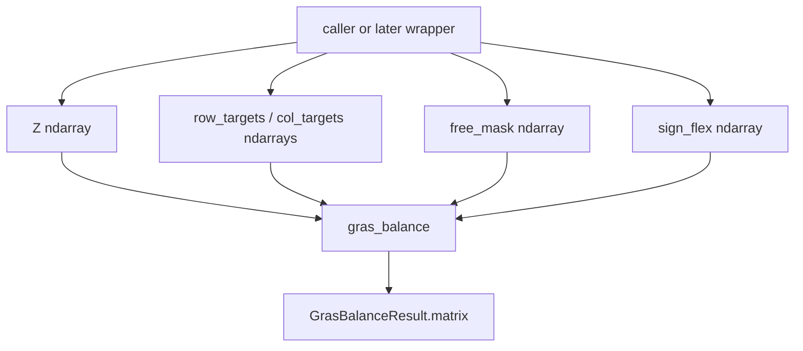

# GRAS kernel ([plan.md](bedrock/analysis/nowcasting/plan.md) §Step 5 engine layer)

**Status:** complete.

**Issue:** [#588](https://github.com/cornerstone-data/bedrock/issues/588) engine layer only. **Git base: `nowcast`.** Scaffolding from [#659](https://github.com/cornerstone-data/bedrock/pull/659) is merged (`Target` / `TargetTerm` / `SutMask` / offset / `precheck`). This PR only adds `[gras.py](bedrock/utils/economic/balance/gras.py)`.

**PR 1 of 3.** Sequence (engine → SUT wrapper → KRAS): [`step5_balance_sequence_2026-08-18.plan.md`](step5_balance_sequence_2026-08-18.plan.md).

## What this implements in `[plan.md](bedrock/analysis/nowcasting/plan.md)` Step 5

`[plan.md](bedrock/analysis/nowcasting/plan.md)` §Step 5 (the RAS step; there is no numbered “§5” besides this) splits the balancer into **two layers** (engine vs SUT orchestration) and three decisions. This PR is **only the engine layer**, with Decision 1 **Option A** chosen for that layer: vendored ceda dense path, GRAS in place of RAS, no scipy/sparse.

**Implemented by this PR** (once `gras.py` lands):

- The **engine** half of “the architecture this actually needs — two layers”: one matrix, seed, row/col targets, scale. Hand-checkable unit tests.
- **Decision 1 Option A, engine slice only:** start from ceda’s dense `ras_balancing.py`; vendor (not package-depend); drop the sparse path (bedrock has no scipy); drop the load-bearing clamps (`:570–571`, `:579`); keep convergence, stall projection (**non-negative only** — see stall policy), diagnostics, `close_rows_exactly` (GRAS closer, not RAS `_margin_scale_factors`), elementwise `atol + rtol |t|`. Delete `_neutralize_infeasible_targets`.
- **Decision 2 objective, inner loop:** **GRAS** — Lenzen, Wood and Gallego (2007) + Temurshoev, Miller and Bouwmeester (2013) all-negative margins; cite Junius and Oosterhaven (2003) as the name only. Plain RAS/IPFP is out. **Not KRAS** (soft constraints stay a later PR, as `plan.md` still recommends).
- **Decision 2 mechanism (not policy):** `free_mask` participation; `sign_flex` with post-hoc clamp to 0. Which cells are locked is the merged mask / a later wrapper, not this PR.
- **Testing strategy — balancer unit tests:** negative cell, sign-lock, empty-margin-vs-nonzero-target, non-convergence. (Clarify `plan.md`’s “zero control total”: a **zero target is legal**; the silent RAS failure is a **nonzero target on an empty free margin**.)
- Practical constraints already in `plan.md`: no scipy, vendored port, private ceda, numpy/pandas pin mismatch.

**Not this PR** (already on `nowcast`, or later):

Do **not** implement `[plan.md](bedrock/analysis/nowcasting/plan.md)` §“The scaffolding is built” as this PR’s public API. That snippet is the **wrapper** contract, not the kernel:

```python
balanced = engine(free, residual, masks)             # <- missing SUT adapter; not this PR
result   = restore_fixed_blocks(balanced, frozen)
```

`plan.md` titles that section “for anyone starting on the engine layer” and says the engine’s contract is narrow. After #659 merged, that language points at this snippet, which is the trap. Those three arguments are not what GRAS consumes:

- `free` / `masks` — block mappings (`use`, `supply`) of DataFrames / `SutMask`
- `residual` — a `TargetSet` of linear combinations, including cross-block identities (T11–T14, T17) and aggregators (T4)

GRAS needs one ndarray, a row-target vector, a column-target vector, `free_mask`, and `sign_flex`. There is no honest function that is both (a) GRAS on one matrix and (b) `engine(free, residual, masks)`. Coding to the snippet means inventing the adapter *inside* `gras_balance`: flattening `TargetTerm`s, special-casing cross-block identities, picking a pass order. That is the SUT-orchestration PR. Doing it here hides adapter bugs inside the scaler, so a red test cannot tell a GRAS failure from a T11-extraction failure.

This PR’s entry point is `gras_balance(...)`. The snippet stays as the **future** call site; a later PR writes `engine(...)` as a function that calls `gras_balance` per block.

- **SUT orchestration** layer (`V`/`Ui`/`Ufd`/`Uva`, pass order, joint `T016 = T019`). `plan.md` still has this as the second layer; Option A’s “write the SUT layer from scratch” is **PR2** ([`step5_balance_sequence_2026-08-18.plan.md`](step5_balance_sequence_2026-08-18.plan.md)). Split is intentional: this PR can be wrong only about scaling, signs, masks, and convergence; PR2 can be wrong only about how `TargetSet` becomes vectors and how the two blocks iterate.
- **Decision 1 Option A in full** — the table’s “add GRAS **+ a SUT layer**.” GRAS is the scaler (one matrix, row/col vectors). The SUT layer is the caller: extract ndarrays from `free` / `residual` / `masks`, call `gras_balance` per block, handle T11–T17 / T4, iterate to joint `T016 = T019`. Packing both into this PR was considered and rejected — it is PR1+PR2 with no failure isolation.
- **Decision 2 KRAS-style soft layer**, hard-vs-soft weights, QP — **PR3** of the same sequence. Not a new inner loop.
- **Decision 2 “what is held fixed” / Decision 3 target set** — recorded in `mask_layer_plan.md` / `target_set_plan.md` and sourced on `nowcast` (`nowcast_mask.py`, `nowcast_targets.py`, offset/precheck). Offset is how a fixed nonzero cell is expressed; this kernel only sees `Z` and a participation mask.
- **Verify the balance in `bedrock/utils/validation/`** (`T016 = T019` 402/402). That is a **table** test after a full Step 5, not a scaler test. This PR never sees a SUT; T11 is cross-block and cannot be expressed as one matrix’s row targets. The check belongs on PR2 (and in `validation/` once a real SUT is balanced). The same *shape* of constraint is tested here on a toy matrix (row/col targets met, or `converged=False`).
- Seed assembly (Steps 1–4).

`plan.md` today still says Decision 1 is **open**, Option A’s case is “materially weaker,” and “Decision 1 should be re-run” (Step 5 recommendation + Open question 4a). That text is **stale relative to this plan**: the kernel work **chooses Option A for the engine** (vendor ceda + GRAS, clamps deleted, mask via offset outside the engine). Update `plan.md` when the code lands — do not leave Decision 1 marked open.

## Two contracts — do not code to the `plan.md` snippet

The **why** is in **Not this PR** above (`engine(free, residual, masks)` is the wrapper API; this PR’s public function is `gras_balance`). This section is the kernel signature and the wrapper mapping.

`[plan.md](bedrock/analysis/nowcasting/plan.md)` §“The scaffolding is built — how to run it” (and `[balance/__init__.py](bedrock/utils/economic/balance/__init__.py)`) document:

```python
balanced = engine(free, residual, masks)             # <- the part that does not exist yet
result   = restore_fixed_blocks(balanced, frozen)
```

That snippet is **SUT orchestration + adapter**, not this kernel:

- `free` / `masks` are block mappings (`use`, `supply`) of DataFrames / `SutMask`
- `residual` is a `TargetSet` that includes **cross-block** identities (T11–T14, **T17**) and **aggregators** (T4). Those are not one pair of row/col vectors
- T17 is the basic-to-producer identity on Supply industry columns (RHS = −S00900 make). T15/T16 are single-block Supply column sums. The kernel consumes none of these.

A one-matrix `gras_balance` cannot implement that call.


| Layer       | API                                                                                                                           | This PR? |
| ----------- | ----------------------------------------------------------------------------------------------------------------------------- | -------- |
| **Kernel**  | `gras_balance(matrix, row_targets, col_targets, free_mask, sign_flex)` in `[gras.py](bedrock/utils/economic/balance/gras.py)` | **yes**  |
| **Wrapper** | `engine(free, residual, masks)` as in `plan.md` / `balance/__init__.py`                                                       | **no**   |


Participation for a later wrapper is `mask.free` (`True` = may move), never `mask.frozen`. Tests and any interim caller build numpy arrays by hand (or `split_fixed` then `.to_numpy()`). Target-as-linear-combination is already on `nowcast`; there is no third PR to wait on.

**Default mismatch (silent wrong adapter if omitted):** kernel `sign_flex is None` → all-**False** (no cell may change sign). A default `SutMask` / `nowcast_mask.sign_lock_mask` is 0 on most cells, which means flex **is** allowed. A later adapter **must** pass `sign_flex=(mask.sign_lock.to_numpy() == 0)` explicitly. Omitting it sign-locks the whole SUT.

The ndarray call a later wrapper (or a test) uses, once it has extracted one block’s vectors:

```python
result = gras_balance(
    matrix=Z.to_numpy(),
    row_targets=row_targets,
    col_targets=col_targets,
    free_mask=mask.free.to_numpy(),                 # not (Z != 0)
    sign_flex=(mask.sign_lock.to_numpy() == 0),     # must pass; kernel default is not SutMask
)
```

Do **not** write `gras_balance(free, residual, masks)`. That **collapses** the two contracts: one name would do both jobs. Then there is no kernel you can test without a `TargetSet`, and no wrapper you can swap without editing the scaler. A T11-extraction bug and a Temurshoev-scale bug would fail the same test. KRAS (PR3) could not wrap “the scaler” without forking this mixed function. Keep `gras_balance` ndarray-only; only `engine(...)` (PR2) reads `free` / `residual` / `masks`.

**Out of this PR:** consuming `TargetSet` / `TargetTerm` / `SutMask` in the public function; `nowcast_targets.py` / `nowcast_mask.py`; SUT pass order; `gras_scale_table_agg` / KRAS; scipy; any nowcast seed / 2017 SUT; extracting row/col vectors from aggregators or `restrict_to`.




Later wrapper (not this PR) sits around that:

```text
frozen, free = split_fixed_blocks(seeds, masks)
residual     = offset_targets(targets, frozen)
precheck(seeds, masks, targets)
# later: extract ndarrays from free / residual / masks, call gras_balance per block
result       = restore_fixed_blocks(balanced, frozen)
```

`split_fixed` splits on `fixed_value` only. Engine participation is `mask.free` = `~(structural_zero | fixed_value)`. Do not use the split’s `Z` as a substitute for `free_mask`: structural-zero cells are 0 in `Z` but must also be False in `free_mask` so GRAS cannot fill them.

The kernel is **one signed matrix + row/col vectors**. Cross-block identities (T11–T14, T17) stay a later SUT wrapper.

## Post-merge facts the kernel must respect

`[restore_fixed](bedrock/utils/economic/balance/offset.py)` **raises** if `(frozen != 0) & (balanced != 0)`. The kernel **must** leave those cells at 0 in `result.matrix` or a later wrapper cannot round-trip. Tests already require `~free_mask` → 0; that is now a restore invariant, not add-vs-overwrite equivalence.

Leak into a **structural zero** is **not** caught by `restore_fixed`. Verified on current `nowcast`: the check is `(frozen != 0) & (balanced != 0)`, and `frozen` is `F` from `split_fixed`, which is nonzero only on `fixed_value` cells. A structural zero is 0 in both `F` and `Z`; if the engine writes a nonzero there, `restore_fixed` adds `5 + 0` and does not raise. `assert_free_seed` also only flags nonzero `fixed_value` cells. `validate_against` checks the **input** seed, not the engine output. Same hole for a `fixed_value` cell whose seed was already 0. So `free_mask` must be `mask.free`, not “nonzero cells of `Z`.”

Diagonal GRAS scaling keeps zeros at 0. `close_rows_exactly` is another call to the **same GRAS helper** (positives `* s`, negatives `/ s`, zeros stay `0`); it cannot fill a zero. The RAS picture `x = s[:, None] * x` is **not** the closer — that formula only matches GRAS on a non-negative row. `project_infeasible` mutates **targets**, not the matrix. Do **not** implement an additive dump onto a row. After every scale, after the `~sign_flex` clamp, and after `close_rows_exactly`, still enforce `result[~free_mask] == 0` as an **invariant** (re-zero; do not skip those paths) because `restore_fixed` cannot see structural-zero leaks. Copy inputs; do not mutate the caller’s `matrix` / masks / target vectors.

## After this PR lands — update `plan.md`

Once `gras_balance` is merged, **edit `[bedrock/analysis/nowcasting/plan.md](bedrock/analysis/nowcasting/plan.md)`** and the `balance/` package docstring so they describe the code. Do **not** rewrite `balanced = engine(free, residual, masks)` in `plan.md` or `__init__.py` — that line stays the **missing wrapper**. Do **not** write `gras_balance(free, residual, masks)`.

**Keep as the wrapper contract** (retitle, do not rewrite the call):

- Retitle “For anyone starting on the engine layer” / “what remains is the engine itself” → **what remains is the SUT wrapper** around `gras_balance`.
- Keep “The engine’s contract is narrow…” as the **wrapper** contract (`free` / `residual` / `masks` as block mappings and `TargetSet`).
- Keep `balanced = engine(free, residual, masks)` exactly; comment it as the adapter that does not exist yet.

**Insert this exact second snippet** (or equivalent keyword-for-keyword) under the wrapper snippet, labelled as the kernel this PR added:

```python
result = gras_balance(
    matrix=Z.to_numpy(),
    row_targets=row_targets,
    col_targets=col_targets,
    free_mask=mask.free.to_numpy(),                 # not (Z != 0)
    sign_flex=(mask.sign_lock.to_numpy() == 0),     # must pass; kernel default is not SutMask
)
```

State next to it: kernel `sign_flex is None` → all-False; `SutMask` default 0 means flex allowed. Omitting `sign_flex` in a later adapter silently sign-locks the whole SUT.

**Must-strike / must-record** (do not leave these as “open”):

- Strike “in #659 until that merges.”
- Strike or qualify “Decision 1 remains open” / “the only thing still gating code.” Record **Option A chosen for the engine** (vendored ceda dense + GRAS). **Mark Open question 4a resolved** (Option A engine done; SUT-orchestration half later) rather than deleting the row.
- Record the GRAS variant (Lenzen 2007 + Temurshoev 2013). Leave KRAS / soft weights **not yet**. Align “converged” with elementwise `atol`/`rtol` and `GrasBalanceResult.converged`. Close Open question **4b**’s “variant/convergence still open” for the inner loop (mask policy already recorded; KRAS remains open).
- Testing strategy: point at `balance/__tests__/test_gras.py`; “zero control total” → nonzero target on an empty free margin raises; a zero target is legal.
- Issues table: #653 / #654 / #591 scaffolding **landed**, not “starts now.”
- Strike `plan.md` ~204–208 “no RAS/GRAS code anywhere in bedrock today.”
- Strike or qualify the Step 5 banner “Do not start writing code until all three are made.”
- Do **not** claim the full Step 5 balancer (SUT identity, KRAS, production wrapper) is done.

**Landing path:** add `[gras.py](bedrock/utils/economic/balance/gras.py)` to the **existing** `[bedrock/utils/economic/balance/](bedrock/utils/economic/balance/)` package **on `nowcast`**. Public entry: `gras_balance` (not ceda’s `ras_balance`). Do **not** recreate `__init__.py`; append exports. Update the “nothing in it imports a solver” sentence. **Keep** the `engine(free, residual, masks)` line in that docstring as the missing wrapper.

## What to take from where

**Ceda** `[ceda/utils/ras_balancing.py](https://github.com/cornerstone-data/ceda/blob/main/ceda/utils/ras_balancing.py)` (dense path + tests only). Ceda is not in this repo; vendor from a local/private checkout. At implement time, pin provenance in a `gras.py` module comment: **full 40-character commit SHA, commit date, and subject** (e.g. `git -C <ceda> log -1 --format='%H %ci %s'`). The SHA identifies the commit; date and subject are what a reviewer can read without looking it up. Do not invent a SHA in this plan.

Keep from the dense path: elementwise convergence (`atol + rtol * |target|`), `_StallDetector` (under the stall policy below), `project_infeasible`, `close_rows_exactly` as a **call to the GRAS helper**, not RAS scale. Participation `free_mask`: `np.where(mask, X, 0)` is correct for **structural zeros**. Docstring must stop saying “held at seed values.” Nonzero holds are the caller’s job (offset). After every GRAS scale (row, column, and `close_rows_exactly`), re-zero `~free_mask` as an invariant. Do not copy `_neutralize_infeasible_targets`.

Tests to port (drop sparse twins): toy dense, elementwise residual, atol floor, relative tolerance at dollar scale, inconsistent margins do not converge, stall with/without projection **on non-negative toys**, `close_rows_exactly` (plus a mixed-sign closer test), stall threshold. **Do not port** `test_ras_balance_infeasible_row_neutralized_and_reported` (silent target-zeroing). **Skip** `test_ras_balance_dataframe`. **Invert** `test_ras_balance_negative_seed_clamped_and_reported`: negatives must survive.

**Do not copy from ceda:** `scipy.sparse`, `_ras_balance_sparse`, `np.maximum` on row/col targets, `np.maximum` on the masked seed (the non-negativity clamps; `plan.md` and ceda line numbers drift — delete by semantics, not by `:570` / `:579` / `:574`). `_neutralize_infeasible_targets` and `_margin_scale_factors`. `ceda.utils.logging` (stdlib logger `logging.getLogger('bedrock.utils.economic.balance.gras')`; keep ceda’s every-10-iter progress and stall warnings, worded GRAS not RAS; `ValueError` paths do not also log). No `pip install ceda`. No `gras_balance_dataframe` in this PR (ceda’s helper defaults sparse / scipy).

`sut_ras.py` as spec only ([USEEIO `nowcasting` branch](https://github.com/cornerstone-data/USEEIO/blob/nowcasting/nowcasting/sut_ras.py)):

- **Use:** one typed helper copied from `gras_internal` / `gras_scale_table_totals` (cases below). `M_opposite_eps = 0` stays off. Drop magic `1e-4` / `breakpoint()`.
- **Clamp reference:** after each scale **including `close_rows_exactly`**, clamp `~sign_flex` cells that flipped relative to the **caller’s input** `matrix`, not the pre-scale iterate. Under clamp-every-scale + diagonal GRAS this matches iterate-clamp on the listed tests; the comparison operand is still the input.
- **Do not copy:** `sut_ras()`, `gras_scale_table_agg`, `gras_scale_table_layers`, `validate_inputs`, untyped loops, fixed 1000 / `1e-5`.

### GRAS scale helper (one function; row, column, and `close_rows_exactly`)

Delete `_margin_scale_factors`. For a margin, `p` = sum of **positive free** cells, `n` = sum of `|negative free|` cells, `t` = that margin’s target. Assign `s` in this order (later `where` wins, matching `gras_internal`):

1. If `p > 0`: `s = (t + sqrt(max(0, t² + 4 p n))) / (2 p)`
2. Else: `s = n / (-t)` (Temurshoev; `s` may be **negative**). Compute under `np.errstate(divide='ignore', invalid='ignore')` so `t == 0` does not raise; step 4 overwrites that case.
3. If `p <= 0` and `n == 0`: `s = 1`
4. If `t == 0` and `p == 0`: `s = 0` (even when `n > 0` — later `where` wins, matching `gras_internal`)
5. Apply: positives `* s`, negatives `/ s`, zeros stay `0`. If `s == 0`, set the whole margin’s free cells to `0` (do not divide by 0).

Then the post-hoc `~sign_flex` clamp vs the input `matrix`. Pin with a mixed-sign `close_rows_exactly=True` test that leftover RAS `t/a` (only when both `> 0`) would fail.

### Stall policy (locked): **A — non-negative projection**

Keep ceda’s `_StallDetector` formulas (`record_scales` only `scale > 0`; `_clamp_deficient_margin` uses `targets > 0`; post-clamp rescale uses `col_total > 0`). Temurshoev `s < 0` is allowed in the **scale** helper.

- If `project_infeasible=True` **and** any participating seed cell is `< 0` **or** any row/col target is `< 0`: raise `ValueError`. Stall is undefined on signed problems in this PR.
- Negative-`s` / Temurshoev / mixed-sign tests use the default `project_infeasible=False`.
- Ported stall/projection tests stay on **non-negative** ceda toys.

Signed stall (how `s < 0` enters the log, how a negative target is “deficient”) is out of this PR.

**Variant (docstring, not a later decision):** Lenzen, Wood and Gallego (2007) objective + Temurshoev, Miller and Bouwmeester (2013) all-negative margins. Also cite Junius and Oosterhaven (2003) as the name. Do not cite 2003 alone. KRAS (Lenzen 2009) stays a follow-up.

## `sign_flex` algorithm (locked)

GRAS with `s > 0` does **not** flip a mixed-sign cell. Independent “this one cell crosses zero, neighbors stay” is **out of scope** (that would need the `1e-4` ghost seed the plan forbids).

What this PR implements:

1. Scale with the GRAS helper (Temurshoev all-negative / negative-`s` branch included). Same helper for the final `close_rows_exactly` row scale.
2. **Post-hoc clamp:** after each row scale, each column scale, **and** `close_rows_exactly`, any cell with `~sign_flex` whose sign flipped relative to the **input** `matrix` is set to **0**. Zero satisfies `SutMask` locks (`+1` means `>= 0`, `-1` means `<= 0`).
3. Flexed cells (`sign_flex True`) are left as the scale produced them, including a sign change from the Temurshoev branch.

**Defaults:** `sign_flex is None` → all-**False** (strict: no cell may change sign). That is **stricter** than a default `SutMask` (`sign_lock` all 0 ⇒ every cell may cross). A later wrapper that maps `sign_lock == 0` must pass that array explicitly; the kernel does not take a `SutMask`.

**Tests that match this algorithm:**

- Locked mixed-sign matrix: `~sign_flex` cells keep their sign or become 0; they never take the opposite sign.
- Flex: Temurshoev all-negative margin whose target has the opposite sign, with `sign_flex True` on those cells — they may cross (or the scale `s` may be negative per Temurshoev). Do **not** write a mixed-sign one-cell-flip test.
- **Default `sign_flex is None`:** Temurshoev opposite-sign case with `sign_flex` omitted (or `None`). Cells must clamp to 0 / keep the original sign, **not** cross. This pins all-False; an implementer who defaults `None` to all-True to “match SutMask” must fail.

## API

```python
@dataclass(frozen=True)
class GrasBalanceResult:
    matrix: np.ndarray            # same shape as input; ~free_mask cells are 0.0
    converged: bool
    iterations: int
    max_row_err: float
    max_col_err: float
    max_row_rel_err: float
    max_col_rel_err: float
    col_rel_err_p50: float
    col_rel_err_p99: float
    projection_rounds: int
    projected_target_mass: float
    projected_rows: np.ndarray    # bool, always length n_rows; all-False if unused
    projected_cols: np.ndarray    # bool, always length n_cols; all-False if unused

def gras_balance(
    *,
    matrix: npt.NDArray[np.float64],
    row_targets: npt.NDArray[np.float64],
    col_targets: npt.NDArray[np.float64],
    free_mask: npt.NDArray[np.bool_] | None = None,
    sign_flex: npt.NDArray[np.bool_] | None = None,
    max_iter: int = 100,
    rtol: float = 1e-6,
    atol: float = 0.0,
    project_infeasible: bool = False,
    close_rows_exactly: bool = False,
) -> GrasBalanceResult: ...
```

`matrix` is 2-D. `row_targets.shape == (n_rows,)`, `col_targets.shape == (n_cols,)`. Panel need not be square. `free_mask` / `sign_flex` if given must match `matrix.shape`. `free_mask is None` → all True (every cell participates, including zeros). Opposite polarity from `sign_flex is None` → all False. Copy inputs; do not mutate caller arrays.

**Input coercion:** `np.array(..., dtype=np.float64, copy=True)` on `matrix` / targets (`.ravel()` on vectors). `np.asarray` is **not** enough: on an already-`float64` input it returns a view, and the kernel would mutate the caller. Then `ValueError` if any non-finite **after** the copy. Do not reject int arrays before the cast. Masks: `np.array(..., dtype=bool, copy=True)`.

**Drop from ceda’s `RasBalanceResult`:** `clamped_negative_mass`; `unfillable_target_mass` (neutralize is deleted — do not keep a field that is always `0.0`); `projected_row_mask` / `projected_col_mask` / `projected_row_amounts` / `projected_col_amounts`. Ceda’s `projected_rows` is an **int count**; this kernel’s `projected_rows` / `projected_cols` are the bool masks, always allocated, all-False when projection is off. Ported stall tests assert those bool arrays and `projected_target_mass` / `projection_rounds` — not an int on `projected_rows`, not `is None` when disabled.

**Failure vs return (two paths only):**

- **Raise `ValueError`** (no new exception type; do not reuse `InfeasibleBalance`, which is for `precheck` on `TargetSet`):
  - shape / non-finite after cast / mask shape mismatch
  - `project_infeasible=True` with any participating seed cell `< 0` or any target `< 0` (stall policy A)
  - **nonzero target facing an unscalable free margin** — that row/col has **no `True` in `free_mask`** **and** `|target| > atol`. Do not use `sum(|Z|)==0`: a free all-zero row returns `converged=False` and **does not mutate that target**, not a raise. Write a **new** `ValueError` test in `test_gras.py`. Do not cite `test_empty_margin_with_a_nonzero_hard_target_is_fatal` as the kernel test — that is `precheck` / `InfeasibleBalance`. A **zero target** is legal; after offset a residual 0 means frozen mass already met the published total.
- **Return `converged=False`:** iteration budget exhausted, or a free all-zero row against `|target| > atol`, or stall without claiming success. Do not raise. Do not silently zero a nonzero target.

Inner loop:

- Targets keep sign (no `np.maximum(..., 0)`).
- Structural zeros stay zero via `free_mask`.
- One GRAS row scale **then clamp**, then one GRAS column scale **then clamp**, per iteration. Same helper for `close_rows_exactly`, then clamp vs input, then re-zero `~free_mask`.
- RAS ≡ GRAS on non-negative seeds that already pass ceda’s toy tests.

No `gras_balance_dataframe` in this PR.

## Tests

New file: `[bedrock/utils/economic/balance/__tests__/test_gras.py](bedrock/utils/economic/balance/__tests__/test_gras.py)`. Hand-checkable numpy only — no 2017 SUT, no GCS. May use `split_fixed` then `.to_numpy()` for the signed-residual case. Tests construct `free_mask` / `sign_flex` / vectors themselves; they do not call a wrapper.

Must include in the **first** batch (#588):

- Non-negative toy: same answer as RAS (port ceda `test_ras_balance_toy_dense`).
- **Negative cell** survives a scale step; `~sign_flex` cells do not take the opposite sign (clamp to 0 is allowed).
- **Sign lock:** mixed-sign matrix, `sign_flex` False on a negative cell — after balance that cell is `<= 0`.
- **Sign flex (Temurshoev):** all-negative row, opposite-sign target, `sign_flex` True — cell may leave the original sign.
- `sign_flex` omitted / `None`: same Temurshoev opposite-sign setup; cells must **not** cross (all-False default). `project_infeasible=False`.
- `free_mask` omitted / `None`: every cell participates (all-True default).
- **Nonzero target vs empty free margin raises `ValueError`** in `test_gras.py` (new test, not the `precheck` one). A zero target on a live (or empty) margin does **not** raise.
- Same all-zero row, two paths: `free_mask` True and `|target| > atol` → `converged=False`, target **unchanged**, **not** a raise (do not port neutralize); `free_mask` False and `|target| > atol` → `ValueError`. This is the “do not use `sum(|Z|)==0`” rule as a test.
- Residual target that **changes sign** after `split_fixed` (or hand-rolled `X = F + Z`); pass the residual as `row_targets` / `col_targets`.
- All-negative row/column (Temurshoev 2013; `SUB`-shaped) with a negative target — converges without clamping seed to 0. `project_infeasible=False`.
- `project_infeasible=True` on a matrix with a negative seed cell or a negative target → `ValueError` (stall policy A).
- Mixed-sign row, `close_rows_exactly=True`: rows match the (signed) targets to tight rtol; leftover RAS `_margin_scale_factors` would no-op or zero the negatives.
- Empty row/column; non-convergence returns `converged=False`; infeasible cut + optional projection **on non-negative toys** (from ceda).
- Engine output is 0 on `~free_mask` (required for `restore_fixed` not to raise).
- `close_rows_exactly=True` and `project_infeasible=True` together **on a non-negative toy**: include a structural-zero cell (`free_mask` False, seed 0, `F` 0) and a fixed-value cell (`free_mask` False, seed 0 in `Z`, `F` nonzero). Both stay 0 in `result.matrix`; wrapping the output in `restore_fixed` does not raise. Inputs are unchanged (no in-place mutation).

No scipy in `[pyproject.toml](pyproject.toml)`. Typed to bedrock mypy (`disallow_untyped_defs`).

## Files

- Add `gras.py` (vendored dense loop + GRAS scale helpers + `GrasBalanceResult`).
- Export `gras_balance`, `GrasBalanceResult` from existing `[balance/__init__.py](bedrock/utils/economic/balance/__init__.py)`. No name collision with current exports. Update the “nothing in it imports a solver” sentence. **Keep** `engine(free, residual, masks)` as the missing wrapper. State the wrapper mapping: `free_mask = mask.free.to_numpy()`, `sign_flex = (mask.sign_lock.to_numpy() == 0)`.
- Add `__tests__/test_gras.py`.
- Touch `[bedrock/utils/economic/README.md](bedrock/utils/economic/README.md)`: GRAS kernel, citations, ndarray-only, same wrapper mapping (not only “caller owns SutMask conversion”), nonzero holds are offset, copy inputs, participation is `mask.free`.
- **Edit `[plan.md](bedrock/analysis/nowcasting/plan.md)`** using the must-edit list above. Do not leave Decision 1 open. Do not replace the wrapper snippet with the kernel API.

## Explicit non-goals (later PRs)

- SUT wrapper: `engine(free, residual, masks)` that extracts ndarrays, calls `gras_balance` per block, handles `TargetTerm` / T11–T17 / aggregators / `restrict_to`.
- KRAS softness; `precheck` hard-vs-soft.
- Giving GRAS back to ceda.

