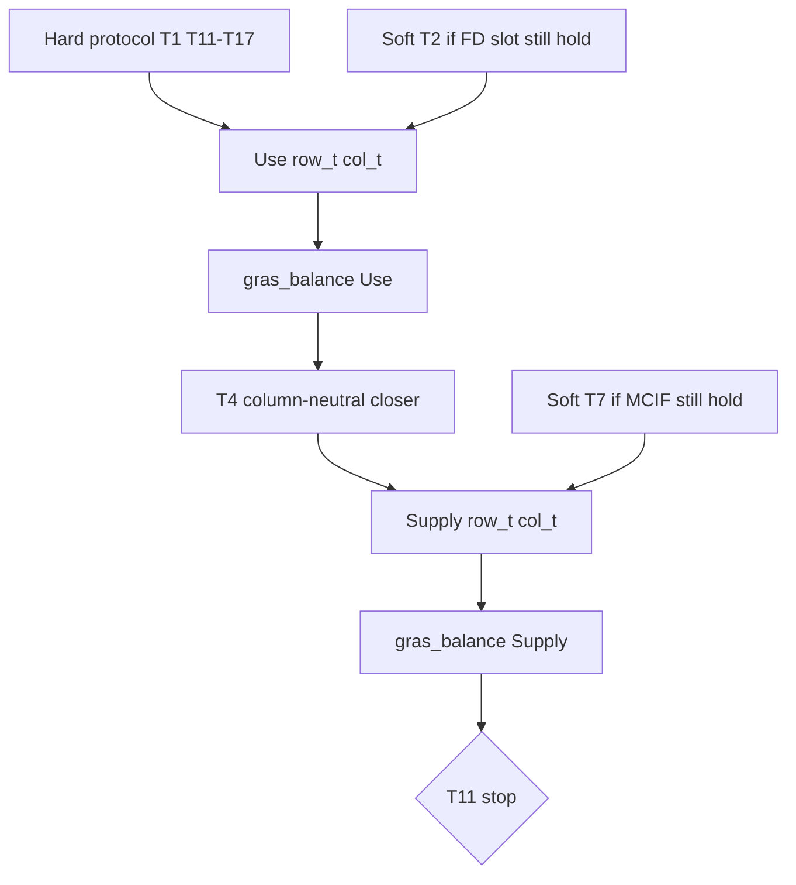

# KRAS-style soft layer (PR3 of 3)

**Issue:** [#588](https://github.com/cornerstone-data/bedrock/issues/588) softness only. **Stack on PR2** (`jv_nowcast_step5_SUT_orchestration` / `engine`). Sequence: [`step5_balance_sequence_2026-08-18.plan.md`](step5_balance_sequence_2026-08-18.plan.md). Hard protocol: [`sut_orchestration_03e8183c.plan.md`](sut_orchestration_03e8183c.plan.md) (implemented).

**Branch check:** PR1 and PR2 are on this branch. Soft T2/T4/T6–T9 sit in `TargetSet` with `hard=False` and [`WEIGHTS`](bedrock/transform/iot/nowcast_targets.py). `engine` still skips them. **Calibration of WEIGHTS is not this PR** (sequence text that said otherwise is stale; the mechanism uses the starting `WEIGHTS` as-is).

## Locked design

Softness is **who gives way**, not a new GRAS split. Do not put `TargetSet` in `gras.py`. No scipy/QP. No second dense scaler.

T7 writes Supply `col_t['MCIF']` (not a Use column). Do **not** add `MCIF` to shared `_supply_seed` / `SUPPLY_COLS` — a nonzero column changes Supply row sums and breaks existing T11-zero toys; a zero column is structural-zero and GRAS will not deliver a blend. T7 toys **clone** Supply, then add a **free, nonzero** `MCIF` column.

**Blend cadence (locked: once from entry Z).** Same-block soft targets whose kernel slots are still at hold (T2, T7; T6/T8/T9 only if not whole-name deferred).

On **entry** to `engine` (the residual `Z` after `assert_free_seed`, before any `gras_balance` pair):

`current0 = target.evaluate({block: Z_entry})`  
`t_used = current0 + w * (target.values - current0)`

Store `t_used`. Write that **same** vector onto kernel slots on every later Use/Supply pair, including a finishing `close_rows_exactly` pair. Do **not** recompute `evaluate` on the post-GRAS `Z` and blend again.

`w = target.weight` on the residual `Target`. Never read `nowcast_targets.WEIGHTS` in `orchestrate.py`. Never overwrite a slot the hard protocol already set. `current0` is **evaluate on entry Z**, not a raw un-aggregated sum (required for T6 if it is ever imposed without T12/T13).

**Why once, not every pass.** The nowcast estimates later-year Make/Use tables from 2017 structure plus year-Y sources. Those sources will not agree to the dollar, and the gap is larger off the 2017 replay than on it. `w` is how much that source is trusted **this year**; it must mean the same mix whether T11 closes in one pair or twenty. Re-blending each pass makes `w` a per-iteration rate: after two pairs (the usual 2017 path: pair 0 plus finishing closer) effective weight is `1-(1-w)^2` (0.96 at `w=0.8`); `max_outer=20` walks almost to the raw target. Later years with a worse seed would take more pairs and treat the same `w` as almost hard — the opposite of a weight you can set or calibrate year to year. Once-from-entry keeps “who gives way” as a convex mix of this year’s seed and this year’s target; identities still iterate to close.

T4’s mix uses the same cadence: `desired` is computed once from entry `Z` (step 2 below). The closer may still run after every Use pass, but it aims at that **frozen** `desired`, not a new `w`-mix of the post-GRAS group sums.

Write sites when not deferred:

- **T2:** `col_t` on `T2.values.index` that are **not** in `T1.values.index` (FD). T1 already owns industry columns; overlapping labels are not overwritten.
- **T7:** Supply `col_t['MCIF']` (hold today).
- **T6** (only if T12 and T13 both absent): Use `row_t` on `T00TOP`/`T00SUB`.
- **T8** (only if T14 absent): Supply `col_t['MDTY']`.
- **T9** (only if T12 and T13 both absent): Supply `col_t` on `TOP`/`SUB`.

**Whole-name defer (locked):** if **any** kernel slot a soft target would write is already hard-occupied, do **not** blend leftovers; put the **name** in `soft_deferred` and write nothing. `skipped` and `soft_deferred` are **disjoint**.

When `impose_soft=False`: every `hard=False` name is in `skipped`; `soft_deferred` is `()`. When `impose_soft=True`: imposed T2/T4/T7 are in neither; T6/T8/T9 that lose to T12–T14 are in `soft_deferred` only; unknown soft names stay in `skipped`.

Production `build_target_set` always includes hard T12–T14, so **T6, T8, T9 are always `soft_deferred`** on the real SUT. `--check-engine-soft` showing no T6/T8/T9 movement is expected, not a bug.

- T6 defers if hard T12 **or** T13 is imposed (two Use VA rows; one hard slot is enough).
- T9 defers if hard T12 **or** T13 is imposed (`TOP`+`SUB`).
- T8 defers if hard T14 is imposed (`MDTY`).

**T4 column-neutral closer** (locked so **T1 stays exact at return**):

T4 is not a GRAS row/col. After **every** Use `gras_balance` (including a finishing Use), before Supply.

**Why this recipe.** `plan.md` holds identities hard and sourced totals soft, and it treats a structural zero as a pattern GRAS must not fill. T4 is a **group** total (compensation by industry group), not a licence to move mass from industry B onto industry A. Additive fills of free zeros would create cells GRAS would have left at 0. Scaling only the columns that can compensate so the group still **hits** `desired` would dump the stuck industries’ gap onto the rest — the same silent relocation the mask work already rejected. Those two constraints imply the group **may miss** `desired`. There is no third recipe that preserves zeros, does not reallocate across industries, and still hits T4 whenever a column cannot put `−d` somewhere legal.

**Not chosen:** additive onto free zeros; drop stuck columns from `free_sum` then scale the rest to hit `desired`; all-or-nothing (one stuck column freezes the whole summary group); refuse `factor < 0` (production `V00100` is essentially nonnegative; a negative factor is a toy edge, not a nowcast policy). “Additive proportional to current nonzero cells” is the same as multiplicative, not a second method.

Require `len(T4.terms)==1`, `T4.terms[0].aggregator` present, `restrict_to` **exactly one** Use row (production: `V00100`). Missing aggregator or bad `restrict_to` → `ValueError`, not skip. When T4 is imposed, that row must exist (`KeyError`, no `fill_value=0`). Group members: `Aggregator.matrix` is positional `(n_groups, n_detail)` — loop `enumerate(aggregator.groups)` / `enumerate(aggregator.detail)`, not label keys. A cell is in group `g` when `matrix[gi, ji] == 1`. Intersect those `j` with `Z.columns`. Iterate `desired.index` (same as `T4.values.index`); do not walk unused aggregator groups. Do not import `industry_group_aggregator()` in toys.

1. Once, from entry `Z` (same cadence as T2/T7): `current0 = T4.evaluate({'use': Z_entry})` (aggregator space). `desired = current0 + w * (T4.values - current0)`. Reuse that `desired` after every Use pass; do not re-blend from post-GRAS `Z`.
2. After each Use `_balance_block`, **copy** Use before the closer writes (`_balance_block` wraps `result.matrix` with no copy; in-place T4 edits would mutate `last['use'].matrix`). Then for each group `g` on the **current** Use `Z`:
   - `row` = the restrict_to row. `~free` cells on that row **stay 0** in Z (offset already peeled `F`).
   - `free_sum` = sum of `row[j]` over group columns where `mask.free.loc[row, j]`. `frozen_sum` = sum of `row[j]` over the other group columns (should be 0 on Z).
   - If `free_sum == 0`: **hold** the group (no divide).
   - Else `factor = (desired[g] - frozen_sum) / free_sum`.
   - A column `j` is **compensable** iff the restrict_to cell is free **and** there is at least one **compensator** in that column with `sum(|cell|) > 0`. A compensator is `mask.free` **and** `sign_lock == 0` (kernel `sign_flex`), **not** the restrict_to row, **not** `~free`. Sign-locked free rows (e.g. `T00SUB`) are not compensators.
   - Compute `factor` from **all** free restrict_to cells in the group (including columns that will not move). **Write only compensable columns** — do not apply-then-undo. Ineligible columns never move. That is compute-then-revert with the same numbers.
   - For each compensable `j`: `old = row[j]`; `new = factor * old`; `d = new - old`; set `row[j] = new`. Then each compensator `i` in column `j` gets `−d * |cell_i| / sum(|cell|)`. Opposite sign on `d` moves T1. Use `|cell|`, not signed `cell`.
3. After the closer, every Use industry column sum equals what it was after the preceding `gras_balance`. That is **T1-exact** when `close_rows_on_last=False` (already required for column asserts). A finishing `close_rows_exactly` Use pass can already drift columns, as in PR2; the closer does not restore beyond post-Use-GRAS sums. Supply does not touch Use. Empty-free T11 live-row rule from PR2 unchanged: compensators require `free`, so an empty-free T11 row cannot receive `−d`.

If T4 absent or `impose_soft=False`, skip the closer.

## API

Keep `engine(free, residual, masks)` as the SUT entry. Add `impose_soft: bool = True`.

- Default **True** (production).
- `impose_soft=False` is exact PR2 behavior. **Must pass `False` at:** [`test_skip_soft_does_not_read_values`](bedrock/utils/economic/balance/__tests__/test_orchestrate.py) and [`_engine_hard_residuals`](bedrock/analysis/nowcasting/mask_layer_feasibility.py) (`--check-engine`). Other PR2 tests use `_hard_set` with no T2/T4/T6–T9; default True is a no-op there.
- `SutBalanceResult.skipped`: `hard=False` and not imposed (`impose_soft=False`, or unknown soft name). `soft_deferred` uses the same **residual-iteration order** as PR2 `skipped`. Engine is the only constructor; adding `soft_deferred: tuple[str, ...]` at the end is not a caller break.
- Unknown **hard** names raise. Unknown **soft** names: skip, list in `skipped`. Known soft names with missing labels: `KeyError` like PR2.

**`KNOWN_SOFT = frozenset({'T2','T4','T6','T7','T8','T9'})`.** Keep `NAMED` / `KNOWN_HARD` as T1, T11–T17 only. Duplicate names among `KNOWN_HARD | KNOWN_SOFT` → `ValueError`.

Do not call `precheck`/`split`/`restore` inside `engine`. Kernel kwargs unchanged.

## Files

- [`orchestrate.py`](bedrock/utils/economic/balance/orchestrate.py): blend, whole-name defer, T4 column-neutral closer, `impose_soft`, `soft_deferred`.
- Tests: [`test_orchestrate.py`](bedrock/utils/economic/balance/__tests__/test_orchestrate.py). **Create** [`test_full_nowcasting_sut_balance.py`](bedrock/utils/economic/balance/__tests__/test_full_nowcasting_sut_balance.py) (not in the repo yet). Stage 1 builds toy Use `row_t`/`col_t` for `gras_balance`; that is test-only.
- [`mask_layer_feasibility.py`](bedrock/analysis/nowcasting/mask_layer_feasibility.py): `--check-engine` / `--check-engine-soft` as locked below.
- Docs + sequence pointer: mechanism landed; **WEIGHTS uncalibrated** (follow-up, not this PR).

**`--check-engine-soft` wiring (locked).** `main` is `main(**vars(parser.parse_args()))`, so add `check_engine_soft: bool = False` next to `check` / `check_engine` or argparse will `TypeError`. Flag: `--check-engine-soft` with `dest='check_engine_soft'`.

`engine` default `impose_soft=True` is production. A missed wire on 2017 still **passes** hard `<= 100`: placeholders *are* the published tables, so T2/T4/T7 have ~0 gap. The hard-only replay must not pick up that default.

1. **Skip `report()` when either engine flag is the sole request.** Today: `if check or not check_engine: print(report())`. Change to `if check or not (check_engine or check_engine_soft)`. `report()` needs the GO parquet; `--check-engine` already skips it. `--check-engine-soft` alone must too. `--check` still prints the leverage report. Do not write a one-sided `or not check_engine_soft` on the old condition (that skips the default no-flag path or still prints under the new flag).

2. **One helper, `impose_soft` explicit.** `_engine_hard_residuals(..., impose_soft: bool = False)`. `--check-engine` calls it with `False` (exact PR2). `--check-engine-soft` calls it with `True`. **Two explicit calls if both flags are set** (False then True). Do not write `if check_engine or check_engine_soft: _engine_hard_residuals(impose_soft=check_engine_soft)` — that drops the hard-only replay when both are passed. Do not leave a bare `engine(free, residual, masks)` in this path. Print T1 source as today. Keep a copy of **hard and soft** `Target.values` before `offset_targets`. After restore: hard `|evaluate(X) − pre_offset|.max() <= 100` is the fail gate (T1 included). Soft T2/T4/T6–T9 `|evaluate(X) − pre_offset|` is **printed**, not a fail gate. T6/T8/T9 in `soft_deferred` on production (hard T12–T14 always present) is expected, not a bug.

3. **Exit code sees both flags.** Today: `if check or check_engine: return 1 if failed else 0`. Change to `if check or check_engine or check_engine_soft`. Soft print never increments `failed`. A hard residual `> 100` under `--check-engine-soft` is exit 1.

**Why this wiring.** The 2017 replay is how we learn whether identities still hold once softness is on; it is not yet a test of NIPA vs seed. Two helper copies would drift. A T2/T4 fail bar would be empty on placeholders and would not transfer to later years (those gaps are real; this PR does not wire NIPA/ITA). Failing the process only on **hard** residuals, and printing soft ones, keeps CI honest about T1/T11–T17 without pretending WEIGHTS are calibrated. Exit 0 on a hard fail under the new flag would make that CI check a no-op.

No scipy. Do not edit GRAS math. Do not wire NIPA/ITA. Do not impose T5.

## Tests

Toys, `close_rows_on_last=False` for column asserts:

- T2 blend toward target at `w=0.8`, not all the way. **Force two pairs with a non-holding T11** (seed T11 residual above `atol` after pair 0). Tight `atol` does **not** force a second pair: `_use_seed`/`_supply_seed` already satisfy T11, so T11 hits after pair 0 (`outer_iterations == 1`) and a re-blend would never run. After pair 2, FD sums still equal the **entry mix**, not `1-(1-w)^2`. `close_rows_on_last=False` (no finishing closer on this column assert). `impose_soft=False` holds. At least one toy uses `weight` ≠ `WEIGHTS['T2']`.
- T12+T6 → T00SUB follows T12; T6 in `soft_deferred`; no leftover T00TOP blend from T6.
- T4: two industries, other **sign-flex free** cells in those columns; after `engine` with `close_rows_on_last=False`, **T1 exact** and T4 group residual `< (1-w+eps)*initial`. Empty-free T4 group holds. Frozen `V00100` cell stays 0 in Z / bit-identical F after restore. One column with **no compensators** does not move; the group **misses** `desired` by that column’s would-be `d`; other industries in the group are **not** scaled extra to hit the target. Do not use `T00SUB` as the only compensator if the toy asserts signs. Prefer VA sign-flex cells (`V00300` / `T00OTOP`) so T11 is not in the way.
- T7: clone Supply, add a free nonzero `MCIF` column; blend that column. Do not mutate shared `_supply_seed`. T8 in `soft_deferred` when T14 imposed.
- Weight from the `Target`, not `WEIGHTS`.

**`test_full_nowcasting_sut_balance`:** one test, three stages, **no 2017/GCS**. **Re-`split_fixed_blocks` (or copy the original `free`) before each stage.** Do not feed `out.blocks` from stage 2 into stage 3.

1. **PR1:** `gras_balance` on Use; `converged`; `~free_mask` is 0.
2. **PR2:** `engine(..., impose_soft=False)` with hard T1+T11–T17 plus soft T2; restore; identities; T2 in `skipped`.
3. **PR3:** new split of the **same original seeds**; add T2/T4; `impose_soft=True`; `close_rows_on_last=False` (T1-exact; a finishing Use closer can already drift columns, as in PR2); hard identities; T1 exact; T2 moved; T4 closer; T2 not in `skipped`.

If stage 3 fails, stages 1–2 must already have passed in the same function.

2017: `--check-engine` / `--check-engine-soft` only.

## Explicit non-goals

Calibrated `WEIGHTS`; real NIPA/ITA; QP; KRAS inside `gras.py`; T5; leftover-blend for T6/T9; generic `TargetTerm` compiler; concatenating panels.
