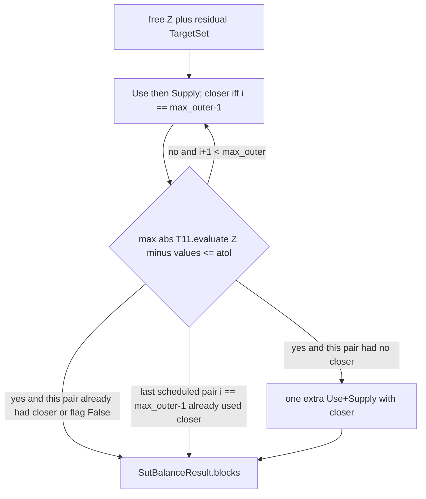

# SUT orchestration (PR2 of 3)

**Choice A (locked):** impose **hard** targets only — **T1 and T11–T17**. Skip is `if not t.hard` (T2, T4, T6–T9 default `hard=False`). Do not treat placeholders as GRAS vectors. KRAS / weights are PR3.

Dated pointer (same stack): [`sut_orchestration_plan_2026-08-18.plan.md`](sut_orchestration_plan_2026-08-18.plan.md). Sequence: [`step5_balance_sequence_2026-08-18.plan.md`](step5_balance_sequence_2026-08-18.plan.md). Kernel: [`gras_kernel_plan_2026-08-18.plan.md`](gras_kernel_plan_2026-08-18.plan.md).

Stack on PR1 (`jv_nowcast_step5_gras` / `gras_balance`). Do **not** write `gras_balance(free, residual, masks)`.

## Why this PR exists

[`plan.md`](bedrock/analysis/nowcasting/plan.md) still calls `engine(free, residual, masks)`, which does not exist. `gras_balance` is ndarray-only. This PR extracts vectors and calls the kernel **per block**. It does not re-implement GRAS, hold fixed cells, or renormalise signs. Offset and `SutMask` already did that.

Caller (as in `plan.md`; **not** inside `engine` — do not call `precheck`, `split_fixed*`, or `restore_fixed*` from `engine`):

```python
frozen, free = split_fixed_blocks(seeds, masks)
residual     = offset_targets(targets, frozen)
precheck(seeds, masks, targets, allow_placeholders=True)
out          = engine(free, residual, masks)
result       = restore_fixed_blocks(out.blocks, frozen)
```

## API

Add [`bedrock/utils/economic/balance/orchestrate.py`](bedrock/utils/economic/balance/orchestrate.py). Export `engine` and `SutBalanceResult` from [`balance/__init__.py`](bedrock/utils/economic/balance/__init__.py). Generic over `TargetSet` + `SutMask`; **do not** import `nowcast_targets` or `nowcast_mask`. Tests and `--check-engine` wire those.

```python
@dataclass(frozen=True)
class SutBalanceResult:
    blocks: dict[str, pd.DataFrame]          # same keys as free: use/supply balanced; extra keys copy-through
    outer_iterations: int                    # Use+Supply pairs actually run ( >= 1 )
    t11_max_abs_residual: float              # max |T11.evaluate(Z) - T11.values|
    skipped: tuple[str, ...]                 # names with hard=False, not imposed
    last: dict[str, GrasBalanceResult]       # last kernel pass per block (includes .converged)

def engine(
    free: Mapping[str, pd.DataFrame],
    residual: TargetSet,
    masks: Mapping[str, SutMask],
    *,
    max_outer: int = 20,
    rtol: float = 1e-6,       # passed through to every gras_balance call
    atol: float = 100.0,      # T11 stop only (BEA $M); NOT passed as kernel atol
    close_rows_on_last: bool = True,
) -> SutBalanceResult: ...
```

Every `gras_balance` call:

- `matrix=Z.to_numpy()` for that block
- `free_mask=mask.free.to_numpy()`, `sign_flex=(mask.sign_lock.to_numpy() == 0)` — never omit `sign_flex`
- `project_infeasible=False` (signed SUT; stall policy A — `True` is `ValueError` in `gras.py`)
- `rtol=rtol` (engine kwarg)
- kernel `atol` left at default **`0.0`** — do not pass engine `atol=100` into the kernel (`_raise_empty_free_margins` uses `|target| > atol`)
- do **not** pass `max_iter`; kernel default 100. Not an `engine` kwarg.
- `close_rows_exactly` (both Use and Supply of the same pair, never one panel only):
  - If `close_rows_on_last` is **False**: never pass the closer. **No finishing pair.**
  - If **True**: loop `for i in range(max_outer)` (0-based). The pair at `i == max_outer - 1` uses the closer. If T11 hits `atol` after a pair that did **not** use the closer, run **one** extra finishing Use+Supply pair with `close_rows_exactly=True`, recompute T11, then stop even if T11 ticks up. That extra pair is **not** a `max_outer` slot: after a hit on pair `k` (`k < max_outer - 1`), `outer_iterations == k + 2` (at most `max_outer`, when `k == max_outer - 2`). It is **not** `max_outer + 1` — the last scheduled pair already carries the closer, so exhausting `max_outer` never adds another pair. The extra pair does **not** run when the pair that just hit already used the closer (`i == max_outer - 1` or `max_outer == 1`). Never pass the closer on earlier non-finishing pairs.

`close_rows_exactly` is a GRAS **row** scale: Use closer can drift T1 (Use columns); Supply closer can drift T15/T16/T17/T12–T14 column slots. Unit tests that assert those **column/cell** identities call `engine(..., close_rows_on_last=False)`. T11-row tests may use the default True. `--check-engine` uses the default True and still requires every hard target `<= 100` after restore — do not drop T1 from that check.

After each kernel call, wrap `GrasBalanceResult.matrix` as `pd.DataFrame(matrix, index=free[block].index, columns=free[block].columns)`. `restore_fixed` raises if labels differ. `last[block]` is the most recent kernel result for that block (the finishing closer pair if one ran).

- `assert_free_seed` on each block before the first kernel call.
- Copy frames; do not mutate `free` / `residual` / `masks`.
- Require blocks `'use'` and `'supply'` in `free` and `masks` (raise `KeyError` otherwise). Extra keys in `free` are **copy-through**: bit-identical frames in `out.blocks`, not passed to `gras_balance`, no mask required. Extra keys in `masks` unused. Do not drop extras (`SutBalanceResult.blocks` has the same keys as `free`). `last` contains only `'use'` and `'supply'`.
- Raise `ValueError` if `max_outer < 1`. Always run the `i == 0` pair **before** any T11 stop — T11 already holding on entry does not skip T1. `outer_iterations` is the number of Use+Supply pairs actually executed (1 after the first pair).
- **Lookup:** `TargetSet` has no dict API. Resolve T1/T11–T17 as the first target whose `.name` matches. Duplicate names among that set → `ValueError`. Duplicate **soft** names: first match; extra copies still appear in `skipped` if `hard=False`. Do not add `TargetSet.by_name`.
- **Required:** a target named `T1` and a target named `T11`, each with `hard=True`. Missing the name **or** present with `hard=False` → `ValueError`. The skip rule does **not** apply to T1/T11.
- Skip for T12–T17 and any other name is `if not t.hard` (not a denylist). Absent or `hard=False` T12–T17: those slots **hold** at current Z sums. If T13 is **imposed** (`hard=True` and present) without T14 also `hard=True` and present → `ValueError` (cannot split `TOP` vs `MDTY`). Soft T13 without T14 does not raise. T14 imposed without T13 **is allowed**: set `MDTY` from T14; `TOP` holds.
- Unknown **hard** names outside `{T1, T11, T12, T13, T14, T15, T16, T17}` → `ValueError`. `skipped` is names with `hard=False`, in residual-iteration order.
- `gras_balance` returning `converged=False`: **do not raise**. Keep the returned matrix, continue the outer loop, surface `last[block].converged`. Outer stop is T11 `atol` or `max_outer`, independent of inner GRAS `converged`.
- `gras_balance` **raising `ValueError`** (empty free margin, non-finite, shape, signed `project_infeasible`): **propagate unchanged**. Do not wrap in `InfeasibleBalance`, catch-and-continue, or pass engine `atol` as kernel `atol`.

## Label inference (no `nowcast_mask` import)

Do **not** call `balance_commodities()`, `panel_labels()`, or `SUPPLY_BRIDGE_COLUMNS`. Infer and use literals.

**Build vectors hold-first:** copy current Z row sums into `row_t` and column sums into `col_t` (every label on that block), then overwrite named slots. Extra panel labels stay at hold. Remaining Supply rows not in `T11.values.index` **hold** (do not classify Supply rows as VA; VA classification is Use-only). Empty-free T11 slots also **hold** (see below).

**Raise `KeyError` (match `Target.evaluate`); never `reindex(..., fill_value=0)`** on T1/T11/T17 indexes:

- `T1.values.index` must be a subset of `free['use'].columns`
- `T11.values.index` must be a subset of **both** `free['use'].index` and `free['supply'].index`
- If T17 is imposed: `T17.values.index` must be a subset of both `free['use'].columns` and `free['supply'].columns`; Use rows `T00TOP` and `T00SUB` must exist (`Z_use.loc[['T00TOP','T00SUB']]` in the Supply pass)
- Imposed T12–T16 literals missing from the scaled block (`T00SUB`, `T00TOP`, `4200ID`, `'TRADE '`, `TRANS`, `SUB`, `TOP`, `MDTY`) also raise `KeyError`.

Then:

- Commodity rows = `T11.values.index` (400 labels in production; not 402). Overwrite T11 slots on both panels **for live rows only** (`mask.free.any(axis=1)` on that label, after the subset check). Empty-free T11 slots **hold** at the current Z row sum. Same-block empties (T1, T12–T17) still raise — do not catch kernel `ValueError`. 2017: eight retail commodities are all structural zeros on Use with ±$1M Supply rounding; 1:1 FD commodities have a frozen Use row that Supply absorbs. That is T11’s job, and it is a conscious break from writing T11 onto every commodity row.
- Use industry columns = `T1.values.index`. Remaining Use columns = FD (**hold**).
- Remaining Use rows (in `free['use'].index` but not in `T11.values.index`) = VA. `T00TOP` / `T00SUB` are **rows**. Other VA rows (**hold** unless T12/T13 set them).
- `4200ID` is a **Use industry column** (in `T1.values.index`), never a commodity row.
- Supply industry columns = `T17.values.index` if T17 is imposed, else `T1.values.index`. Remaining Supply columns = bridge (**hold** unless T12–T16 set them).
- Bridge / tax **literals** (module constants in `orchestrate.py`; trailing space is BEA’s): `TRADE `, `TRANS`, `MDTY`, `TOP`, `SUB`, `T00TOP`, `T00SUB`, `4200ID`. Comment that they match `nowcast_mask.SUPPLY_BRIDGE_COLUMNS` / Use VA rows; do not import that module.

`use.col[T00TOP, T00SUB]` means the **column sums of those two Use rows** (`TargetTerm(..., axis='column', restrict_to=('T00TOP', 'T00SUB'))`), not column selection.

## Residual protocol (locked)

Engine receives a **residual** `TargetSet` (`r' = r - evaluate(F)`). Never published seeds. Never set T11 from Z-only equality.

- **Same-block hard margins** (T1, T15, T16): kernel vector slot = `target.values` (already residual).
- **Cross-block** (T11–T14, T17): solve the `TargetTerm` identity for the panel being scaled, using **current other-block Z** plus **residual `.values`**.
- **Unconstrained** slots: GRAS still needs a complete `row_t` / `col_t`. **Skip** means do **not** read that target’s `.values`. Fill those slots with the current Z row/col sum on the block being scaled (**hold**). Holding is not imposing a placeholder `Target.values` (T2/T4/T6–T9).
- Outer T11 residual: `max |(T11.evaluate(Z) - T11.values)|`. After **each** completed Use+Supply pair, if that max `<= atol`, stop (or take the finishing closer pair when `close_rows_on_last` is True and this pair did not already use the closer). Else continue until `max_outer`. Always finish pair `i == 0` first. Field `t11_max_abs_residual` is that number after the last Supply pass. `atol=100` is BEA million-dollar units ($100M), the same units as `hard_target_residuals` (2017 rounding worst 21). Do **not** stop on `|Z_supply.row - Z_use.row|` (that ignores frozen 1:1 FD mass; Use `fixed_value` is ~40% of Use dollars).

T11 terms are `+supply.row − use.row`. `evaluate(Z) = Z_supply.row − Z_use.row`. Want `evaluate(Z) = T11.values`.

### Use pass

| Vector | Source |
|---|---|
| `col_t[T1.index]` | T1 `.values` |
| `col_t[other Use cols]` | current Use Z column sums (hold; T2 is soft) |
| `row_t[T11 live]` | `Z_supply.row.loc[live] - T11.values.loc[live]` (subset check first; no fill_value=0). Live = T11 labels with at least one free Use cell. Empty-free T11 rows hold. |
| `row_t[T00SUB]` | if T12: `T12.values.item() + Z_supply.col['SUB'].sum()`; else hold |
| `row_t[T00TOP]` | if T13: `T13.values.item() + Z_supply.col['TOP'].sum() + Z_supply.col['MDTY'].sum()`; else hold |
| `row_t[other VA]` | current Use Z row sums (hold) |

### Supply pass

| Vector | Source |
|---|---|
| `row_t[T11 live]` | `Z_use.row.loc[live] + T11.values.loc[live]` (subset check first; no fill_value=0). Live = T11 labels with at least one free Supply cell. Empty-free T11 rows hold. |
| `col_t[industry]` | if T17: `T17.values + Z_use.col − Z_use.loc[['T00TOP','T00SUB']].sum(axis=0)`, then `.loc[T17.index]` (industries only, not FD); else hold |
| `col_t['TRADE ']` | if T15: `T15.values.item()` (not hardcoded 0); else hold |
| `col_t['TRANS']` | if T16: `T16.values.item()`; else hold |
| `col_t['MDTY']` | if T14: `Z_use.loc['T00TOP', '4200ID'] - T14.values.item()`; else hold. Compute this slot **before** `TOP` (T13 reads `col_t['MDTY']`). |
| `col_t['SUB']` | if T12: `Z_use.loc['T00SUB'].sum() - T12.values.item()`; else hold |
| `col_t['TOP']` | if T13: `(Z_use.loc['T00TOP'].sum() - T13.values.item()) - col_t['MDTY']`; else hold |
| `col_t[MCIF, MADJ, other]` | current Supply Z column sums (hold; T7–T9 are soft) |

T17 `.values` already include `−S00900` make (and offset of frozen). T17 wedge is Use **rows** `T00TOP`/`T00SUB`, not Supply `TOP`/`SUB` columns. Panels are **not** square.

After each Use+Supply pair, recompute `t11_max_abs_residual` from `T11.evaluate(Z) - T11.values` on the current **Z** dict.



API text is the source of truth if the diagram and prose disagree. The last scheduled pair (`i == max_outer - 1`) **uses** the closer; it is not an extra finishing pair.

**Outer loop:** Use then Supply (T1 binds Use industry columns; T17 reads the current Use tax wedge). Two panels, not `sut_ras` `V`/`Ui`/`Ufd`/`Uva`.

## Files

- Add `orchestrate.py` (`engine`, `SutBalanceResult`, vector builders, label literals).
- Export from `__init__.py`; **must-edit** the package docstring snippet from `balanced = engine(...)` / `restore_fixed_blocks(balanced, frozen)` to `out = engine(...); restore_fixed_blocks(out.blocks, frozen)`.
- Tests: [`balance/__tests__/test_orchestrate.py`](bedrock/utils/economic/balance/__tests__/test_orchestrate.py). Hand-checkable DataFrames only — no 2017 parquet, no GCS.
- Optional 2017 replay: add `--check-engine` to [`mask_layer_feasibility.py`](bedrock/analysis/nowcasting/mask_layer_feasibility.py) (already has `--check` via `hard_target_residuals` on published tables). **Independent flags** — `--check-engine` must not require `--check` or `report()` (report needs the GO parquet). `main` is called as `main(**vars(parser.parse_args()))`, so add `check_engine: bool = False` next to `check: bool = False` or argparse will `TypeError`. T1 prefers `published_gross_output` (UGO305-A extract parquet). If that file is missing, inject Use industry column sums so the replay can run — that is a **weaker** T1 than UGO305-A (2017 GO vs Use columns differ by at most $13M, inside 100). Print which T1 source ran. Keep a copy of hard `Target.values` from the `TargetSet` **before** `offset_targets`. After `split` → `offset` → `engine` (default `close_rows_on_last=True`) → `restore_fixed_blocks` on published 2017 panels, every **hard** `|t.evaluate(X) - pre_offset_values|.max() <= 100`. Do not compare residual `.values` to `Z`. 100 is BEA million-dollar units ($100M). T11 is 400 margins. Not a unit test.
- [`bedrock/utils/economic/README.md`](bedrock/utils/economic/README.md): wrapper exists; hard-only; skip means do not read `.values` (hold current Z sums); kernel mapping.
- [`plan.md`](bedrock/analysis/nowcasting/plan.md) **must-edit**: snippet uses `out.blocks`; orchestration no longer “does not exist”; still **not** KRAS; do not claim T4 is imposed; do not claim full Step 5 done. Also replace wrapper sequence `V`/`Ui`/`Ufd`/`Uva` with two panels Use then Supply; strike T4 aggregators as a job this wrapper imposes (T4 stays skipped until KRAS); keep the historical `sut_ras` comparison table as description of that script, not of `engine()`.

No scipy. Do not edit `gras.py` except a one-line docstring pointer if needed. Do not put T4 aggregators in this PR. Named protocol, not a generic `TargetTerm` compiler (T13 Supply is two columns, one scalar).

## Tests (first batch)

Construct two small `use` / `supply` blocks with overlapping commodity rows, industry columns including `4200ID`, VA rows `T00TOP`/`T00SUB`, one FD column, Supply bridge `TRADE `/`TRANS`/`SUB`/`TOP`/`MDTY`. Build `SutMask` + `Target`s by hand. Call `split_fixed` → `offset_targets` → `engine` → `restore_fixed_blocks`.

Must include:

- **T11 frozen FD:** nonzero `fixed_value` on a Use FD cell; after offset `T11.values` is not all-zero. After `engine`+restore, `T11.evaluate(X) ≈ original 0` (not `Z_supply.row == Z_use.row`). This is the test that catches the Z-only T11 bug. May use default `close_rows_on_last=True`.
- **T11 empty-free Use row:** the whole Use commodity row has no free cell (structural zeros plus a frozen FD total — not a zeroed row that would target Supply at 0). Engine does not raise. After restore, `T11.evaluate(X) ≈ original values` and the Use row is unchanged. Do not scale a Supply row to exact 0 (kernel `atol` 0.0 → GRAS scale-by-zero numpy warning).
- **T1 / T15 residual.values:** Use industry cols match T1; Supply `TRADE ` col sum matches `T15.values` on Z (not hardcoded 0). Put a frozen cell in `TRADE ` so residual ≠ 0. Call `close_rows_on_last=False` (column identities).
- **T11 iterate:** Use vs Supply commodity rows satisfy `evaluate(Z) ≈ T11.values` to engine `atol`.
- **T12–T14, T17:** subsidy equality; `T00TOP` vs `TOP+MDTY`; `T00TOP[4200ID]` vs `MDTY`; `T17.evaluate(X) ≈ pre-offset values` (or residual identity on Z). T17 wedge is Use **rows** `T00TOP`/`T00SUB`, not Supply `TOP`/`SUB`. Align to `T17.index`, not FD columns. `close_rows_on_last=False`.
- **Skip soft:** `hard=False` target’s `.values` are not written into kernel vectors; name in `skipped`. Hold still fills those slots from current Z sums.
- **Raises:** unknown hard name; missing T1; missing T11; T1 or T11 present with `hard=False`; hard T13 without hard T14; duplicate names among T1/T11–T17; `max_outer < 1`. Soft T13 without T14 does not raise. T14 without T13 does not raise.
- **KeyError (no `fill_value=0`):** T1 index not a subset of Use columns; T11 index not a subset of both panels’ rows; imposed T17 index not a subset of both panels’ columns; imposed T17 with missing Use rows `T00TOP`/`T00SUB`. Never silently zero-fill those labels.
- **Pair 0 always:** seed already has T11 within `atol`; `engine(..., max_outer=2, close_rows_on_last=False)` still runs one Use+Supply pair (`outer_iterations == 1`); T1 is still imposed.
- **Finishing pair:** `close_rows_on_last=True`, `max_outer=2`, T11 hits after pair 0 (no closer) → extra closer pair, `outer_iterations == 2`. Same seed with `max_outer=1` → pair 0 already has the closer, no extra, `outer_iterations == 1`.
- **Extra keys copy-through:** a third block in `free` (no mask) is bit-identical in `out.blocks` and absent from `last`.
- **`sign_flex`:** sign-locked negative Supply `SUB` cell does not go positive.
- **`restore_fixed`:** nonzero **F** cell unchanged. Leak assert is `(frozen != 0) & (balanced != 0)` — structural-zero `F=0` fills are **not** caught by `restore_fixed`.
- **`assert_free_seed`:** passing a full `X` (nonzero on `~free`) raises; engine is not called.
- **`converged=False`:** a toy that stalls GRAS still returns `SutBalanceResult`; `last[block].converged is False`; no exception. Kernel `ValueError` (empty free margin) still raises.
- **Does not mutate** caller `free` frames; **does not import** a 2017 SUT in this file.

## Explicit non-goals (PR3 / later)

- Soft targets as kernel vectors; T4 group aggregator; calibrated `WEIGHTS`.
- `project_infeasible=True` on the SUT.
- Concatenating Use and Supply into one matrix.
- `S00900` post-balance re-derive (`−F010 + Supply T016`).
- Generic `TargetTerm` → vector compiler beyond the named protocol.
- Giving GRAS `TargetSet` / `SutMask` in `gras_balance`.
