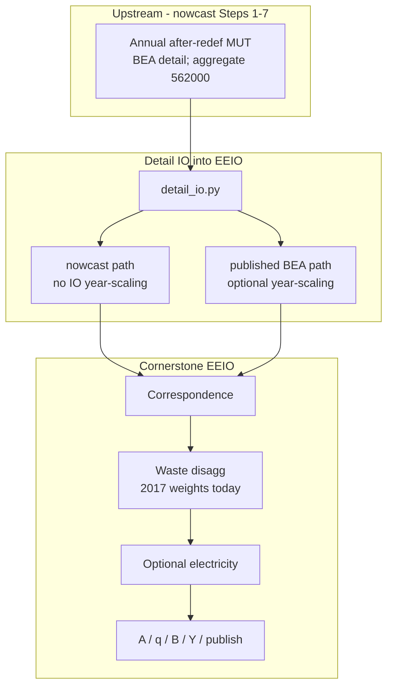
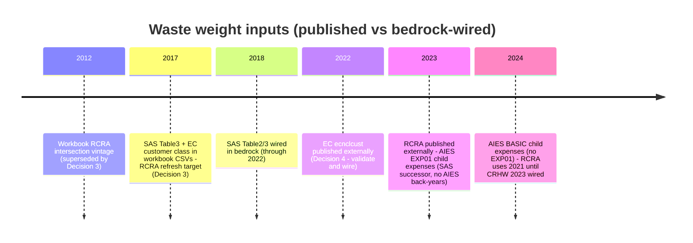

# Multi-year waste disaggregation weights — feasibility report

**Audience:** stakeholders deciding whether to fund/approve year-varying waste weights on Cornerstone’s nowcast production path.
**Scope:** Phase 1 only (research + recommendations). No production code changes.
**Folder:** `bedrock/analysis/nowcasting/waste_disaggregation/`

**Workbook reviewed (this revision):** local copy of the authorship workbook  
`.cursor/_Archive/V2_Disagg_project/CS_weight_calcs/2017sch_USEEIO_562000_Detail_disagg_AfterRedef_2026_03_13.xlsx`  
(same content as the [Drive weights workbook](https://docs.google.com/spreadsheets/d/1qTauaiLS-q3MoKh4ibtqlQj9aBOvmv1h/edit)).

---

## 4.1.1 Introduction — pipeline, nowcasting, waste

### What Cornerstone is

Cornerstone is a national environmentally extended input-output (EEIO) model of the U.S. economy. It starts from Make and Use tables (who makes what, who buys what), attaches greenhouse-gas inventories, and produces **emission factors**:

- **D** — direct emissions intensity (emissions per dollar of industry output)
- **N** — total (life-cycle) emissions intensity (direct + supply-chain)

### Current main pipeline (nowcasting / v0.4)

Today’s production path builds an **annual** detail Make/Use/Import/Margins (MUT) table for each year 2018–2024 at BEA 2017 Detail taxonomy, then feeds that table into the same Cornerstone EEIO build used for published benchmarks.

- Config pattern: `2025_usa_cornerstone_v0_4_nowcast_{year}.yaml`
- Detail IO router: `usa_detail_io_source: nowcast` (`bedrock/extract/iot/detail_io.py`)
- **No** summary IO year-scaling (`apply_io_year_adjustments: False`) — dollars already live in the calendar year

Nowcasting itself (Steps 1–7) stays at aggregate BEA waste sector **`562000`**. Waste *children* appear only later, in the EEIO stage.

### How nowcasting touches the waste Use row/column (aggregate only)

| Nowcast step | What happens for waste | NAICS / BEA depth |
|--------------|------------------------|-------------------|
| **Step 3** intermediate seed | Reshapes Use interior. Waste **industry column** `562000` is one of ~100 services/transport columns seeded from SAS Table 5 / AIES service expenses at survey NAICS **`562` (3-digit)**. Manufacturing **refuse purchases** (`PCHRFUS` / `EXPS_REFUSE_VAL`) map to commodity **`562000`** (purchaser spend). | Aggregate `562` / `562000` only |
| **Step 5** balance | RAS/GRAS hard totals still one row/column `562000`. | Aggregate |
| **Step 1** FD | Final demand for commodity `562000` only. | Aggregate |

**Critical distinction (do not conflate):**

| Series | Economic object | Used by |
|--------|-----------------|---------|
| SAS/AIES **“water/sewer/refuse” or `EXPS_REFUSE_VAL`** | What *other* industries **buy** as refuse services | Nowcast Step 3 → aggregate Use **commodity** `562000` |
| SAS Table 3 **total Expenses** of NAICS `562111`, `562212`, … | Cost structure / size of *waste firms themselves* | **Weight workbook Step 2** → Use **column-sum** (industry mix among 7 children) for **≤2022** |
| AIES **`EXPS_TOT_DVAL`** by detailed waste NAICS (EXP01 / BASIC) | Same object as SAS Table 3 — total expenses of waste firms by child NAICS | **Industry mix** for **2023–2024** (AIES successor; see §4.1.3 item 6 probe) |
| EC `ecnclcust` receipts by customer class for `562*` | Who **buys from** waste firms (business, gov, household, …) | **Weight workbook Step 3** → Use **rows** / FD |

Nowcast Use-row machinery therefore **cannot** produce seven-child weights and **cannot** replace EC 2022 for FD/who-buys rows (see §4.1.3).

### Legacy v0.3 path (context only)

Older releases used published BEA **2017** detail IO, then scaled structure toward a model year with summary ratios. The original 2017 waste weight CSVs were authored for that world. This report treats v0.3 as **historical design context**, not the primary path.

### What waste disaggregation does

One BEA waste sector (`562000`) is split into **seven** Cornerstone waste activities using percent-share weight tables (not dollar tables). The split runs **after** BEA→Cornerstone correspondence and **before** optional electricity steps and EF construction.

| Code | Plain name |
|------|------------|
| `562111` | Solid waste collection |
| `562HAZ` | Hazardous waste collection / treatment / disposal |
| `562212` | Solid waste landfilling |
| `562213` | Solid waste combustors / incinerators |
| `562910` | Remediation services |
| `562920` | Materials recovery facilities |
| `562OTH` | Other waste |

### Scope callout (locked)

Updating weights is an **EEIO-stage-only** change. It does **not** rebuild nowcast Steps 1–7 or GCS MUT artifacts. MUT stays aggregate `562000`; children appear only after waste disaggregation.

### Why this matters

Waste is already **on** in production nowcast configs, but weight **shares stay frozen at 2017** while the parent dollars move with each nowcast year. That is a methodological tension: structure from one year applied to dollars from another.

### Pipeline placement

### Nowcast (current) vs v0.3 (legacy)

| | Nowcast (v0.4 current) | v0.3 scaling (legacy) |
|--|------------------------|------------------------|
| Detail IO | Annual nowcast MUT | Published BEA 2017 |
| Year-scaling of IO | Off | Optional summary scaling |
| Waste disagg | On | On |
| Waste weight year today | Frozen **2017** CSVs | Frozen **2017** CSVs |

### What a weight CSV is

Each row is a **percent share** that tells the model how to split a parent cell among waste children (or how waste industries buy each other’s services). It is **not** a dollar IO table. Example: “76% of industry-output column for waste goes to solid waste collection.”

---

## 4.1.2 Data sources and methods for 2017 CSVs; newer vintages

### Workbook method (from `Disagg Steps` + grey source tabs)

The authorship workbook builds the export CSVs (`Use input csv` / `Make input csv`) in two iterations:

| Step | Target slice | Source tab / data | How used |
|------|--------------|-------------------|----------|
| **1** | Use **intersection** (waste×waste) | `1_RCRA_data` — shipper→receiver tons among 562* | Mass shares → intersection allocation. Workbook sheet still cites **2012** RCRA; **Decision 3:** Phase 2 rebuilds from **≥2017** after CRHW load fix |
| **2** | Use **columns** (industry mix) | `2_SAS_22_Table3` — SAS **Table 3 total Expenses** by detailed waste NAICS (≤2022); **AIES** `EXPS_TOT_DVAL` by child NAICS for 2023–2024 | Child expense totals → Use column-sum shares among 7 children |
| **3** | Use **rows** (who buys) | `3A_EC_CLUST` / `3B_EC_USEEIO_Mapping` — EC receipts by **customer class** for 562* | “Business firms and farms” → default Use row-sum for most industries; Federal / State&local / NFP / Household → special FD & gov rows |
| **4–6** | Make columns / intersection / rows | Use row totals + **manual** static rules | Make column sums track Use commodity output; intersection diagonal from adjusted output; selected Make cells expert-fixed |
| **7** | VA (Use columns) | Balancing pass | VA shares adjusted so Use column sums match Make row sums |

**NAICS→Cornerstone aggregation in the workbook (EC tab):**

| Cornerstone | EC / SAS NAICS grouped |
|-------------|------------------------|
| `562111` | `562111` |
| `562HAZ` | `562112` + `562211` |
| `562212` | `562212` |
| `562213` | `562213` |
| `562910` | `562910` |
| `562920` | `562920` |
| `562OTH` | `562119` + `562219` + `562991` + `562998` |

(Technical appendix also folds some codes similarly for SAS revenue previews.)

### Weight slices — published vs wired

| Weight slice | Workbook source (confirmed) | Newer vintages — published externally | Wired in bedrock today |
|--------------|-----------------------------|----------------------------------------|-------------------------|
| Waste industry mix (Use column sum) | SAS **Table 3 total Expenses** by child NAICS (`2_SAS_22_Table3`); AIES successor for 2023–2024 | SAS Table 3 through **2022**. AIES (successor to SAS) has **no** 2017–2022 back-years; **2023** EXP01 and **2024** BASIC publish `EXPS_TOT_DVAL` at 6-digit `562*` (same type as Table 3). *Not* purchaser `EXPS_REFUSE_VAL`. | `Census_SAS` Table 3 **2013–2022**; AIES EXP01/BASIC **not yet wired** for this extract path (EXP02 service-expenses is wired but aggregate-only) |
| Waste commodity mix (Use/Make row & column sums) | EC “Business firms” class shares (default row) + SAS/EC size; Make follows Use | SAS revenue (Table 2) also usable as proxy; EC 2022 published | SAS Table 2/3 wired; EC `ecnclcust` **2012/2017 only** |
| Waste-to-waste flows (Use intersection) | RCRAInfo (workbook CSV still **2012**; **Decision 3:** rebuild from ≥2017) | Biennial odd years; **2023** at EPA/STEWI | CRHW YAMLs **2013/2015/2017/2019/2021**; no `CRHW_national_2023.yaml`; FBS load currently errors (`target_schema_year`) — Phase 2 fix required |
| Who buys waste (FD / special Use rows) | EC `ecnclcust` customer-class receipt shares | **2022** API/tables published (same series as 2012/2017). No alternate 6-digit waste who-buys source found (Decision 4 search). | `Census_EC.yaml` **2012, 2017 only** — **Decision 4:** validate + wire 2022 |
| Value added | Follows / rebalances industry mix | Derived | Derived |
| Make static rules | Expert assumptions in workbook | Time-invariant | Bundled 2017 constants |

### Master availability matrix (2018–2024)

| Year | Industry-mix expenses (child NAICS) | SAS Table 2 revenue (child) | RCRA / CRHW | EC customer class | Nowcast refuse / expense seed (aggregate only) |
|------|-------------------------------------|-----------------------------|-------------|-------------------|-----------------------------------------------|
| 2018 | SAS Table 3 — Wired | Wired | →2017 | →2017 | Purchaser refuse / services seed at `562`/`562000` |
| 2019 | SAS Table 3 — Wired | Wired | 2019 YAML | →2017 | same |
| 2020 | SAS Table 3 — Wired | Wired | →2019 | →2017 | same |
| 2021 | SAS Table 3 — Wired | Wired | 2021 YAML | →2017 | same |
| 2022 | SAS Table 3 — Wired | Wired | →2021 | **Published — Decision 4: validate + wire** | EC expenses also anchor mfg refuse |
| 2023 | **AIES EXP01** `EXPS_TOT_DVAL` (published; not wired) | Carry 2022 | **External / not wired** | →2022 after EC wire | AIES purchaser refuse; services seed omits refuse map |
| 2024 | **AIES BASIC** `EXPS_TOT_DVAL` (published; EXP01 absent; not wired) | Carry 2022 | →2021 until 2023 wired | →2022 after EC wire | AIES continues |

### Timeline

---

## 4.1.3 Missing sources and alternatives

For each gap: problem → options → **Phase 1 recommendation**.

### 1. Industry mix after 2017 — clarify SAS / AIES series (workbook vs nowcast)

- **Problem (corrected):** Earlier drafts mixed up two different “expense” concepts. The **workbook** Use column-sum uses SAS **Table 3 total Expenses of waste NAICS** (published through 2022). The **nowcast** purchaser line “Water, sewer, refuse removal” / `EXPS_REFUSE_VAL` is a *different* series and is irrelevant to child industry mix. AIES succeeds SAS for 2023+, but has **no** 2017–2022 back-years.
- **Options:** (a) SAS Table 3 expenses by child (≤2022, matches workbook); (b) AIES total firm expenses by child (`EXPS_TOT_DVAL` via EXP01/BASIC) for 2023–2024; (c) SAS Table 2 revenue by child (proxy / cross-check); (d) scale 2017 shares by expense or revenue growth; (e) carry 2022; (f) uniform 1/7 last resort.
- **Recommendation (LOCKED — Decision 2):** Primary = **SAS Table 3 expenses** for **≤2022**; **AIES** total expenses by waste child NAICS for **2023–2024** (EXP01 in 2023; BASIC in 2024 — see item 6 probe). Secondary = Table 2 revenue. Do **not** use AIES/`EXPS_REFUSE` for this slice.

### 2. RCRA only odd years / incomplete bedrock wiring / 2012 provenance

- **Problem:** Intersection needs shipper→receiver flows. Workbook for the published 2017 CSV still cites **2012** RCRA. Newer biennials (2017/2019/2021) are the right refresh targets; 2023 exists externally but is not CRHW-wired; FBS generation currently fails with `KeyError: 'target_schema_year'`.
- **Options:** nearest prior wired biennial; fix CRHW config + validate 2017/2019/2021; add 2023 after validation; leave 2012 frozen.
- **Recommendation (LOCKED — Decision 3):** Phase 2 **fixes CRHW load** and **rebuilds** the Use intersection from **RCRA ≥2017** (do not keep the bundled CSV’s 2012 RCRA as the production path). Resolver: `resolve_rcra_year(2023|2024)=2021` until CRHW 2023 is validated and wired.

### 3. Economic Census every ~5 years — who-buys / FD rows (no alternate at 6-digit waste)

- **Problem:** FD / special customer-class rows need **sellers’** receipts by class of customer among **child** waste NAICS (`562111`…). Bedrock has 2012/2017 wired; **2022 `ecnclcust` is published** externally (Census API + multi-sector tables; waste questionnaire `AS-56220` Item 20 collects business / NFP / federal / state&local / household shares).
- **Can nowcast Use-row estimation replace EC 2022?** **No.**
  - Nowcast never leaves aggregate `562000`.
  - Refuse/`PCHRFUS`/`EXPS_REFUSE` measure **purchasers’** spend toward aggregate waste — wrong economic object vs EC `ecnclcust`.
  - Services expense seed for the waste **industry** is only NAICS **`562`**, not `562111`…`562OTH`.

#### Alternate who-buys search (Phase 1, 2026-09-22)

Requirement: **receipts (or revenue) by class of customer at 6-digit waste NAICS**, comparable to workbook Step 3 / EC `ecnclcust`. Search notes + verdict in `cache/who_buys_alt_sources_search.json`.

| Candidate | What we checked | Fit for 6-digit waste who-buys? |
|-----------|-----------------|----------------------------------|
| **EC 2022 `ecnclcust`** | [Census API dataset](https://api.census.gov/data/2022/ecnclcust.html); Sector 56 EC tables; waste form Item 20 class-of-customer | **Pass — only primary** |
| **AIES56CLASS** (2023–2024) | Census AIES table pages + FTP files in `cache/aies_probe/class56_*` | **Fail** — only `56133` / `56151` / `56152` / `561599`; **zero `562*` rows** |
| **SAS Table 8** (“Revenue by Product and Class of Customer”) | [SAS 2022 tables](https://www.census.gov/data/tables/2022/econ/services/sas-naics.html); bedrock `Census_SAS.yaml` notes Table 8 for truck `484` product rows | **Fail** — not waste-child who-buys shares |
| **QSS** (Quarterly Services) | QSS covers sector 56 / subsector 562 with class-of-customer series (e.g. FRED business revenue for **562**) | **Fail** — **aggregate `562`**, not 6-digit children |
| **BLS QCEW** | 6-digit employment/wages | **Fail** — no receipts by customer class |
| **Nowcast refuse / AIES `EXPS_REFUSE`** | Nowcast Step 3 seed | **Fail** — purchaser / aggregate |
| **BEA detail IO / GDP-by-industry** | Aggregate waste only | **Fail** |

**Result:** No viable alternate to EC `ecnclcust` at 6-digit waste NAICS.

- **Options:** (a) validate + wire EC 2022; (b) freeze 2017 EC rows for a thin pilot; (c) SAS-scale 2017 EC for intercensal years only (not a 2022 substitute).
- **Recommendation (LOCKED — Decision 4):** **Validate EC 2022 and wire after validation** for who-buys/FD rows for 2022+. Do **not** treat nowcast / AIES56CLASS / SAS Table 8 / QSS as substitutes. (A short pilot freeze of 2017 EC rows remains an optional sequencing choice, not an alternate data source.)

### 4. No BEA detail child IO

- **Problem:** Cannot invent child shares from aggregate `562000` MUT cells alone (nowcast or published).
- **Recommendation:** External data required (SAS Table 3 ≤2022; AIES EXP01/BASIC 2023–2024; Table 2; EC; RCRA).

### 5. What can stay frozen vs must update

| Keep frozen | Must update when years change |
|-------------|-------------------------------|
| Make static expert rules | Use column-sum (SAS Table 3 ≤2022; AIES EXP01/BASIC 2023–2024) |
| PR #563 Use-intersection orientation | Use intersection (RCRA ≥2017 after CRHW fix — **not** leave 2012 frozen) |
| 2017 parity customer-class *code set* (9 codes) | EC customer-class *percents* when EC vintage changes |

### 6. Post-SAS continuity (2023–2024) — AIES probe vs SAS Table 3

AIES is the **successor** survey to SAS for this annual services program. Phase 1 probed Census FTP / table pages and downloaded files under `cache/aies_probe/` (summary: `aies_vs_sas_table3_probe.json`).

| Year / table | Same type as SAS Table 3 (total expenses by waste child NAICS)? | Notes |
|--------------|----------------------------------------------------------------|-------|
| **2017–2022** | Via **SAS only** — AIES has **no** back-years | Continue `Census_SAS` Table 3 |
| **2023 `AIES00EXP01`** | **Yes** — `EXPS_TOT_DVAL` at full 6-digit `562*` children | Primary 2023 source |
| **2023 `AIES00BASIC`** | **Yes** — same measure also present | Redundant with EXP01 for this slice |
| **2023/2024 `AIES00EXP02`** | **No** for children — waste only at aggregate **`562`** | Detailed expense *lines*; bedrock `Census_AIES_Service_Expenses` path |
| **2024 `AIES00EXP01`** | **Does not exist** on 2024 FTP / Industry Expenses tables page | — |
| **2024 `AIES00BASIC`** | **Yes** — `EXPS_TOT_DVAL` at full 6-digit `562*` | EXP01-equivalent totals folded into BASIC |
| **`AIES56CLASS`** | **No** — no `562*` | Travel/PEO `561*` customer-class only; not EC-style waste who-buys |

| Question | Answer |
|----------|--------|
| Does AIES `EXPS_REFUSE_VAL` measure waste **industry-mix** by child NAICS 562*? | **No** (purchaser refuse → aggregate Use row) |
| Does AIES `EXPS_TOT_DVAL` (EXP01 / BASIC) match SAS Table 3 for children? | **Yes** for 2023–2024 |
| Recommend nowcast refuse seed for seven-child weights? | **No — LOCKED (Decision 5)** |
| Recommend AIES total expenses (EXP01/BASIC) for 2023–2024 column-sum? | **Yes — LOCKED (Decision 2)** |

**Locked decision for industry mix:** **SAS Table 3** for **≤2022**; **AIES** (`EXPS_TOT_DVAL` via EXP01 in 2023, BASIC in 2024) for **2023–2024**. Still reject `EXPS_REFUSE_VAL` / nowcast refuse seed for this slice.

### 7. Alternate sources considered (web search + nowcast review + AIES probe)

| Candidate | Fitness for 7 children | Recommendation |
|-----------|------------------------|----------------|
| EC 2022 `ecnclcust` | **Pass** for FD/customer-class at 6-digit waste | **Primary** — validate + wire (**Decision 4**) |
| RCRAInfo 2017+ / 2023 | **Pass** for intersection once loadable | **Primary**; fix CRHW; until 2023 wired use ≤2021 |
| SAS Table 3 expenses by 562* | **Pass** for industry mix (workbook method) | **Primary** for column-sum **≤2022** |
| AIES `EXPS_TOT_DVAL` (EXP01 2023 / BASIC 2024) | **Pass** — same type as SAS Table 3 at 6-digit `562*` | **Primary** for column-sum **2023–2024** |
| SAS Table 2 revenue by 562* | **Pass** as proxy / row-sum support | **Secondary** / previewed |
| Nowcast Step 3 refuse / services seed | **Fail** — aggregate `562`/`562000` only; wrong object for EC | **Reject** as EC 2022 or child-mix substitute |
| AIES `EXPS_REFUSE_VAL` | **Fail** for industry-mix children | **Reject** for column-sum |
| AIES EXP02 | **Fail** for children — aggregate `562` only | **Reject** for column-sum |
| AIES56CLASS | **Fail** for waste who-buys — no `562*` (FTP probe) | **Reject** |
| SAS Table 8 (product × class of customer) | **Fail** for waste who-buys — truck/`484` focus in practice | **Reject** as EC substitute |
| QSS class-of-customer | **Fail** — aggregate `562`, not 6-digit children | **Reject** |
| BLS QCEW 6-digit 562 | **Fail** for who-buys — labor ≠ receipts by class | **Reject** (validation-only if ever) |
| BEA GDP-by-industry 562 | **Fail** — 3-digit only | **Reject** |

**Outcome:** Primary stack is **SAS Table 3 (≤2022) + AIES EXP01/BASIC (2023–2024)** (+ Table 2 secondary) / **EC `ecnclcust` (validate+wire 2022)** / RCRA ≥2017. No alternate 6-digit waste who-buys source. Nowcasting’s Use-row data does **not** add a child-level alternative to EC 2022.

---

## 4.1.4 Preliminary weight-change analysis (2018–2024 vs 2017)

### Feasibility judgment (report + chat)

- **Partially feasible without full CSV implementation** for industry/commodity mix via **SAS** (Table 2 revenue previewed; Table 3 expenses ≤2022 preferred for column-sum) and **AIES** total expenses by child for 2023–2024 (EXP01/BASIC probe).
- **Not fully feasible without implementation** for complete Use/Make CSVs (EC FD rows, Make `adjusted_q`, orientation, slice routing).
- **RCRA intersection preview blocked** (FBS `target_schema_year`) — no invented numbers.
- **Nowcast Use estimates are not a Phase 1 preview source** for child weights (aggregate only).

### What we ran

Script: `preview_sas_rcra_shares.py`

| Step | Result |
|------|--------|
| SAS Table 2 **revenue** → 7 children (2017–2022) | **Succeeded** — `figures/sas_child_revenue_shares.png` + `cache/` |
| RCRA CRHW 2017/2019/2021 intersection | **Blocked:** `KeyError: 'target_schema_year'` |
| EC 2022 | Deferred by design until Decision 4; now **validate + wire** (no 6-digit alternate found) |
| Nowcast Use intermediate / refuse seed as child-share source | **Rejected** after method review (§4.1.1 / §4.1.3) |
| AIES EXP01 / BASIC / EXP02 / CLASS56 vs SAS Table 3 | **Done** — EXP01 (2023) and BASIC (2024) match Table 3 type at 6-digit `562*`; no AIES 2017–2022; EXP02/CLASS56 not substitutes (`cache/aies_probe/`) |
| Who-buys alternate sources (6-digit waste) | **Done** — no alternate; lock EC 2022 (`cache/who_buys_alt_sources_search.json`) |

**Note:** Phase 1 numeric preview used Table 2 revenue as a convenient share vector. Workbook Step 2 authorship uses Table 3 **expenses**; Phase 2 should prefer **SAS Table 3 ≤2022** and **AIES `EXPS_TOT_DVAL` 2023–2024** for column-sum parity (revenue remains a cross-check). 2017 revenue shares were already close to bundled column-sum (max abs Δ ≈ 0.026).

### SAS revenue results (headline)

- Across 2017–2022, max abs Δ vs 2017 bundled column-sum ≈ **0.033**.
- Drift modest: collection share edges up; hazardous fluctuates; `562213` → **0 in 2021–2022** (likely suppression — do not treat as true zero without fallback).
- Figure: [`figures/sas_child_revenue_shares.png`](figures/sas_child_revenue_shares.png)

| Year | 562111 | 562HAZ | 562212 | 562213 | 562910 | 562920 | 562OTH |
|------|--------|--------|--------|--------|--------|--------|--------|
| 2017 | 0.494 | 0.128 | 0.076 | 0.013 | 0.161 | 0.060 | 0.068 |
| 2022 | 0.506 | 0.099 | 0.085 | 0.000 | 0.167 | 0.061 | 0.081 |
| Bundled 2017 column-sum | 0.476 | 0.121 | 0.083 | 0.015 | 0.166 | 0.045 | 0.094 |

### Coverage meter (hard field)

| Metric | Value |
|--------|-------|
| Use CSV mass in principle previewable (column + row + intersection) | **~20%** |
| Successfully previewed (SAS revenue proxy for column/row) | **~13.3%** |
| Attempted but blocked (RCRA intersection) | **~6.7%** |
| Deferred (EC customer-class + VA; ~80% of Use CSV mass) | Needs Phase 2 + EC 2022 for full update |

### Partial vs full feasibility (chat summary)

**Partial yes** — SAS child mix drifts mildly through 2022. **Full no** — every PercentUsed cell needs Phase 2 generator + EC + working RCRA. **Nowcast Use path is not an EC substitute.**

---

## Decisions requested (Phase 1 exit)

Work through these in order. **Proceed with Phase 2 is last.** Decision 7 is **LOCKED: Pilot-only (2024)**. Begin Phase A code per the single guiding plan [`.cursor/plans/waste_disagg_two_phases_18d3c084.plan.md`](../../../../.cursor/plans/waste_disagg_two_phases_18d3c084.plan.md) (Phase 2 section). Do not implement 2018–2023 until after 2024 impact review. The local [`implementation_plan.md`](implementation_plan.md) is a stub pointer only.

### Locked

1. **Pilot year — LOCKED: 2024 first.** Phase 2 builds and runs control vs treatment impact for nowcast **2024**. Extension to 2018–2023 is deferred until after 2024 impact review (Decision 7).  
   *See §4.1.4; `2025_usa_cornerstone_v0_4_nowcast_2024.yaml`.*

2. **Industry mix primary source — LOCKED: SAS Table 3 for ≤2022; AIES for 2023–2024.** Use SAS **Table 3 total Expenses** by waste child NAICS through 2022 (workbook method); use AIES **`EXPS_TOT_DVAL`** by waste child NAICS for 2023 (**EXP01**) and 2024 (**BASIC**; EXP01 not published). Table 2 revenue remains secondary. Still reject purchaser `EXPS_REFUSE_VAL` / nowcast refuse seed for this slice.  
   *See §4.1.2 workbook Step 2 / matrix; §4.1.3 items 1, 6–7; `cache/aies_probe/aies_vs_sas_table3_probe.json`.*

3. **RCRA / intersection — LOCKED: fix CRHW load; rebuild from RCRA ≥2017.** Do **not** leave the bundled CSV’s **2012** RCRA as the production intersection. Phase 2 fixes `target_schema_year`, regenerates waste×waste shares from wired biennials 2017/2019/2021, and uses `resolve_rcra_year(2023|2024)=2021` until CRHW 2023 is validated and wired.  
   *See §4.1.2 Step 1 / matrix; §4.1.3 item 2; §4.1.4 RCRA blocker; `bedrock/transform/crhw/CRHW_national_*.yaml`.*

4. **EC 2022 / who-buys — LOCKED: validate EC 2022, then wire.** No alternate 6-digit waste who-buys source found (AIES56CLASS / SAS Table 8 / QSS / QCEW / nowcast refuse all fail). Phase 2 validates `ecnclcust` 2022 against workbook expectations, then wires it in `Census_EC.yaml` for FD/customer-class rows for 2022+. Nowcast is **not** an EC substitute.  
   *See §4.1.3 item 3 search table; `cache/who_buys_alt_sources_search.json`; `Census_EC.yaml` (years 2012/2017 only today).*

5. **Reject AIES `EXPS_REFUSE` / nowcast refuse for industry-mix — LOCKED: yes, reject.** Purchaser refuse spend toward aggregate `562000` is the wrong economic object for Use column-sum child mix. Distinct from Decision 2’s accept of AIES **total firm expenses** (`EXPS_TOT_DVAL` via EXP01/BASIC).  
   *See §4.1.1 critical distinction; §4.1.3 items 1, 6–7; `Census_AIES.py` / `service_expense_seed.py`.*

6. **Electricity off for weight A/B impact — LOCKED: yes.** Control vs treatment impact runs with electricity steps **off** so EF deltas isolate waste-weight changes (same nowcast MUT year).  
   *See guiding plan Phase 2 impact experiment.*

7. **Proceed with Phase 2 — LOCKED: Pilot-only (2024).** Implement and run the 2024 control vs treatment impact only. Do **not** implement or wire 2018–2023 time-series weights until after review of the 2024 implementation/impact. Multi-year extension is a separate follow-on after that review.  
   *See guiding plan Phase 2 §12 Pilot-only exit; [`.cursor/plans/waste_disagg_two_phases_18d3c084.plan.md`](../../../../.cursor/plans/waste_disagg_two_phases_18d3c084.plan.md).*

### Pending

*(none — Phase 1 exit complete. Begin Phase A per guiding plan.)*

---

## Glossary

| Term | Plain meaning |
|------|----------------|
| **MUT** | Make / Use / Import / Margins tables |
| **SUT** | Supply and Use tables |
| **Make / Use** | Who produces / who consumes commodities |
| **Disaggregation** | Splitting one aggregate sector into detailed ones |
| **Weight / share** | Percent used to allocate a parent cell to children |
| **NAICS** | Industry classification codes |
| **BEA `562000`** | Aggregate waste management & remediation in BEA detail IO |
| **EF D / N** | Direct / total GHG intensity |
| **Nowcast** | Annual estimated detail IO after last published detail benchmark |
| **RCRAInfo** | EPA hazardous-waste biennial report database |
| **SAS Table 3 Expenses** | Total expenses of firms in a NAICS (industry-mix source ≤2022) |
| **AIES `EXPS_TOT_DVAL` (EXP01 / BASIC)** | Same type as SAS Table 3; industry-mix source 2023–2024 (AIES succeeds SAS; no 2017–2022 AIES) |
| **SAS refuse / AIES `EXPS_REFUSE`** | Purchaser spend on refuse services (nowcast aggregate Use row; **not** industry mix) |
| **EC `ecnclcust`** | Economic Census receipts by class of customer |
| **Correspondence** | BEA detail ↔ Cornerstone sector mapping |
| **Before / after redefinitions** | BEA IO presentation variants |
